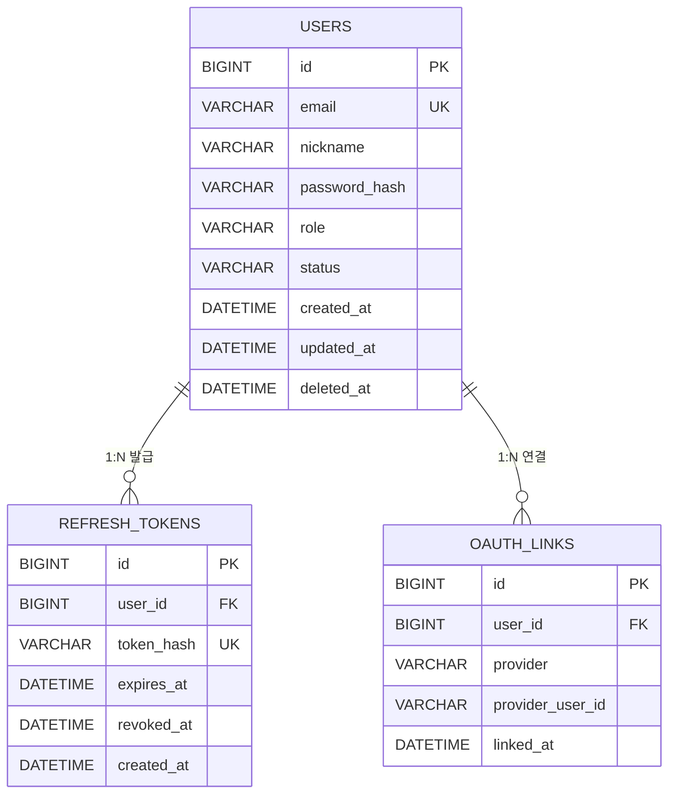
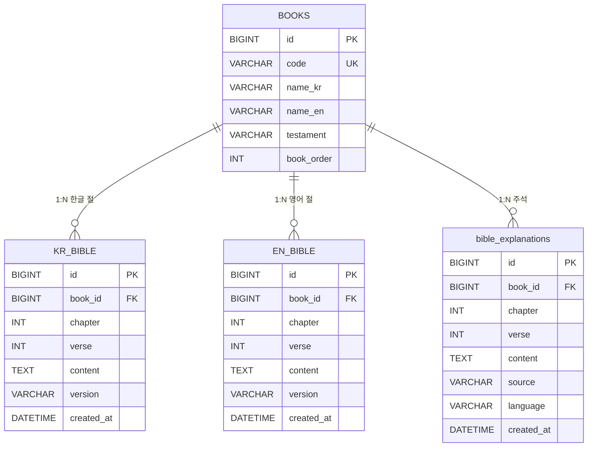
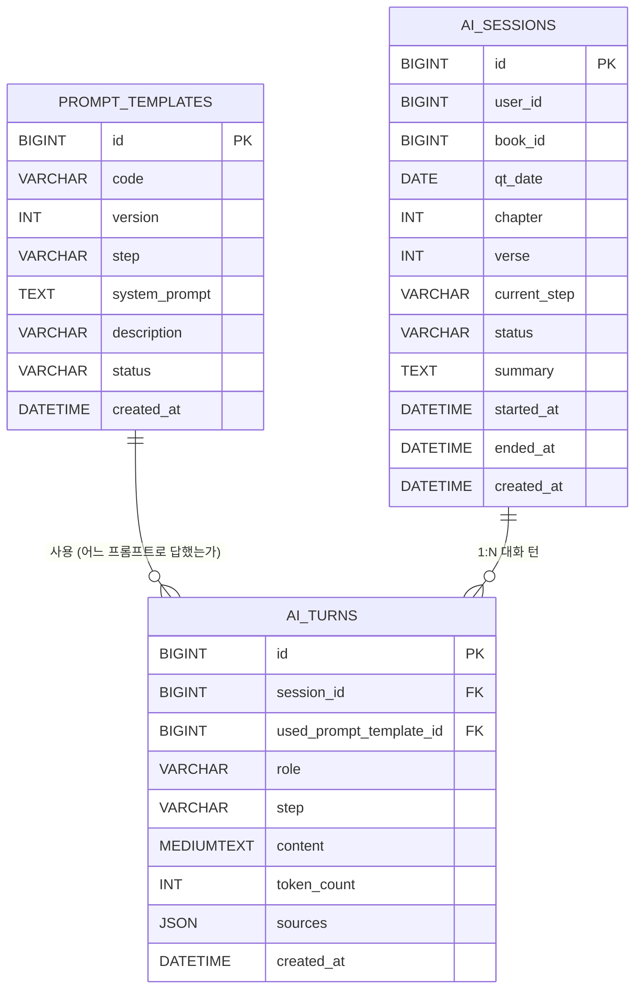
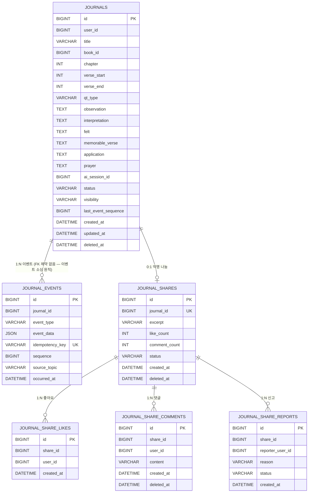
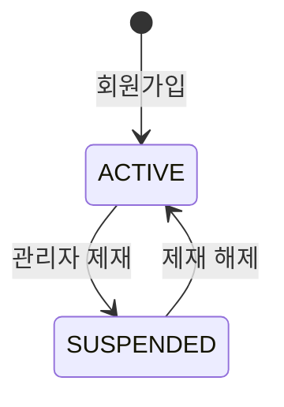
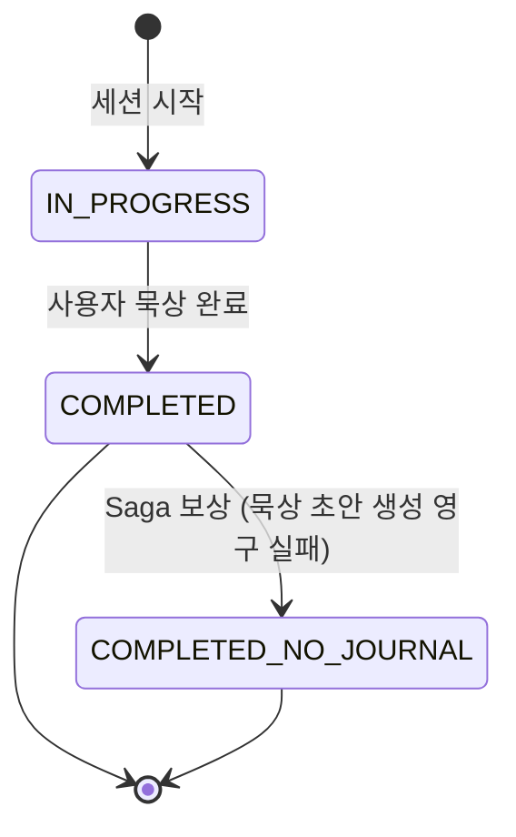
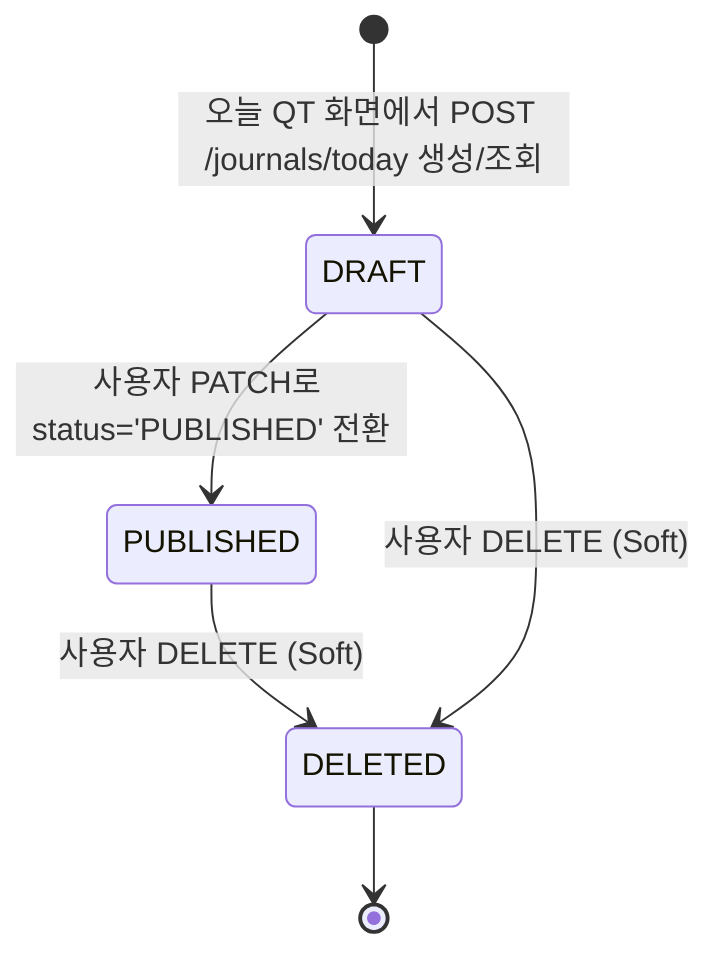

# 📊 QT-AI (큐티 AI 앱) — ERD 문서 v2.0

> **문서 버전:** v2.0
> **작성일:** 2026-05-06 (v1.0) / … / 2026-05-13 (v1.7) / **2026-05-14 (v2.0 — Modular Monolith 전환, 단일 DB·도메인 prefix, ChromaDB 제거, COMMENTARIES→EXPLANATIONS)**
> **연관 문서:** [DECISIONS.md](./DECISIONS.md) / [AGENTS.md](./AGENTS.md) / [03_아키텍처_정의서](./03_아키텍처_정의서.md) / [04_API_명세서](./04_API_명세서.md) / [23_도메인_용어사전](./23_도메인_용어사전.md)
> **데이터 원칙 (2026-05-14, ADR-0001·0003):** **Modular Monolith — 단일 DB `qtai_db` + 도메인별 테이블 prefix(`auth_`, `bible_`, `ai_`, `journal_`).** 도메인 간 데이터 공유는 도메인 Interface 호출 또는 in-process 이벤트로만. 다른 도메인 prefix 테이블 직접 JOIN 금지.

---

## 📌 변경 이력

| 버전 | 날짜 | 작성자 | 주요 변경 |
| --- | --- | --- | --- |
| v1.0 | 2026-05-06 | 강태오 | 초기 작성 — 4개 서비스 DB 분리, ChromaDB 별도, Kafka 이벤트 연결 |
| v1.1 | 2026-05-06 | 강태오 | **3차 검토 결과 25항목 일괄 패치** — PROMPT_TEMPLATES UK 정정 / AI_TURNS·AI_SESSIONS 추적 컬럼 추가 / JOURNAL_EVENTS sequence 메커니즘 / utf8mb4 표준 / MEDIUMTEXT / email 재가입 정책 / DRAFT 명칭 분리 / 토픽 표 보강 (Schema subject·DLQ) / Schema Registry 명시 / NOTIFICATION 정책 / Flyway / Outbox v1.0 한계 / event_data 예시 / 다이어그램 보강 |
| v1.1.1 | 2026-05-06 | 강태오 | 03번 v1.1 동기화 — § 1.1 다이어그램에 Auth Redis-WS (refresh blacklist), Bible Redis-Cache 분리 표기 / § 2.3 REFRESH_TOKENS Redis blacklist 정책 노트 추가 |
| v1.2 | 2026-05-07 | 강태오 | **외부 검토 9항목 일괄 패치** — § 6.1 토픽 표 8번째 추가 (`journal.creation.failed` Saga 보상) + `user.activity.tracked` 멱등성 키 형식 04번과 통일 (`read.passage:{userId}:{book}:{ch}:{v}:{epochMinute}`) + envelope에 `idempotencyKey` 필드 명시 / § 7.6 JOURNALS.status 다이어그램 정정 (PUBLISHED → DRAFT 화살표 제거 + "사용자 직접 작성" 제거 — 04번 § 7.4 INVALID_STATUS_TRANSITION 정책 정합) |
| v1.3 | 2026-05-09 | 강태오 | DECISIONS.md 정합 패치 — § 1.1 Kafka 토픽 다이어그램에 `journal.creation.failed` 추가 / § 3 헤더 + § 9.3 Redis 캐시 키 형식 수정(`passage:` → `cache:passage:kr:`) + EN 캐시 키 추가 / § 6.1 멱등성 키 snake_case→camelCase 통일({userId},{sessionId},{journalId},{epochMinute}) / 헤더 연관문서 v1.3→v1.4 |
| v1.4 | 2026-05-12 | 강태오 | Auth Service 제거·Gateway Auth 정리, Journal Service → Bible Service 통합, 묵상 4분할, 익명 나눔 테이블 추가 |
| v1.5 | 2026-05-12 | 강태오 | **D형 QT 도메인 용어사전 반영** — JOURNALS에 `observation` / `interpretation` / `qt_type` 컬럼 추가. D형 QT 4단계 완전 지원 |
| v1.6 | 2026-05-13 | 강태오 | 오전 회의 결정 반영 — 오늘 QT 기준 묵상 자동 저장을 위해 `JOURNALS.qt_date` 추가, 자유 본문 AI/묵상 제외, 사용자 입력 글자 수 제한 없음 |
| v1.7 | 2026-05-13 | 강태오 | **§ 5.2 JOURNALS `verse` 단일 컬럼 → `verse_start` + `verse_end` 분리** (DECISIONS.md §3.1·Kafka `journal.created`/`ai.session.completed` payload schema와 정합 — MVP는 verse_start == verse_end 고정, v1.1 구절 범위 확장 대비) / `idx_journals_passage` 컬럼명 갱신 / Mermaid 다이어그램 동일 적용 |
| **v2.0** | **2026-05-14** | 강태오 | **MSA→Modular Monolith 전환** — 4 schema(auth_db, bible_db, ai_db, journal_db) → 단일 DB `qtai_db` + 도메인 prefix(`auth_*`, `bible_*`, `ai_*`, `journal_*`). **ChromaDB·벡터 DB 완전 제거(§10 폐기)**. **COMMENTARIES → EXPLANATIONS 전면 리네이밍**(§3.5). **AI_TURNS.rag_sources → sources**(§4.4). **§6 Kafka → v1 in-process / v2 Kafka**로 재정의. INBOX_KEYS → `*_inbox_keys` 도메인별. 멱등성 키는 v1 in-process 핸들러에도 동일 적용(ADR-0007 갱신). |

---

## 목차

1. [데이터 아키텍처 개요](#1-데이터-아키텍처-개요)
2. [Gateway Auth ERD](#2-gateway-auth-erd) — 강태오
3. [Bible Service ERD](#3-bible-service-erd) — 이지윤·이승욱
4. [AI/RAG Service ERD](#4-airag-service-erd) — 강태오·김태혁·강상민
5. [Journal 도메인 ERD](#5-bible-service-journal-erd) — Bible팀(이지윤·이승욱·김지민)
6. [도메인 간 통신 (v1 in-process / v2 Kafka)](#6-서비스-간-연결-kafka-이벤트)
7. [상태 코드 정의](#7-상태-코드-정의)
8. [공통 패턴](#8-공통-패턴) — BaseEntity / Soft Delete / 멱등성 키 / Charset / Migration
9. [인덱스 전략](#9-인덱스-전략)
10. ~~ChromaDB 벡터 스토어~~ — **폐기 (2026-05-14 ADR-0013)**
11. [설계 결정 사항 & 주의사항](#11-설계-결정-사항--주의사항)

---

## 1. 데이터 아키텍처 개요

### 1.1 Modular Monolith — 단일 DB `qtai_db` + 도메인 prefix

```
┌─────────────────────────────────────────────────────────────────┐
│  qtai-server (단일 서비스, Port 8080)                            │
│                                                                  │
│  ┌──────────────────┐ ┌─────────────────┐ ┌──────────────────┐  │
│  │ com.qtai.        │ │ com.qtai.bible  │ │ com.qtai.ai      │  │
│  │   gatewayauth    │ │                 │ │                  │  │
│  │ JWT/OAuth        │ │ 본문·해설        │ │ DeepSeek·SSE     │  │
│  └──────────────────┘ └─────────────────┘ └──────────────────┘  │
│  ┌──────────────────┐ ┌─────────────────┐ ┌──────────────────┐  │
│  │ com.qtai.bff     │ │ com.qtai.journal│ │ com.qtai.simulator│ │
│  │ 어그리게이션      │ │ 이벤트 소싱      │ │ 장면 시뮬레이터    │ │
│  └──────────────────┘ └─────────────────┘ └──────────────────┘  │
│                                                                  │
│   ↕ in-process 이벤트 (Spring ApplicationEventPublisher          │
│      + @TransactionalEventListener(AFTER_COMMIT))                │
└─────────────────────────────────────────────────────────────────┘
                              │
              ┌───────────────┴────────────────┐
              ▼                                ▼
   ┌────────────────────────────┐  ┌────────────────────────┐
   │ MySQL: qtai_db (단일 DB)    │  │ Redis (단일 인스턴스)   │
   │                            │  │                        │
   │ auth_*    (USERS,          │  │ - cache:passage:* (24h)│
   │            REFRESH_TOKENS, │  │ - auth:refresh:revoked │
   │            OAUTH_LINKS)    │  │ - ws:session:*         │
   │ bible_*   (BOOKS,          │  │                        │
   │            KR_VERSES,      │  └────────────────────────┘
   │            EN_VERSES,
   │            EXPLANATIONS,
   │            TODAY_QT_SCHEDULE)
   │ ai_*      (PROMPT_TEMPLATES,
   │            SESSIONS, TURNS,
   │            INBOX_KEYS)
   │ journal_* (JOURNALS, EVENTS,
   │            SHARES, LIKES,
   │            COMMENTS, REPORTS,
   │            INBOX_KEYS)
   └────────────────────────────┘

   ※ v1 인프라 제외 (v2 분리 시 도입): Kafka, Schema Registry, ChromaDB, K8s
   ※ 도메인 간 통신은 v1 in-process 이벤트로, envelope 구조는 v2 Kafka와 동일
```

### 1.2 도메인 패키지 간 데이터 참조 원칙 (ADR-0001·0003)

> **절대 금지 (PR 자동 거절):**
> - 다른 도메인 prefix 테이블 직접 JOIN / 직접 SELECT
> - 다른 도메인 패키지의 Entity·Service·Repository 직접 import
> - 도메인 간 FK 외래키 (단일 DB라도 도메인 경계 유지)
>
> **허용:**
> - 도메인 Interface 호출 (`com.qtai.{domain}.api` 패키지의 public Facade)
> - in-process 이벤트 발행/구독 (`@TransactionalEventListener(AFTER_COMMIT)`)
> - 외부 ID 참조 → DB 컬럼은 단순 BIGINT, FK 제약 없음 (예: `journal_journals.user_id`는 `auth_users.id` 값을 저장하지만 FK 제약 없음)

### 1.3 BFF 도메인의 역할

- **자체 테이블 없음.** 여러 도메인의 데이터를 조합해서 단일 응답 DTO 반환.
- 입체적 묵상 화면 같은 다중 데이터 화면은 BFF가 Bible Facade + AI Facade를 `CompletableFuture`로 병렬 호출.
- Notification Aggregator 기능 포함 (§ 6.4 참조).

### 1.4 Gateway Auth 도메인의 역할

- JWT 발급·검증·Google OAuth·Refresh Rotation을 처리한다.
- 인증 데이터는 `com.qtai.gatewayauth` 도메인의 `auth_*` 테이블에 저장한다.
- JWT 검증에 필요한 키는 v1에서는 Docker `.env` / OS env, v2 분리 시 K8s Secret에 적재한다.

---

## 2. Gateway Auth ERD

> **Owner:** Bible팀 (이지윤·이승욱·김지민) / **테이블 prefix:** `auth_*` / **외부 노출 ID:** `auth_users.id` (다른 도메인이 참조)
>
> Auth는 독립 서비스가 아니라 Gateway 내부 인증 모듈이다. 계정 탈퇴는 MVP 범위에서 제외한다.

### 2.1 다이어그램



### 2.2 USERS — 회원

| 컬럼 | 타입 | NULL | 기본값 | PK/FK/UK | 설명 |
| --- | --- | --- | --- | --- | --- |
| id | BIGINT | N | AUTO_INCREMENT | PK | 외부 노출 ID (다른 서비스가 참조) |
| email | VARCHAR(254) | N | — | UK | 로그인 ID, RFC 5321 max 254 |
| nickname | VARCHAR(50) | N | — | | 표시 이름 |
| password_hash | VARCHAR(100) | Y | NULL | | bcrypt cost=12 (소셜 전용 사용자는 NULL) |
| role | VARCHAR(20) | N | 'ROLE_USER' | | § 7.3 참조 |
| status | VARCHAR(20) | N | 'ACTIVE' | | § 7.1 참조 |
| created_at | DATETIME(6) | N | CURRENT_TIMESTAMP(6) | | BaseEntity |
| updated_at | DATETIME(6) | Y | NULL | | BaseEntity |
| deleted_at | DATETIME(6) | Y | NULL | | Soft Delete (§ 8.2) |

**인덱스**
- `uk_users_email` UNIQUE ON (email)
- `idx_users_status` ON (status)
- `idx_users_deleted_at` ON (deleted_at)

#### 2.2.1 이메일 재가입 정책 (v1.0)

> 탈퇴(deleted_at IS NOT NULL) 사용자가 같은 email로 재가입 시 UNIQUE 충돌 → 다음 정책으로 회피.

**v1.0 default — 탈퇴 시 email 마스킹:**
- `deactivate()` 호출 시 email을 `u_{id}_deactivated_{epoch_ms}@deleted.local` 형식으로 UPDATE
- 원본 email은 `JOURNAL_EVENTS` 또는 별도 audit 로그에 보존 (감사 목적)
- 결과: UNIQUE 충돌 없음, 같은 email 재가입 시 새 user 행 생성

**대안 (v1.1 검토):**
- 30일 grace 기간 후 hard delete → 그 후 재가입 허용
- 또는 `email + status` 복합 UNIQUE (status='ACTIVE'에서만 unique)

ADR 후보 0010.

### 2.3 REFRESH_TOKENS — 리프레시 토큰

| 컬럼 | 타입 | NULL | 기본값 | PK/FK/UK | 설명 |
| --- | --- | --- | --- | --- | --- |
| id | BIGINT | N | AUTO_INCREMENT | PK | |
| user_id | BIGINT | N | — | FK → USERS.id | |
| token_hash | VARCHAR(100) | N | — | UK | SHA-256 해시 (원본 토큰은 저장 X) |
| expires_at | DATETIME(6) | N | — | | 만료 시각 (기본 14일) |
| revoked_at | DATETIME(6) | Y | NULL | | 폐기 시각 (로그아웃·재발급·rotation 시) |
| created_at | DATETIME(6) | N | CURRENT_TIMESTAMP(6) | | BaseEntity |

> **Refresh Blacklist (Redis-WS):** 로그아웃·rotation 시 `auth:refresh:revoked:{jti}` key 등록 (TTL = refresh 만료까지). DB의 `revoked_at` 컬럼은 감사용, 실시간 차단은 Redis로. **Access Token은 blacklist 없음** — 만료(30분)까지 유효.

**Token Rotation 정책 (v1.0):** Refresh 호출 시 기존 토큰 `revoked_at` 세팅 + 새 토큰 발급. 만료된 토큰은 야간 배치로 hard delete (90일 보관).

**인덱스**
- `uk_refresh_tokens_hash` UNIQUE ON (token_hash)
- `idx_refresh_tokens_user_id_expires` ON (user_id, expires_at)

### 2.4 OAUTH_LINKS — 소셜 로그인 연결

| 컬럼 | 타입 | NULL | 기본값 | PK/FK/UK | 설명 |
| --- | --- | --- | --- | --- | --- |
| id | BIGINT | N | AUTO_INCREMENT | PK | |
| user_id | BIGINT | N | — | FK → USERS.id | |
| provider | VARCHAR(20) | N | — | | 'GOOGLE' (v1.0 1종) |
| provider_user_id | VARCHAR(100) | N | — | | 외부 ID (Google sub) |
| linked_at | DATETIME(6) | N | CURRENT_TIMESTAMP(6) | | |

**인덱스**
- `uk_oauth_links_provider_user` UNIQUE ON (provider, provider_user_id)
- `idx_oauth_links_user_id` ON (user_id)

---

## 3. Bible 도메인 ERD

> **Owner:** Bible팀 (이지윤·이승욱·김지민) / **테이블 prefix:** `bible_*` + Redis 캐시 (`cache:passage:kr:{book}:{ch}:{v}`, TTL 24h)
>
> **데이터 출처:** § [01번 § 3.1 데이터 저작권 표](./01_프로젝트_계획서.md) — KJV (PD) + Matthew Henry (PD) + 개역한글(출처 표기) + 한글 주석 더미데이터

### 3.1 다이어그램



### 3.2 BOOKS — 성경 책 메타

| 컬럼 | 타입 | NULL | 기본값 | PK/FK/UK | 설명 |
| --- | --- | --- | --- | --- | --- |
| id | BIGINT | N | AUTO_INCREMENT | PK | |
| code | VARCHAR(10) | N | — | UK | 'GEN', 'EXO', 'MAT' (3-letter 표준 약어) |
| name_kr | VARCHAR(20) | N | — | | '창세기' |
| name_en | VARCHAR(50) | N | — | | 'Genesis' |
| testament | VARCHAR(2) | N | — | | 'OT' (구약) / 'NT' (신약) |
| book_order | INT | N | — | | 1~66 (정경 순서) |

**시드 데이터:** 66권 — **Flyway migration 시드 SQL** (`V1__seed_books.sql`)로 W0에 일괄 적재 (66 행은 즉시 가능).

### 3.3 KR_BIBLE — 한글 성경 (개역한글)

| 컬럼 | 타입 | NULL | 기본값 | PK/FK/UK | 설명 |
| --- | --- | --- | --- | --- | --- |
| id | BIGINT | N | AUTO_INCREMENT | PK | |
| book_id | BIGINT | N | — | FK → BOOKS.id | |
| chapter | INT | N | — | | 장 |
| verse | INT | N | — | | 절 |
| content | TEXT | N | — | | 본문 |
| version | VARCHAR(20) | N | 'REVISED' | | 'REVISED' (개역한글) |
| created_at | DATETIME(6) | N | CURRENT_TIMESTAMP(6) | | BaseEntity |

**인덱스**
- `uk_kr_bible_book_ch_v_ver` UNIQUE ON (book_id, chapter, verse, version)
- `idx_kr_bible_lookup` ON (book_id, chapter, verse) — 다중 JOIN 핵심

**ETL 시점:** **W1** (약 31,000 절). Flyway repeatable migration 또는 별도 ETL 스크립트.

### 3.4 EN_BIBLE — 영어 성경 (KJV)

| 컬럼 | 타입 | NULL | 기본값 | PK/FK/UK | 설명 |
| --- | --- | --- | --- | --- | --- |
| id | BIGINT | N | AUTO_INCREMENT | PK | |
| book_id | BIGINT | N | — | FK → BOOKS.id | |
| chapter | INT | N | — | | |
| verse | INT | N | — | | |
| content | TEXT | N | — | | |
| version | VARCHAR(20) | N | 'KJV' | | 'KJV' (Public Domain) |
| created_at | DATETIME(6) | N | CURRENT_TIMESTAMP(6) | | |

**인덱스**
- `uk_en_bible_book_ch_v_ver` UNIQUE ON (book_id, chapter, verse, version)
- `idx_en_bible_lookup` ON (book_id, chapter, verse)

**ETL 시점:** **W1** (약 31,000 절).

### 3.5 bible_explanations — 해설 (구 COMMENTARIES, 2026-05-14 리네이밍)

> **명칭 변경:** "주석"은 한국어 상업 주석의 저작권 회피 및 UI 일관성을 위해 **"해설"** 로 통일. DB 테이블·API 응답 필드 모두 `explanations`로 변경 (ADR-0013).
>
> **활용:** Public Domain 영어 주석(Matthew Henry 등)을 AI **비교 데이터**로 활용해 자체 생성한 해설을 저장. 원문 그대로 노출 X.

| 컬럼 | 타입 | NULL | 기본값 | PK/FK/UK | 설명 |
| --- | --- | --- | --- | --- | --- |
| id | BIGINT | N | AUTO_INCREMENT | PK | |
| book_id | BIGINT | N | — | FK → bible_books.id | |
| chapter | INT | N | — | | |
| verse | INT | N | — | | |
| content | TEXT | N | — | | AI가 생성한 해설 본문 |
| source | VARCHAR(50) | N | — | | 'AI_GENERATED' (편집자 검증 통과) / 'MATTHEW_HENRY_REFERENCE' (비교 데이터 기록용) |
| reference_ids | JSON | Y | NULL | | 생성에 사용된 비교 데이터의 출처 식별자 배열 |
| language | VARCHAR(2) | N | — | | 'EN' / 'KR' |
| editor_verified_at | DATETIME(6) | Y | NULL | | 편집자 에이전트 검증 통과 시각 |
| created_at | DATETIME(6) | N | CURRENT_TIMESTAMP(6) | | |

**인덱스**
- `idx_explanations_lookup` ON (book_id, chapter, verse, language) — 다중 JOIN 핵심
- `idx_explanations_source` ON (source)

**ETL 시점:** **W1~W2** (Matthew Henry MD 변환 → 비교 데이터 적재 → AI 해설 생성 → 편집자 검증 → `bible_explanations` 적재).

> **다중 JOIN 패턴:** `bible_kr_verses` + `bible_en_verses` + `bible_explanations` 를 `(book_id, chapter, verse)` 동일 인덱스로 JOIN. 핫셋(자주 조회되는 100절)은 Redis 캐시.
> **해설 생성 파이프라인:** AGENTS.md "해설 생성 파이프라인" 절 참조. 메커니즘 상세는 강상민 정의.

---

## 4. AI 도메인 ERD

> **Owner:** 강상민 (주도) / **테이블 prefix:** `ai_*` / ~~ChromaDB~~ — 사용 안 함 (ADR-0013)
>
> **비즈니스 책임:** QT A~D 가이드 프롬프트 설계 / 출처 기반 1회성 Q&A / 사용한 `bible_explanations.id` 배열을 `sources`로 응답 인용

### 4.1 다이어그램



> **다이어그램 정정 (v1.1):** `PROMPT_TEMPLATES.code`의 단독 UK 표기 제거. 실제 UNIQUE는 `(code, version)` 복합 — 같은 code의 v1, v2가 공존해야 하므로 단독 UK는 부정확.

### 4.2 PROMPT_TEMPLATES — 큐티 A~D 프롬프트 템플릿

| 컬럼 | 타입 | NULL | 기본값 | PK/FK/UK | 설명 |
| --- | --- | --- | --- | --- | --- |
| id | BIGINT | N | AUTO_INCREMENT | PK | |
| code | VARCHAR(50) | N | — | | 'A_OBSERVATION', 'B_INTERPRETATION', 'C_APPLICATION', 'D_DECISION' |
| version | INT | N | 1 | | 프롬프트 개정 버전 |
| step | VARCHAR(2) | N | — | | 'A', 'B', 'C', 'D' |
| system_prompt | TEXT | N | — | | LLM 시스템 프롬프트 본문 |
| description | VARCHAR(500) | Y | NULL | | 사용 의도 설명 |
| status | VARCHAR(20) | N | 'ACTIVE' | | § 7.4 참조 |
| created_at | DATETIME(6) | N | CURRENT_TIMESTAMP(6) | | |

**인덱스**
- `uk_prompt_templates_code_version` UNIQUE ON (code, version) — 같은 code의 다른 version은 공존
- `idx_prompt_templates_step_status` ON (step, status)

### 4.3 AI_SESSIONS — AI 질문 세션

| 컬럼 | 타입 | NULL | 기본값 | PK/FK/UK | 설명 |
| --- | --- | --- | --- | --- | --- |
| id | BIGINT | N | AUTO_INCREMENT | PK | 외부 노출 ID (Journal이 참조) |
| user_id | BIGINT | N | — | | Gateway 인증 사용자 ID 참조 (FK 제약 없음) |
| book_id | BIGINT | N | — | | Bible Service `books.id` 참조 (FK 제약 없음) |
| chapter | INT | N | — | | |
| verse | INT | N | — | | |
| guide_step | VARCHAR(2) | N | 'A' | | 질문이 연결된 QT 가이드 단계. 자동 단계 진행 용도가 아님 |
| status | VARCHAR(20) | N | 'IN_PROGRESS' | | § 7.5 참조 |
| **summary** | TEXT | Y | NULL | | **사용자가 "묵상 완료"를 선택할 때 생성된 요약**. `ai.session.completed` 이벤트의 summary 필드 source. |
| started_at | DATETIME(6) | N | CURRENT_TIMESTAMP(6) | | |
| ended_at | DATETIME(6) | Y | NULL | | 완료 시각 |
| created_at | DATETIME(6) | N | CURRENT_TIMESTAMP(6) | | BaseEntity |

**인덱스**
- `idx_ai_sessions_user_id_started` ON (user_id, started_at DESC) — 사용자별 최근 세션 조회
- `idx_ai_sessions_status` ON (status)
- `idx_ai_sessions_passage` ON (book_id, chapter, verse)

### 4.4 AI_TURNS — 질문·응답 턴

| 컬럼 | 타입 | NULL | 기본값 | PK/FK/UK | 설명 |
| --- | --- | --- | --- | --- | --- |
| id | BIGINT | N | AUTO_INCREMENT | PK | |
| session_id | BIGINT | N | — | FK → AI_SESSIONS.id | |
| **used_prompt_template_id** | BIGINT | Y | NULL | FK → PROMPT_TEMPLATES.id | **이 턴에 적용된 프롬프트 템플릿 (role=ASSISTANT 시 권장, USER/SYSTEM은 NULL).** 프롬프트 개정 후 회귀 분석에 필수. |
| role | VARCHAR(20) | N | — | | 'USER' / 'ASSISTANT' / 'SYSTEM' |
| step | VARCHAR(2) | **Y** | **NULL** | | 질문이 연결된 QT 가이드 단계 'A','B','C','D' (role=SYSTEM 시 NULL) |
| content | **MEDIUMTEXT** | N | — | | **메시지 본문 (LLM 응답이 길어 16MB까지 허용).** SSE 스트리밍 완료 후 적재 |
| token_count | INT | Y | NULL | | LLM 토큰 사용량 (요금·메트릭) |
| **sources** | JSON | Y | NULL | | **사용한 사전 적재 해설 출처 배열** — `bible_explanations.id` 목록. (구 `rag_sources`, 2026-05-14 ADR-0013 리네이밍) |
| created_at | DATETIME(6) | N | CURRENT_TIMESTAMP(6) | | |

**인덱스**
- `idx_ai_turns_session_id_created` ON (session_id, created_at) — 세션별 시간순 조회
- `idx_ai_turns_role` ON (role)
- `idx_ai_turns_template_id` ON (used_prompt_template_id) — 프롬프트 버전별 회귀 분석

> **신학 가드레일:** ASSISTANT 턴에 `sources` 가 비어 있으면 PR 머지 금지 (강상민 검수). 출처 = `bible_explanations.id` 배열 (사전 적재된 해설 row 참조).

---

## 5. Bible Service Journal ERD

> **Owner:** 이지윤·이승욱 / **DB schema:** `bible_db`
>
> **이벤트 소싱 패턴:** `JOURNAL_EVENTS`가 묵상 기록 변경 이력의 source of truth, `JOURNALS`는 재구성 가능한 read model. 별도 Journal Service는 사용하지 않고 Bible Service 안에서 담당한다.

### 5.1 다이어그램



### 5.2 JOURNALS — 묵상 노트 (read model)

| 컬럼 | 타입 | NULL | 기본값 | PK/FK/UK | 설명 |
| --- | --- | --- | --- | --- | --- |
| id | BIGINT | N | AUTO_INCREMENT | PK | |
| user_id | BIGINT | N | — | | Gateway 인증 사용자 ID 참조 (FK 제약 없음) |
| title | VARCHAR(200) | N | — | | **자동 생성: `'{name_kr} {chapter}:{verse} 묵상'` (예: '창세기 1:1 묵상').** 사용자가 수동 변경 가능. `name_kr`은 BFF가 Bible Service에서 조회 후 저장 |
| book_id | BIGINT | N | — | | Bible Service 참조 (FK 제약 없음) |
| qt_date | DATE | N | — | | 오늘 QT 기준 날짜. MVP에서는 사용자별·날짜별 묵상 DRAFT를 1개만 둔다 |
| chapter | INT | N | — | | |
| **verse_start** | INT | N | — | | **오늘 QT 본문 시작 절. MVP는 한 절 고정이므로 verse_start == verse_end (DECISIONS.md §3.1)** |
| **verse_end** | INT | N | — | | **오늘 QT 본문 끝 절. v1.1에서 구절 범위 확장 시 사용** |
| **qt_type** | **VARCHAR(2)** | **Y** | **NULL** | | **A/B/C/D형 QT 유형. 23_도메인_용어사전 참조** |
| **observation** | **TEXT** | **Y** | **NULL** | | **관찰 단계: 단락나누기, 재진술, 육하원칙 분석 내용** |
| **interpretation** | **TEXT** | **Y** | **NULL** | | **해석/연구와묵상 단계: 하나님은 어떤 분이신가? + 연구 내용** |
| felt | TEXT | Y | NULL | | 본문을 읽고 느낌 단계: 마음의 반응 |
| memorable_verse | TEXT | Y | NULL | | 기억할 구절 |
| application | TEXT | Y | NULL | | 적용 단계: 구체적 행동 결단 |
| prayer | TEXT | Y | NULL | | 기도 내용 |
| ai_session_id | BIGINT | Y | NULL | | AI Service `ai_sessions.id` 참조 (FK 제약 없음) |
| status | VARCHAR(20) | N | 'DRAFT' | | § 7.6 참조 |
| visibility | VARCHAR(30) | N | 'PRIVATE' | | `PRIVATE`, `ANONYMOUS_SHARED` |
| **last_event_sequence** | BIGINT | N | 0 | | **JOURNAL_EVENTS.sequence 부여 시 atomic 증분용 카운터** (§ 5.4 참조) |
| created_at | DATETIME(6) | N | CURRENT_TIMESTAMP(6) | | BaseEntity |
| updated_at | DATETIME(6) | Y | NULL | | BaseEntity |
| deleted_at | DATETIME(6) | Y | NULL | | Soft Delete |

**인덱스**
- `idx_journals_user_id_created` ON (user_id, created_at DESC) — 마이페이지 리스트
- `idx_journals_user_id_status` ON (user_id, status)
- `uk_journals_user_qt_date` UNIQUE ON (user_id, qt_date) — 오늘 QT DRAFT 멱등 생성/조회
- `idx_journals_user_id_qt_type` ON (user_id, qt_type) — QT 유형별 필터링
- `idx_journals_passage` ON (book_id, chapter, verse_start) — 인기 구절 통계용 (MVP는 verse_start == verse_end 고정이므로 verse_start만 인덱스. v1.1 범위 확장 시 (verse_start, verse_end) 복합 인덱스 검토)
- `idx_journals_ai_session_id` ON (ai_session_id) — AI 대화 → Journal 연결 조회

### 5.3 JOURNAL_EVENTS — 이벤트 소싱 스토어 (source of truth)

| 컬럼 | 타입 | NULL | 기본값 | PK/FK/UK | 설명 |
| --- | --- | --- | --- | --- | --- |
| id | BIGINT | N | AUTO_INCREMENT | PK | |
| journal_id | BIGINT | N | — | | journals.id 참조 (FK 제약은 두지 않음 — 이벤트 소싱 원칙: journal 하드 삭제되어도 이벤트 보존) |
| event_type | VARCHAR(50) | N | — | | 'CREATED' / 'UPDATED' / 'PUBLISHED' / 'DELETED' / 'RESTORED' |
| event_data | JSON | N | — | | 변경 전후 스냅샷 또는 델타 (§ 5.5 예시) |
| idempotency_key | VARCHAR(100) | N | — | UK | Kafka 컨슈머 멱등성 키 (외부 이벤트 중복 방지) |
| sequence | BIGINT | N | — | | journal 내 이벤트 순서 (1부터 시작, journal 단위 증가) |
| source_topic | VARCHAR(100) | Y | NULL | | 외부 Kafka 토픽 (예: 'ai.session.completed') |
| occurred_at | DATETIME(6) | N | CURRENT_TIMESTAMP(6) | | |

**인덱스**
- `uk_journal_events_idempotency` UNIQUE ON (idempotency_key) — **외부 이벤트 멱등성 핵심**
- `uk_journal_events_journal_seq` UNIQUE ON (journal_id, sequence) — **순서 무결성 핵심**
- `idx_journal_events_occurred_at` ON (occurred_at) — 시간 순 통계

> **이승욱 작업 카드 6개 디테일 항목** (운영 노트 § 3 참조): ① JOURNAL_EVENTS 적재 ② JOURNALS read model 재구성 ③ idempotency_key 멱등성 ④ DLQ 설정 ⑤ 재처리 시나리오 ⑥ 통합 테스트.

### 5.4 JOURNAL_SHARES — 익명 나눔

| 컬럼 | 타입 | NULL | 기본값 | PK/FK/UK | 설명 |
| --- | --- | --- | --- | --- | --- |
| id | BIGINT | N | AUTO_INCREMENT | PK | |
| journal_id | BIGINT | N | — | UK | 공개된 묵상 노트 ID. 한 묵상은 하나의 활성 나눔만 가진다 |
| excerpt | VARCHAR(1000) | N | — | | 사용자가 공개한 일부 내용. 작성자 정보와 기도 세부 내용은 기본 노출하지 않는다 |
| like_count | INT | N | 0 | | 목록 빠른 표시용 denormalized count |
| comment_count | INT | N | 0 | | 목록 빠른 표시용 denormalized count |
| status | VARCHAR(20) | N | 'ACTIVE' | | `ACTIVE`, `HIDDEN`, `DELETED` |
| created_at | DATETIME(6) | N | CURRENT_TIMESTAMP(6) | | |
| deleted_at | DATETIME(6) | Y | NULL | | 공개 취소 시 soft delete |

**인덱스**
- `uk_journal_shares_journal_id` UNIQUE ON (journal_id)
- `idx_journal_shares_status_created` ON (status, created_at DESC)

### 5.5 JOURNAL_SHARE_LIKES / COMMENTS / REPORTS — 최소 나눔 기능

| 테이블 | 핵심 컬럼 | 제약·정책 |
| --- | --- | --- |
| JOURNAL_SHARE_LIKES | share_id, user_id, created_at | `uk_share_likes_share_user` UNIQUE로 중복 좋아요 방지 |
| JOURNAL_SHARE_COMMENTS | share_id, user_id, content, created_at, deleted_at | MVP에서는 댓글 작성만 제공하고 댓글 비활성화 옵션은 v1.1 이후 |
| JOURNAL_SHARE_REPORTS | share_id, reporter_user_id, reason, detail, status, created_at | 신고는 관리자 확인 대상으로 저장. 자동 숨김은 v1.1 이후 검토 |

> **커뮤니티 경계:** 팔로우, 실시간 댓글 피드, 랭킹 중심 추천, 세분화 공개 범위는 MVP 제외. 기본값은 항상 `PRIVATE`이며, 사용자가 명시적으로 선택한 기록만 `ANONYMOUS_SHARED`가 된다.

### 5.6 JOURNAL_EVENTS.sequence 부여 메커니즘

> `sequence`는 journal 단위로 1부터 증가. 단순 AUTO_INCREMENT는 전역 ID라 부적절. 다음 패턴으로 atomic 증분 보장.

**v1.0 표준 — DB 락 + 카운터:**

```java
@Transactional
public void appendEvent(Long journalId, EventType type, JsonNode data, String idempotencyKey) {
    // 1. JOURNALS 행 잠금 + last_event_sequence 증가
    Journal journal = journalRepository.findByIdForUpdate(journalId)
        .orElseThrow();  // SELECT ... FOR UPDATE
    
    long nextSeq = journal.getLastEventSequence() + 1;
    journal.setLastEventSequence(nextSeq);
    
    // 2. JOURNAL_EVENTS INSERT (idempotency_key UNIQUE 제약 + (journal_id, sequence) UNIQUE 제약)
    JournalEvent event = JournalEvent.builder()
        .journalId(journalId)
        .eventType(type)
        .eventData(data)
        .idempotencyKey(idempotencyKey)
        .sequence(nextSeq)
        .build();
    journalEventRepository.save(event);
    
    // 3. 같은 트랜잭션에서 read model 갱신 (또는 별도 컨슈머)
    journal.applyEvent(event);
}
```

**왜 이 방식인가:**
- `idempotency_key UNIQUE` — 외부 이벤트 중복 방어 (DUPLICATE 시 트랜잭션 롤백 → 정상 무시)
- `(journal_id, sequence) UNIQUE` — race condition 시 한 트랜잭션만 성공
- `SELECT FOR UPDATE` — 동시 INSERT 시 sequence 충돌 차단

**대안 (v1.1 검토):** Outbox 패턴 + 이벤트 소비자가 sequence 부여. ADR 후보 0011.

### 5.7 JOURNAL_EVENTS.event_data JSON 스키마 예시

#### 5.7.1 `CREATED` 이벤트

```json
{
  "journal_id": 1234,
  "user_id": 5678,
  "passage": {
    "book_id": 1,
    "book_code": "GEN",
    "chapter": 1,
    "verse": 1
  },
  "qt_date": "2026-05-13",
  "ai_session_id": 9012,
  "title": "창세기 1:1 묵상",
  "qt_type": "D",
  "observation": "",
  "interpretation": "",
  "felt": "",
  "memorable_verse": "",
  "application": "",
  "prayer": "",
  "visibility": "PRIVATE"
}
```

#### 5.7.2 `UPDATED` 이벤트

```json
{
  "journal_id": 1234,
  "delta": {
    "title": {"old": "창세기 1:1 묵상", "new": "창세기 1:1 — 시작"},
    "qt_type": {"old": "A", "new": "D"},
    "observation": {"old": "", "new": "하나님이 말씀으로 천지를 창조하셨다..."},
    "interpretation": {"old": "", "new": "하나님은 능력의 하나님이시다..."},
    "felt": {"old": "...", "new": "..."},
    "application": {"old": "...", "new": "..."}
  },
  "updated_by": 5678
}
```

#### 5.7.3 `PUBLISHED` / `SHARED` / `UNSHARED` / `DELETED`

```json
// PUBLISHED
{ "journal_id": 1234, "from_status": "DRAFT", "by_user_id": 5678 }

// SHARED
{ "journal_id": 1234, "visibility": "ANONYMOUS_SHARED", "share_id": 9876, "by_user_id": 5678 }

// UNSHARED
{ "journal_id": 1234, "visibility": "PRIVATE", "share_id": 9876, "by_user_id": 5678 }

// DELETED (soft)
{ "journal_id": 1234, "by_user_id": 5678, "soft_delete": true }
```

---

## 6. 도메인 간 통신 (v1 in-process / v2 Kafka)

> **2026-05-14 갱신 (ADR-0001·0004·0007):** Modular Monolith v1에서 도메인 간 통신은 Spring `ApplicationEventPublisher` + `@TransactionalEventListener(AFTER_COMMIT)` in-process 이벤트로 처리. envelope·idempotencyKey 패턴은 v2 Kafka 전환을 대비해 동일하게 유지하므로, publisher만 교체하면 v2로 이전 가능.

### 6.1 이벤트 정의 (eventType별)

| eventType | Producer 도메인 | Consumer 도메인 | 페이로드 핵심 필드 | 멱등성 키 | Schema Subject (v2 Kafka용) | DLQ 토픽 (v2) |
| --- | --- | --- | --- | --- | --- | --- |
| `user.activity.tracked` | bff | bible | `user_id`, `activity_type`, `passage`, `occurred_at`, **`idempotencyKey`** | `read.passage:{userId}:{book}:{ch}:{v}:{epochMinute}` | `user.activity.tracked-value` | `user.activity.tracked.DLQ` |
| `ai.session.completed` | ai | journal | `session_id`, `user_id`, `qt_date`, `passage`, `guide_step`, `summary` | `ai.session.completed:{sessionId}` | `ai.session.completed-value` | `ai.session.completed.DLQ` |
| `journal.created` | journal | bff (Notification), 통계(v1.1) | `journal_id`, `user_id`, `passage`, `created_at` | `journal.created:{journalId}` | `journal.created-value` | `journal.created.DLQ` |
| `journal.updated` | journal | 통계(v1.1) | `journal_id`, `delta`, `updated_at` | `journal.updated:{journalId}:{seq}` | `journal.updated-value` | `journal.updated.DLQ` |
| `journal.deleted` | journal | 통계(v1.1) | `journal_id`, `deleted_at` | `journal.deleted:{journalId}` | `journal.deleted-value` | `journal.deleted.DLQ` |
| `notification.requested` | (다수 도메인) | bff (Notification) | `user_id`, `type`, `payload` | `{type}:{userId}:{occurredAt}` | `notification.requested-value` | `notification.requested.DLQ` |
| `journal.creation.failed` | journal | ai (Saga 보상) | `session_id`, `original_idempotency_key`, `error`, `failed_at` | `journal.creation.failed:{sessionId}` | `journal.creation.failed-value` | `journal.creation.failed.DLQ` |

> **v1 in-process:** `ApplicationEventPublisher.publishEvent(new XxxEvent(envelope))` 발행 → 다른 도메인 패키지의 `@TransactionalEventListener(AFTER_COMMIT)` 핸들러가 같은 JVM 안에서 수신. DLQ 개념은 v2 Kafka 도입 시 적용.
> **v2 Kafka 전환 시:** Apicurio Registry에 위 Schema Subject로 등록. publisher만 KafkaTemplate으로 교체.

### 6.2 이벤트 페이로드 표준 (전 토픽 공통)

```json
{
  "eventId": "evt_01HZX...",          // ULID, 메시지 식별자
  "eventType": "ai.session.completed",
  "eventVersion": 1,                   // 스키마 버전 (Schema Registry subject 버전과 일치)
  "schemaSubject": "ai.session.completed-value",  // Registry 검증
  "idempotencyKey": "...",             // ⭐ v1.2 — 컨슈머 멱등성 키 (§ 6.1 표 형식)
  "occurredAt": "2026-05-26T14:30:00Z",
  "traceId": "trace_abc...",           // 분산 트레이싱 propagation
  "producerService": "ai-service",     // 디버깅·감사
  "data": { ... }                      // 토픽별 본문
}
```

> **`eventId` vs `idempotencyKey` (v1.2):** `eventId`는 메시지 단위 식별자(ULID, 매 발행마다 새로움). `idempotencyKey`는 비즈니스 의미 단위 (같은 사용자가 같은 분에 같은 구절을 읽으면 같은 키 → 컨슈머가 dedup). 둘 다 필수.

**스키마 형식:** v1.0은 **JSON Schema** (Apicurio 기본). v1.1에 Avro 검토 (성능·압축 ↑).

### 6.3 Saga 패턴 적용 시나리오

> **시나리오:** 사용자가 AI 대화를 완료하면 이미 생성/조회된 오늘 QT Journal에 AI 요약이 첨부되어야 함. 둘 중 하나가 실패하면 보상 트랜잭션 필요.

```
[1] ai 도메인: ai_sessions.status = 'COMPLETED' (로컬 트랜잭션 + summary 생성)
[2] ai 도메인: ai.session.completed in-process 이벤트 발행 (v1 ApplicationEventPublisher)
[3] journal 도메인: @TransactionalEventListener(AFTER_COMMIT) 핸들러 수신 →
    user_id + qt_date 기준 journal_journals 조회 → ai_session_id/summary 첨부 +
    journal_events UPDATED 적재 (journal_inbox_keys UNIQUE로 멱등성 검증)
[4] 영구 실패 시: journal.creation.failed 이벤트 발행 → ai 도메인 핸들러가
    ai_sessions.status = COMPLETED_NO_JOURNAL 마킹
```

**v1 Modular Monolith의 장점:** AI 트랜잭션과 Journal 핸들러가 같은 JVM에서 동작하므로 `@TransactionalEventListener(AFTER_COMMIT)` 보장으로 메시지 유실이 사실상 없음. v1에서는 Outbox 패턴 불필요.

**v2 Kafka 전환 시 한계 부활:** publish 실패 시 이벤트 유실 가능. Outbox 패턴 또는 Transactional Producer 도입을 v2 분리 트리거와 함께 재논의.

### 6.4 Notification 처리 정책 (v1.0)

> **v1.0 default — Stateless WebSocket Push.** 별도 NOTIFICATION_LOG 테이블 없음.

**흐름:**
```
[Producer] → notification.requested 이벤트 발행
    ↓ Kafka
[Notification Aggregator (BFF의 일부)] 컨슈머 수신
    ↓ WebSocket 활성 세션 조회 (Redis pub/sub 또는 in-memory)
[활성] WebSocket 즉시 푸시 + ack 무관 (best-effort)
[비활성] 폐기 (사용자가 다음 활동에서 자연 인지)
```

**v1.1 검토:** NOTIFICATION_LOG 테이블 + 재시도·읽음 추적·푸시 알림(FCM) 통합. ADR 후보 0012.

---

## 7. 상태 코드 정의

### 7.1 USERS.status



| 상태 | 설명 | 다음 상태 | 전이 트리거 |
| --- | --- | --- | --- |
| ACTIVE | 정상 | SUSPENDED | — |
| SUSPENDED | 제재 | ACTIVE | 관리자 (ROLE_ADMIN) |

> 계정 탈퇴와 `DEACTIVATED` 상태, `user.deactivated` 이벤트는 MVP 제외이며 v1.1 이후 검토한다.

### 7.2 (예약) 향후 회원 부가 상태

> v1.0에서는 `status` 단일 컬럼으로 충분. v1.1에서 이메일 인증·OTP 등 추가 시 별도 테이블 분리 검토.

### 7.3 USERS.role

| 코드 | 설명 | 주요 권한 |
| --- | --- | --- |
| ROLE_USER | 일반 회원 | 본인 데이터 CRUD, AI 대화, Journal |
| ROLE_ADMIN | 관리자 | 대시보드, 통계, 사용자 제재 |

**v1.0 첫 ROLE_ADMIN 부여:** Flyway 시드 SQL (`V2__seed_admin.sql`)로 강태오 계정 1개 부여. 추가 부여는 운영자가 직접 `UPDATE users SET role='ROLE_ADMIN' WHERE id=...` (관리 화면은 v1.1).

### 7.4 PROMPT_TEMPLATES.status

> **명칭 변경 (v1.1):** `DRAFT` → `EDITING` (JOURNALS.status의 DRAFT와 명칭 충돌 회피)

| 상태 | 설명 |
| --- | --- |
| ACTIVE | 현재 사용 중 (각 step당 1건이 권장) |
| DEPRECATED | 사용 중지 (이력은 보존) |
| EDITING | 작성·검수 중 (서비스 노출 X) |

### 7.5 AI_SESSIONS.status



| 상태 | 설명 | 다음 상태 | 전이 트리거 |
| --- | --- | --- | --- |
| IN_PROGRESS | 진행 중 | COMPLETED | — |
| COMPLETED | 완료 (사용자가 "묵상 완료" 선택) | COMPLETED_NO_JOURNAL | `POST /ai/sessions/{sessionId}/complete` |
| COMPLETED_NO_JOURNAL | 완료했으나 묵상 초안 생성 영구 실패 | — | Saga 보상 (§ 6.3) |

### 7.6 JOURNALS.status (v1.2 정정 — 04번 § 7.4 정합)



| 상태 | 설명 | 다음 상태 | 전이 트리거 |
| --- | --- | --- | --- |
| DRAFT | 임시 저장 | PUBLISHED, DELETED | `POST /api/v1/journals/today`가 생성/조회 (`user_id + qt_date` UNIQUE) |
| PUBLISHED | 정식 저장 | DELETED only | 사용자 PATCH. **PUBLISHED → DRAFT 금지 (04번 § 7.4 `INVALID_STATUS_TRANSITION` 422)** |
| DELETED | Soft 삭제 | (30일 후 hard delete 후보) | 사용자 DELETE |

> **v1.6 정정 사유:** 2026-05-13 오전 회의에서 Journal은 오늘 QT 화면 진입/기록 시작 시 `POST /api/v1/journals/today`로 확보하고, AI 완료는 같은 Journal에 요약을 첨부하기로 확정했다. 자유 본문 `POST /api/v1/journals`는 없음.

---

## 8. 공통 패턴

### 8.1 BaseEntity (전 서비스 공통)

> 모든 엔티티에 공통으로 적용하는 생성일·수정일 자동 관리 패턴.

```java
@MappedSuperclass
@EntityListeners(AuditingEntityListener.class)
@Getter
public abstract class BaseEntity {

    @CreatedDate
    @Column(name = "created_at", updatable = false)
    private LocalDateTime createdAt;

    @LastModifiedDate
    @Column(name = "updated_at")
    private LocalDateTime updatedAt;
}
```

각 서비스 Application 클래스에 `@EnableJpaAuditing` 활성화 필수.

#### 8.1.1 배포 방식 (v1.0)

> **v1.0 default — 소스 복사 (carbon copy):** 강태오가 표준 BaseEntity를 작성하고 6 service에 동일 코드를 복사. 변경 시 강태오가 6 service 동시 sync 책임.
>
> **v1.1 검토:** 별도 maven artifact (`qt-ai-common`)로 분리 → 의존성 버전 관리 + nexus 배포. ADR 후보 0009.

**DB 컬럼 기준**

| 컬럼 | 타입 | NULL | 기본값 | 설명 |
| --- | --- | --- | --- | --- |
| created_at | DATETIME(6) | N | CURRENT_TIMESTAMP(6) | 자동 삽입 |
| updated_at | DATETIME(6) | Y | NULL | 자동 갱신 |

### 8.2 Soft Delete 적용 엔티티

| 서비스 | 엔티티 | 적용 여부 | 이유 |
| --- | --- | --- | --- |
| Auth | USERS | ✅ | 탈퇴 후 30일 복구 가능, 감사 이력 |
| Auth | REFRESH_TOKENS | ❌ | revoked_at 컬럼으로 폐기 추적 |
| Auth | OAUTH_LINKS | ❌ | hard delete (재연결 시 새로 생성) |
| Bible | BOOKS | ❌ | 정적 메타 데이터 (66권 고정), 삭제 시나리오 없음 |
| Bible | KR_BIBLE / EN_BIBLE / bible_explanations | ❌ | 정적 데이터, 삭제 자체가 드묾 |
| AI | AI_SESSIONS / AI_TURNS | ❌ | 로그 성격, 보존 |
| AI | PROMPT_TEMPLATES | ❌ | status='DEPRECATED'로 대체 |
| Journal | JOURNALS | ✅ | 사용자 삭제 후 30일 복구 가능 + 감사 |
| Journal | JOURNAL_EVENTS | ❌ | 이벤트 소싱 — 절대 삭제 X |

**구현 예 (USERS):**

```java
@Entity
@Table(name = "users")
@SQLRestriction("deleted_at IS NULL")  // SELECT 시 자동 필터
public class User extends BaseEntity {

    @Id @GeneratedValue(strategy = GenerationType.IDENTITY)
    private Long id;

    // ... 다른 필드

    @Column(name = "deleted_at")
    private LocalDateTime deletedAt;

    // 계정 탈퇴는 MVP 제외. 필요 시 v1.1에서 별도 정책과 함께 추가한다.
}
```

### 8.3 Kafka 컨슈머 멱등성 키 표준

> 1차(HMS) 트랜잭션 누락 + (신규) Kafka 멱등성 누락 가드레일.

**규칙:**
1. 모든 Kafka 컨슈머는 처리 시 **idempotency_key** 를 검사한다.
2. 멱등성 키는 토픽별로 표준 정의 (§ 6.1 표).
3. 검사 방법: 컨슈머 측 DB(예: `JOURNAL_EVENTS.idempotency_key UNIQUE`)에 INSERT 시도 → DUPLICATE KEY 발생 시 무시 (skip).

```java
@KafkaListener(topics = "ai.session.completed")
public void handle(SessionCompletedEvent event) {
    String idempotencyKey = "ai.session.completed:" + event.getSessionId();
    try {
        journalService.attachAiSummary(event, idempotencyKey);
    } catch (DataIntegrityViolationException e) {
        log.info("Duplicate event skipped: {}", idempotencyKey);  // 정상 무시
    }
}
```

### 8.4 Charset · Collation 표준 (전 서비스 강제)

> 한글·이모지·다국어 문자 누락 방지.

| 항목 | 표준 |
| --- | --- |
| Database charset | `utf8mb4` |
| Database collation | `utf8mb4_unicode_ci` |
| Connection URL | `useUnicode=true&characterEncoding=utf8mb4` |
| MySQL 서버 설정 | `character-set-server=utf8mb4`, `collation-server=utf8mb4_unicode_ci` |

**Flyway migration 첫 줄에 강제:**

```sql
-- V1__init.sql 첫 줄
CREATE DATABASE IF NOT EXISTS auth_db
  CHARACTER SET utf8mb4
  COLLATE utf8mb4_unicode_ci;

USE auth_db;

-- 모든 CREATE TABLE에 명시
CREATE TABLE users (
  ...
) ENGINE=InnoDB DEFAULT CHARSET=utf8mb4 COLLATE=utf8mb4_unicode_ci;
```

### 8.5 DB 마이그레이션 표준 — Flyway

> 각 서비스가 자기 `db/migration` 디렉토리에서 독립 관리.

**디렉토리 구조 (서비스별):**

```
{service}-service/src/main/resources/db/migration/
├── V1__init.sql                 # 초기 스키마
├── V2__seed_master.sql          # 시드 데이터 (BOOKS·관리자 계정 등)
├── V3__add_summary_to_sessions.sql  # 컬럼 추가
├── V4__add_qt_columns_to_journals.sql  # D형 QT 컬럼 추가 (qt_type, observation, interpretation)
└── R__rebuild_views.sql         # repeatable (뷰·인덱스 재생성)
```

**원칙:**
- `V{n}__{이름}.sql` — 한 번만 실행 (versioned)
- `R__{이름}.sql` — 매번 실행 (repeatable, 뷰 등)
- 운영 배포 시 자동 실행 (`spring.flyway.enabled=true`)
- 시드 데이터는 idempotent SQL (`INSERT IGNORE` 또는 `ON DUPLICATE KEY UPDATE`)

---

## 9. 인덱스 전략

### 9.1 설계 원칙

| 원칙 | 설명 |
| --- | --- |
| 조회 빈도 | WHERE / ORDER BY 자주 쓰이는 컬럼 |
| 카디널리티 | 다양한 값일수록 인덱스 효과 큼 |
| 복합 인덱스 | 함께 쓰이는 컬럼 묶음. 동등 조건 먼저, 범위 조건 뒤 |
| 쓰기 비용 | 인덱스 ↑ → INSERT/UPDATE 성능 ↓ |
| 페이징 | `ORDER BY {col} DESC LIMIT N` 패턴은 `(col)` 인덱스 필수 |

### 9.2 핵심 인덱스 요약 (서비스별)

| 서비스 | 테이블 | 컬럼 | 종류 | 이유 |
| --- | --- | --- | --- | --- |
| Auth | USERS | email | UNIQUE | 로그인·중복 검증 |
| Auth | REFRESH_TOKENS | (user_id, expires_at) | INDEX | 사용자별 활성 토큰 조회 |
| Bible | BOOKS | code | UNIQUE | 책 코드 조회·시드 idempotency |
| Bible | KR_BIBLE | (book_id, chapter, verse) | INDEX | 다중 JOIN 핵심 |
| Bible | EN_BIBLE | (book_id, chapter, verse) | INDEX | 다중 JOIN 핵심 |
| Bible | bible_explanations | (book_id, chapter, verse, language) | INDEX | 언어별 주석 조회 |
| AI | PROMPT_TEMPLATES | (code, version) | UNIQUE | 프롬프트 버전 관리 |
| AI | PROMPT_TEMPLATES | (step, status) | INDEX | step별 ACTIVE 프롬프트 조회 |
| AI | AI_SESSIONS | (user_id, started_at DESC) | INDEX | 사용자 최근 세션 |
| AI | AI_TURNS | (session_id, created_at) | INDEX | 세션별 시간순 |
| AI | AI_TURNS | used_prompt_template_id | INDEX | 프롬프트별 응답 회귀 분석 |
| Journal | JOURNALS | (user_id, created_at DESC) | INDEX | 마이페이지 리스트 |
| Journal | JOURNALS | (user_id, qt_type) | INDEX | QT 유형별 필터링 (v1.5) |
| Journal | JOURNALS | (book_id, chapter, verse) | INDEX | 인기 구절 통계 |
| Journal | JOURNAL_EVENTS | idempotency_key | UNIQUE | **외부 이벤트 멱등성 핵심** |
| Journal | JOURNAL_EVENTS | (journal_id, sequence) | UNIQUE | **순서 무결성 + replay** |

### 9.3 Bible Service 캐시 전략 (Redis)

| 키 패턴 | TTL | 무효화 트리거 | 설명 |
| --- | --- | --- | --- |
| `cache:passage:kr:{book}:{ch}:{v}` | 24h | (없음 — 정적 데이터) | KR 구절 캐시 (DECISIONS.md §7) |
| `cache:passage:en:{book}:{ch}:{v}` | 24h | (없음 — 정적 데이터) | EN 구절 캐시 |
| `cache:passage:hot100` | 1h | 통계 배치 | Top 100 핫셋 ID 리스트 |

**캐시 히트율 목표:** ≥ 60% (Hot 100구절 기준, [01번 § 11.2](./01_프로젝트_계획서.md) 참조)

---

## 10. ~~ChromaDB 벡터 스토어~~ — 폐기 (2026-05-14 ADR-0013)

> **2026-05-14 결정:** RAG / 벡터 DB / 엘라스틱서치 전부 제외. 성경 본문이 장·절 단위로 정형화된 데이터라 RDB B-tree 인덱스 셀렉트로 충분. 본 절 전체를 폐기하고, 출처 인용은 `ai_turns.sources` JSON 컬럼에 사용된 `bible_explanations.id` 배열로 기록한다.

### 10.1 폐기된 항목

- ChromaDB Collection 정의 (`commentary_embeddings`, `dummy_paper_embeddings`)
- 임베딩 ETL 배치
- RAG 출처 인용 (`sources` (구 rag_sources) 필드명 포함)

### 10.2 대체 메커니즘 — 사전 적재 해설 row 참조

AI 응답 시 출처 컨텍스트 주입 흐름:

1. AI 세션 시작 시 본문 좌표(`bookCode`, `chapter`, `verse`)로 `bible_explanations` row를 미리 조회.
2. 조회 결과(쉬운 요약·배경 설명·어려운 단어·출처)를 LLM system prompt에 텍스트로 주입.
3. LLM 응답 후 사용한 `bible_explanations.id` 배열을 `ai_turns.sources` JSON에 기록.

### 10.3 sources JSON 형식 (구 rag_sources)

```json
{
  "sources": [
    { "explanation_id": 1234, "language": "EN", "reference": "Matthew Henry on Genesis 1:1" }
  ]
}
```

**신학 가드레일:** ASSISTANT 턴에 `sources`가 비어 있으면 PR 머지 금지 (강상민 검수). 빈 `sources`는 LLM이 본문 외 임의 생성한 신학적 환각 가능성.

---

## 11. 설계 결정 사항 & 주의사항

### 11.1 핵심 설계 결정 (ADR 후보)

1. **Modular Monolith v1 + 도메인 패키지 경계** (ADR-0001, 2026-05-14 갈아엎음) — 단일 `qtai-server`, 도메인 간 import 금지, PR 검증 스크립트로 강제.
2. **단일 DB `qtai_db` + 도메인 prefix** (ADR-0003, 2026-05-14 갈아엎음) — 도메인 간 직접 JOIN·FK 절대 금지. 검색은 RDB B-tree.
3. **이벤트 소싱은 `com.qtai.journal` 도메인에만** (ADR-0004, v1 in-process / v2 Kafka) — 큐티 기록은 변경 이력이 핵심 자산.
4. **외부 ID는 단순 BIGINT 컬럼, FK 제약 없음** (ADR-0005)
5. **소프트 딜리트는 `auth_users`와 `journal_journals`만** (ADR-0006) — 30일 복구 + 감사 가치.
6. **도메인 이벤트 멱등성은 `*_inbox_keys` UNIQUE 제약** (ADR-0007, v1 in-process / v2 Kafka 공통)
7. **PROMPT_TEMPLATES는 DB로 관리, 코드 하드코딩 X** (ADR-0008)
8. **BaseEntity 배포는 v1.0 소스 복사** (ADR-0009) — v1.1에 공통 모듈로 분리.
9. **이메일 재가입 정책 — 탈퇴 시 email 마스킹** (ADR-0010) — `u_{id}_deactivated_{epoch}@deleted.local`.
10. **`journal_events.sequence` 부여 — `journal_journals.last_event_sequence` 컬럼 + SELECT FOR UPDATE** (ADR-0011)
11. **Notification은 v1.0 stateless WebSocket Push** (ADR-0012) — 별도 NOTIFICATION_LOG 없음.
12. **RAG / 벡터 DB / 엘라스틱서치 도입 제외** (ADR-0013, 2026-05-14) — 정형 데이터에 과한 인프라.
13. **QT 본문 일일 스크래핑 수집 (성서 유니온, 19:00)** (ADR-0014, 2026-05-14) — `bible_today_qt_schedule`에 좌표만 적재.

### 11.2 MVP 범위에서 의도적으로 제외한 설계 요소

#### 11.2.1 Outbox 패턴 (v1.1 이관) + v1.0 한계

> v1.0은 Kafka direct publish + 컨슈머 멱등성으로 충분. **단, 다음 한계를 인지하고 운영.**

**v1.0 한계:** AI_SESSIONS 트랜잭션 커밋 후 Kafka publish 실패 시 이벤트 유실 가능.

**v1.0 대응:**
1. Producer 발행 실패 → ERROR 로그 + Prometheus 메트릭 알림 (`kafka_publish_failure_total`)
2. AI_SESSIONS 중 status=COMPLETED인데 24h 이상 Journal 없는 행 배치 보상 발행
3. **W4 부하 테스트에서 publish 실패율 검증 필수** (§ [01번 § 5.5](./01_프로젝트_계획서.md))

**v1.1 본질 해결:** Outbox 패턴 + Debezium CDC 또는 폴링 기반.

#### 11.2.2 기타 v1.0 제외

- **CQRS 분리 read/write 모델** — Journal에 read model 1개만, 별도 write 모델 없음.
- **다국어 UI 데이터 (`i18n`)** — 한국어 UI만, 메시지 카탈로그 별도 테이블 없음.
- **태그·카테고리 분류 (Journal)** — Journal에 tags 컬럼 없음. v1.1.
- **NOTIFICATION_LOG 테이블** — v1.0 stateless. 발송 이력·읽음 추적은 v1.1.
- **결제·구독 도메인** — 전체 제외 (v2.0).
- **공동체 (소그룹·댓글)** — 전체 제외 (v2.0).

### 11.3 1차(HMS) 실패 패턴 ↔ ERD 가드레일 매핑

| 1차 실패 | 이번 ERD 가드레일 |
| --- | --- |
| 트랜잭션 누락 | BaseEntity + JPA `@Transactional` 표준 + Saga 패턴 명시 (§ 6.3) + JOURNAL_EVENTS sequence 트랜잭션 (§ 5.4) |
| Spring Boot 메서드 환각 | BOM 의존성 픽스 + `@SQLRestriction` 같은 Jakarta 표준 사용 |
| 평문 시크릿 커밋 | DB 비밀번호·DeepSeek 키 모두 K8s Secret. ERD 컬럼에 평문 토큰 저장 X (`token_hash` 만 저장) |
| (신규) Kafka 멱등성 누락 | `JOURNAL_EVENTS.idempotency_key UNIQUE` 강제 (§ 8.3) + `(journal_id, sequence) UNIQUE` |
| (신규) 신학적 오류 | `sources` 빈 ASSISTANT 턴 머지 금지 (§ 10.3) |
| (신규) 한글 깨짐 | utf8mb4 / utf8mb4_unicode_ci 강제 (§ 8.4) |
| (신규) Outbox 미적용 이벤트 유실 | Producer 메트릭 알림 + 24h 보상 배치 + W4 부하 테스트 검증 (§ 11.2.1) |

### 11.4 JPA 엔티티 패키지 구조 (서비스별)

#### 11.4.1 도메인 서비스 (Auth, Bible, AI, Journal)

```
{service}-service/
└