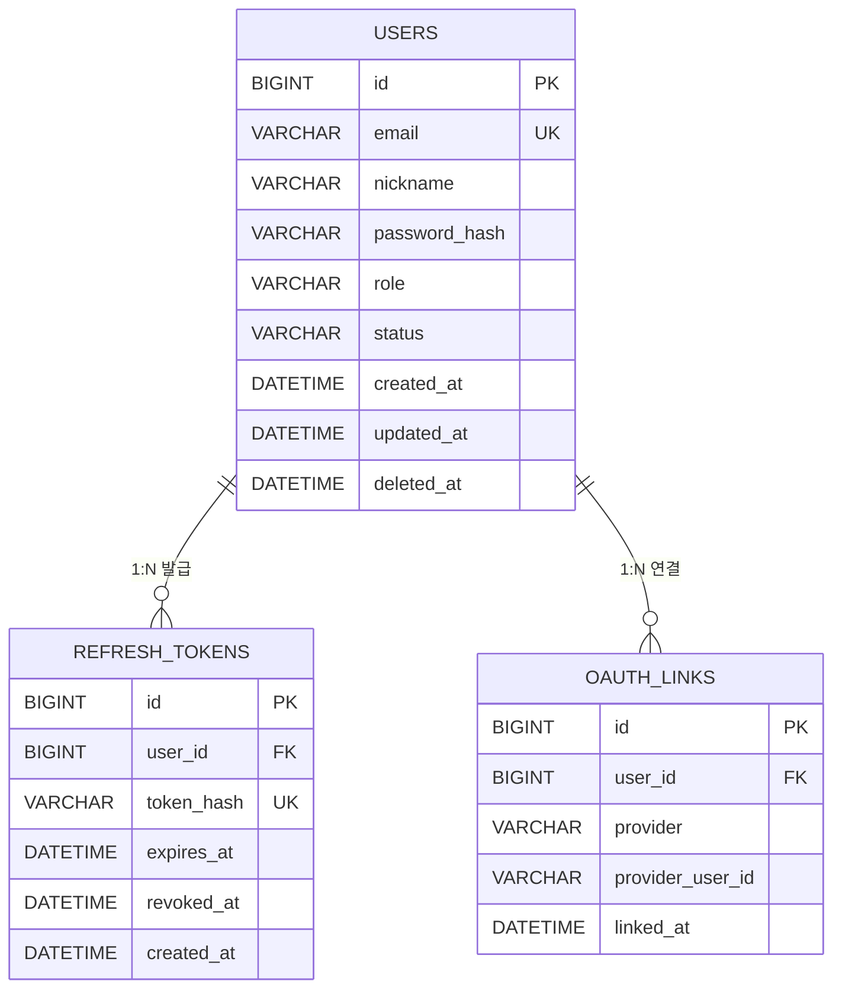
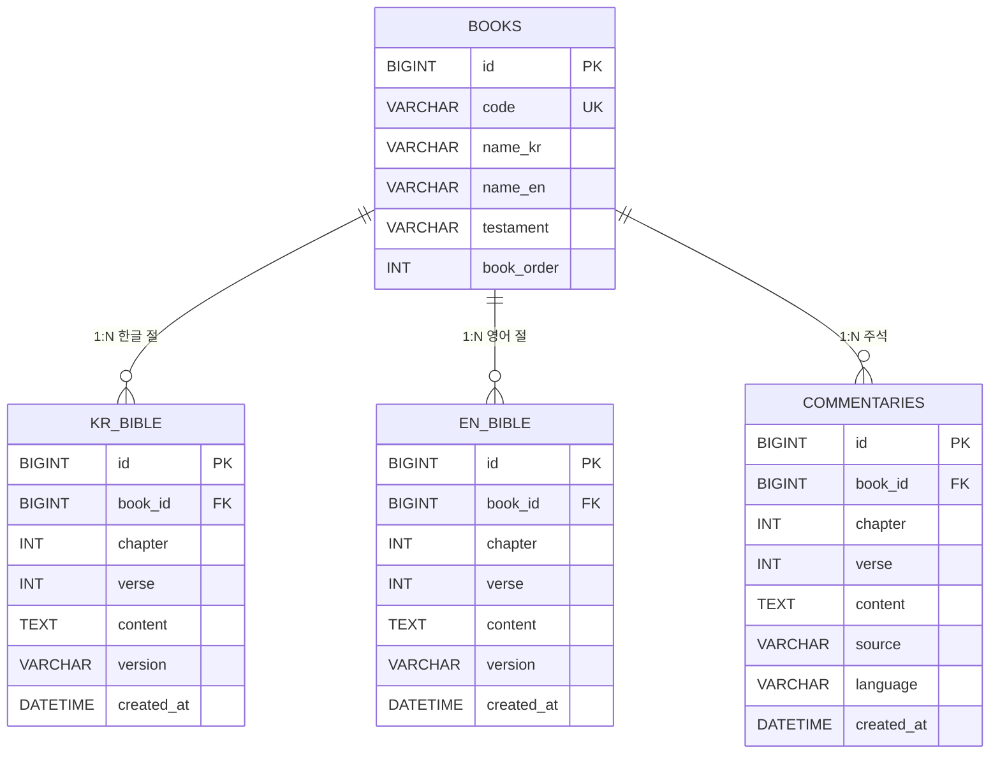
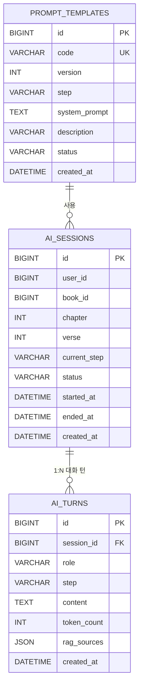
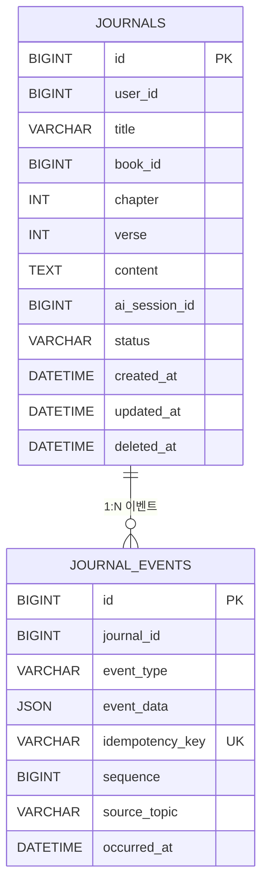
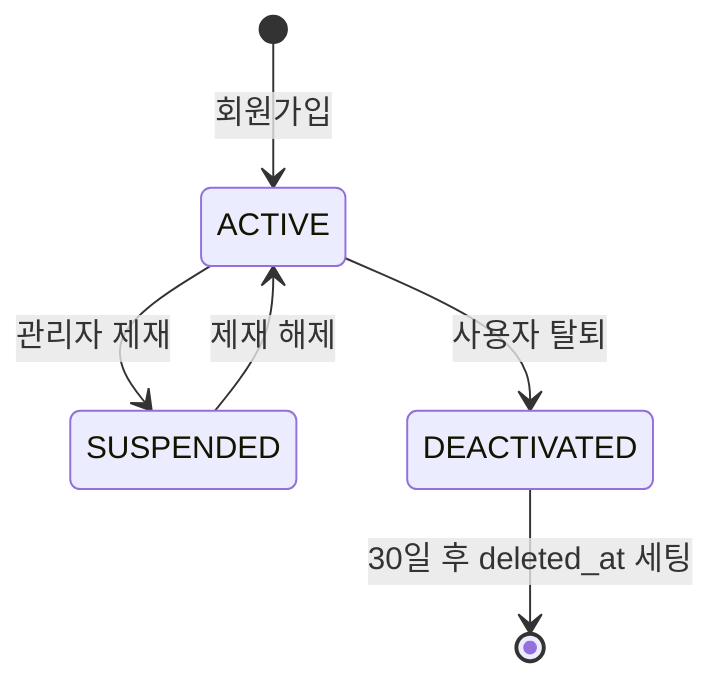
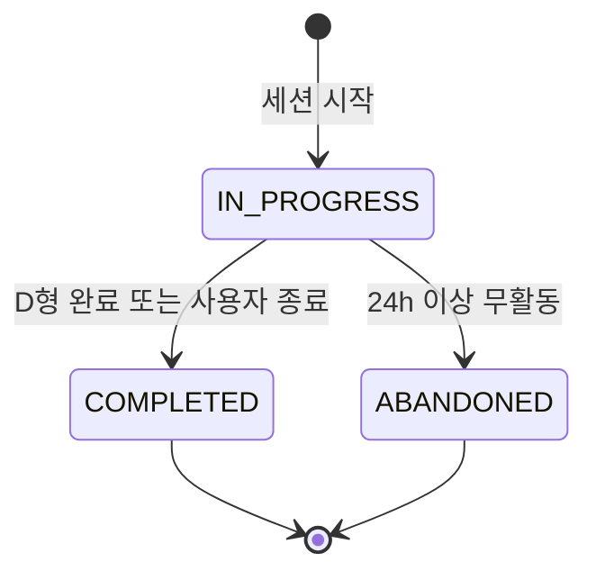
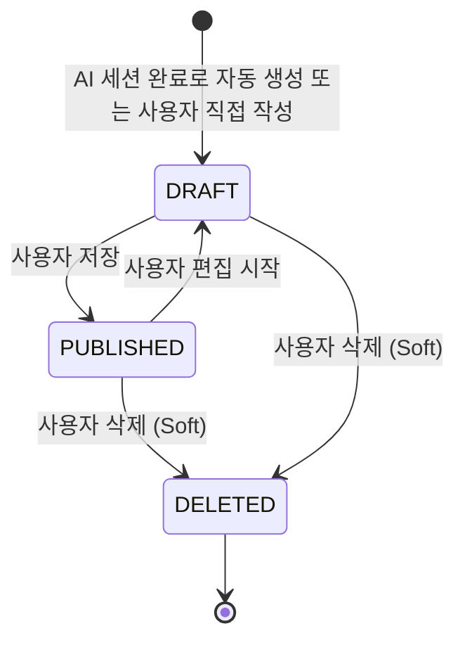

# 📖 QT-AI (큐티 AI 앱) — ERD 문서 v1.0

> **문서 버전:** v1.0
> **작성일:** 2026-05-06
> **연관 문서:** [01_프로젝트_계획서 v1.2](./01_프로젝트_계획서.md) / 03 아키텍처 정의서 / 04 API 명세서
> **MSA 데이터 원칙:** **Database per Service** — 각 서비스가 자기 DB 소유, 서비스 간 직접 JOIN 금지, 비동기 동기화는 Kafka 이벤트로

---

## 📌 변경 이력

| 버전 | 날짜 | 작성자 | 주요 변경 |
| --- | --- | --- | --- |
| v1.0 | 2026-05-06 | 강태오 | 초기 작성 — 4개 서비스 DB 분리, ChromaDB 별도, Kafka 이벤트 연결 |

---

## 목차

1. [데이터 아키텍처 개요](#1-데이터-아키텍처-개요)
2. [Auth/User Service ERD](#2-authuser-service-erd) — 강상민
3. [Bible Service ERD](#3-bible-service-erd) — 김태혁
4. [AI/RAG Service ERD](#4-airag-service-erd) — 이지윤
5. [Journal Service ERD](#5-journal-service-erd) — 이승욱
6. [서비스 간 연결 (Kafka 이벤트)](#6-서비스-간-연결-kafka-이벤트)
7. [상태 코드 정의](#7-상태-코드-정의)
8. [공통 패턴](#8-공통-패턴) — BaseEntity / Soft Delete / 멱등성 키
9. [인덱스 전략](#9-인덱스-전략)
10. [ChromaDB 벡터 스토어 (별도)](#10-chromadb-벡터-스토어-별도)
11. [설계 결정 사항 & 주의사항](#11-설계-결정-사항--주의사항)

---

## 1. 데이터 아키텍처 개요

### 1.1 Database per Service 원칙

```
┌──────────────────┐    ┌──────────────────┐    ┌──────────────────┐    ┌──────────────────┐
│ Auth/User        │    │ Bible            │    │ AI/RAG           │    │ Journal          │
│ Service          │    │ Service          │    │ Service          │    │ Service          │
│                  │    │                  │    │                  │    │                  │
│ MySQL            │    │ MySQL            │    │ MySQL +          │    │ MySQL            │
│ schema: auth_db  │    │ schema: bible_db │    │ ChromaDB         │    │ schema: journal_db│
│                  │    │ + Redis 캐시     │    │ schema: ai_db    │    │                  │
│ - USERS          │    │ - BOOKS          │    │ - PROMPT_TEMPLATE│    │ - JOURNALS       │
│ - REFRESH_TOKENS │    │ - KR_BIBLE       │    │ - AI_SESSIONS    │    │ - JOURNAL_EVENTS │
│ - OAUTH_LINKS    │    │ - EN_BIBLE       │    │ - AI_TURNS       │    │                  │
│                  │    │ - COMMENTARIES   │    │                  │    │                  │
└──────────────────┘    └──────────────────┘    └──────────────────┘    └──────────────────┘
        ↓ 이벤트                ↓ 이벤트                ↓ 이벤트                ↑ 컨슈머
        └──────────────────────────┬──────────────────────────────────────────┘
                                   │
                              ┌────────────┐
                              │  Kafka     │
                              │  topics:   │
                              │  - user.deactivated
                              │  - user.activity.tracked
                              │  - ai.session.completed
                              │  - journal.created
                              │  - journal.updated
                              │  - journal.deleted
                              │  - notification.requested
                              └────────────┘
```

### 1.2 서비스 간 데이터 참조 원칙

> **절대 금지:** 서비스 A의 DB에서 서비스 B의 DB로 직접 JOIN, 직접 SELECT, FK 외래키
>
> **허용:**
> - 비동기 데이터 동기화 → **Kafka 이벤트** (eventual consistency)
> - 실시간 데이터 조회 → **API 호출** (BFF Aggregator가 병렬 호출)
> - 외부 ID 참조 → **DB 컬럼은 단순 BIGINT, FK 제약 없음** (예: `Journal.user_id`는 Auth Service의 `users.id` 값을 저장하지만 FK 제약 없음)

### 1.3 BFF Aggregator의 역할

- **자체 DB 없음.** 6 service의 데이터를 조합해서 단일 응답 DTO 반환.
- 입체적 묵상 화면 같은 다중 데이터 화면은 BFF가 Bible + Commentary를 `CompletableFuture`로 병렬 호출.

### 1.4 Gateway의 역할

- **자체 DB 없음.** JWT 검증·라우팅·Rate Limit·SSE 패스스루.
- JWT 검증에 필요한 공개키는 K8s Secret에 적재.

---

## 2. Auth/User Service ERD

> **Owner:** 강상민 / **DB schema:** `auth_db` / **외부 노출 ID:** `users.id` (다른 서비스가 참조)

### 2.1 다이어그램



### 2.2 USERS — 회원

| 컬럼 | 타입 | NULL | 기본값 | PK/FK/UK | 설명 |
| --- | --- | --- | --- | --- | --- |
| id | BIGINT | N | AUTO_INCREMENT | PK | 외부 노출 ID (다른 서비스가 참조) |
| email | VARCHAR(254) | N | — | UK | 로그인 ID, RFC 5321 max 254 |
| nickname | VARCHAR(50) | N | — | | 표시 이름 |
| password_hash | VARCHAR(100) | Y | NULL | | bcrypt cost=12 (소셜 전용 사용자는 NULL) |
| role | VARCHAR(20) | N | 'ROLE_USER' | | § 7.3 참조 |
| status | VARCHAR(20) | N | 'ACTIVE' | | § 7.1 참조 |
| created_at | DATETIME(6) | N | CURRENT_TIMESTAMP(6) | | BaseEntity |
| updated_at | DATETIME(6) | Y | NULL | | BaseEntity |
| deleted_at | DATETIME(6) | Y | NULL | | Soft Delete (§ 8.2) |

**인덱스**
- `uk_users_email` UNIQUE ON (email)
- `idx_users_status` ON (status)
- `idx_users_deleted_at` ON (deleted_at)

### 2.3 REFRESH_TOKENS — 리프레시 토큰

| 컬럼 | 타입 | NULL | 기본값 | PK/FK/UK | 설명 |
| --- | --- | --- | --- | --- | --- |
| id | BIGINT | N | AUTO_INCREMENT | PK | |
| user_id | BIGINT | N | — | FK → USERS.id | |
| token_hash | VARCHAR(100) | N | — | UK | SHA-256 해시 (원본 토큰은 저장 X) |
| expires_at | DATETIME(6) | N | — | | 만료 시각 (기본 14일) |
| revoked_at | DATETIME(6) | Y | NULL | | 폐기 시각 (로그아웃·재발급 시) |
| created_at | DATETIME(6) | N | CURRENT_TIMESTAMP(6) | | BaseEntity |

**인덱스**
- `uk_refresh_tokens_hash` UNIQUE ON (token_hash)
- `idx_refresh_tokens_user_id_expires` ON (user_id, expires_at)

### 2.4 OAUTH_LINKS — 소셜 로그인 연결

| 컬럼 | 타입 | NULL | 기본값 | PK/FK/UK | 설명 |
| --- | --- | --- | --- | --- | --- |
| id | BIGINT | N | AUTO_INCREMENT | PK | |
| user_id | BIGINT | N | — | FK → USERS.id | |
| provider | VARCHAR(20) | N | — | | 'GOOGLE' (v1.0 1종) |
| provider_user_id | VARCHAR(100) | N | — | | 외부 ID (Google sub) |
| linked_at | DATETIME(6) | N | CURRENT_TIMESTAMP(6) | | |

**인덱스**
- `uk_oauth_links_provider_user` UNIQUE ON (provider, provider_user_id)
- `idx_oauth_links_user_id` ON (user_id)

---

## 3. Bible Service ERD

> **Owner:** 김태혁 / **DB schema:** `bible_db` + Redis 캐시 (`passage:{book}:{ch}:{v}`, TTL 24h)
>
> **데이터 출처:** § [01번 § 3.1 데이터 저작권 표](./01_프로젝트_계획서.md#31-bible-service--kr_bible--en_bible--commentary) — KJV (PD) + Matthew Henry (PD) + 개역한글(출처 표기) + 한글 주석 더미데이터

### 3.1 다이어그램



### 3.2 BOOKS — 성경 책 메타

| 컬럼 | 타입 | NULL | 기본값 | PK/FK/UK | 설명 |
| --- | --- | --- | --- | --- | --- |
| id | BIGINT | N | AUTO_INCREMENT | PK | |
| code | VARCHAR(10) | N | — | UK | 'GEN', 'EXO', 'MAT' (3-letter 표준 약어) |
| name_kr | VARCHAR(20) | N | — | | '창세기' |
| name_en | VARCHAR(50) | N | — | | 'Genesis' |
| testament | VARCHAR(2) | N | — | | 'OT' (구약) / 'NT' (신약) |
| book_order | INT | N | — | | 1~66 (정경 순서) |

**시드 데이터:** 66권 W0 ETL로 일괄 적재.

### 3.3 KR_BIBLE — 한글 성경 (개역한글)

| 컬럼 | 타입 | NULL | 기본값 | PK/FK/UK | 설명 |
| --- | --- | --- | --- | --- | --- |
| id | BIGINT | N | AUTO_INCREMENT | PK | |
| book_id | BIGINT | N | — | FK → BOOKS.id | |
| chapter | INT | N | — | | 장 |
| verse | INT | N | — | | 절 |
| content | TEXT | N | — | | 본문 |
| version | VARCHAR(20) | N | 'REVISED' | | 'REVISED' (개역한글) |
| created_at | DATETIME(6) | N | CURRENT_TIMESTAMP(6) | | BaseEntity |

**인덱스**
- `uk_kr_bible_book_ch_v_ver` UNIQUE ON (book_id, chapter, verse, version)
- `idx_kr_bible_lookup` ON (book_id, chapter, verse) — 다중 JOIN 핵심

### 3.4 EN_BIBLE — 영어 성경 (KJV)

| 컬럼 | 타입 | NULL | 기본값 | PK/FK/UK | 설명 |
| --- | --- | --- | --- | --- | --- |
| id | BIGINT | N | AUTO_INCREMENT | PK | |
| book_id | BIGINT | N | — | FK → BOOKS.id | |
| chapter | INT | N | — | | |
| verse | INT | N | — | | |
| content | TEXT | N | — | | |
| version | VARCHAR(20) | N | 'KJV' | | 'KJV' (Public Domain) |
| created_at | DATETIME(6) | N | CURRENT_TIMESTAMP(6) | | |

**인덱스**
- `uk_en_bible_book_ch_v_ver` UNIQUE ON (book_id, chapter, verse, version)
- `idx_en_bible_lookup` ON (book_id, chapter, verse)

### 3.5 COMMENTARIES — 주석

| 컬럼 | 타입 | NULL | 기본값 | PK/FK/UK | 설명 |
| --- | --- | --- | --- | --- | --- |
| id | BIGINT | N | AUTO_INCREMENT | PK | |
| book_id | BIGINT | N | — | FK → BOOKS.id | |
| chapter | INT | N | — | | |
| verse | INT | N | — | | |
| content | TEXT | N | — | | |
| source | VARCHAR(50) | N | — | | 'MATTHEW_HENRY' (PD) / 'DUMMY_KR' (더미) |
| language | VARCHAR(2) | N | — | | 'EN' / 'KR' |
| created_at | DATETIME(6) | N | CURRENT_TIMESTAMP(6) | | |

**인덱스**
- `idx_commentaries_lookup` ON (book_id, chapter, verse, language) — 다중 JOIN 핵심
- `idx_commentaries_source` ON (source)

> **다중 JOIN 패턴:** `KR_BIBLE` + `EN_BIBLE` + `COMMENTARIES` 를 `(book_id, chapter, verse)` 동일 인덱스로 JOIN. 핫셋(자주 조회되는 100절)은 Redis 캐시.

---

## 4. AI/RAG Service ERD

> **Owner:** 이지윤 / **DB schema:** `ai_db` (메타·로그) + ChromaDB (벡터 스토어, § 10)
>
> **비즈니스 책임:** 큐티 A~D형 프롬프트 설계 / 신학 가드레일 / RAG 출처 인용 강제

### 4.1 다이어그램



### 4.2 PROMPT_TEMPLATES — 큐티 A~D 프롬프트 템플릿

| 컬럼 | 타입 | NULL | 기본값 | PK/FK/UK | 설명 |
| --- | --- | --- | --- | --- | --- |
| id | BIGINT | N | AUTO_INCREMENT | PK | |
| code | VARCHAR(50) | N | — | | 'A_OBSERVATION', 'B_INTERPRETATION', 'C_APPLICATION', 'D_DECISION' |
| version | INT | N | 1 | | 프롬프트 개정 버전 |
| step | VARCHAR(2) | N | — | | 'A', 'B', 'C', 'D' |
| system_prompt | TEXT | N | — | | LLM 시스템 프롬프트 본문 |
| description | VARCHAR(500) | Y | NULL | | 사용 의도 설명 |
| status | VARCHAR(20) | N | 'ACTIVE' | | § 7.4 참조 |
| created_at | DATETIME(6) | N | CURRENT_TIMESTAMP(6) | | |

**인덱스**
- `uk_prompt_templates_code_version` UNIQUE ON (code, version)
- `idx_prompt_templates_step_status` ON (step, status)

### 4.3 AI_SESSIONS — AI 대화 세션

| 컬럼 | 타입 | NULL | 기본값 | PK/FK/UK | 설명 |
| --- | --- | --- | --- | --- | --- |
| id | BIGINT | N | AUTO_INCREMENT | PK | 외부 노출 ID (Journal이 참조) |
| user_id | BIGINT | N | — | | Auth Service `users.id` 참조 (FK 제약 없음) |
| book_id | BIGINT | N | — | | Bible Service `books.id` 참조 (FK 제약 없음) |
| chapter | INT | N | — | | |
| verse | INT | N | — | | |
| current_step | VARCHAR(2) | N | 'A' | | 진행 중인 큐티 단계 |
| status | VARCHAR(20) | N | 'IN_PROGRESS' | | § 7.5 참조 |
| started_at | DATETIME(6) | N | CURRENT_TIMESTAMP(6) | | |
| ended_at | DATETIME(6) | Y | NULL | | 완료 시각 |
| created_at | DATETIME(6) | N | CURRENT_TIMESTAMP(6) | | BaseEntity |

**인덱스**
- `idx_ai_sessions_user_id_started` ON (user_id, started_at DESC) — 사용자별 최근 세션 조회
- `idx_ai_sessions_status` ON (status)
- `idx_ai_sessions_passage` ON (book_id, chapter, verse)

### 4.4 AI_TURNS — 대화 턴 (질문 + 응답 단위)

| 컬럼 | 타입 | NULL | 기본값 | PK/FK/UK | 설명 |
| --- | --- | --- | --- | --- | --- |
| id | BIGINT | N | AUTO_INCREMENT | PK | |
| session_id | BIGINT | N | — | FK → AI_SESSIONS.id | |
| role | VARCHAR(20) | N | — | | 'USER' / 'ASSISTANT' / 'SYSTEM' |
| step | VARCHAR(2) | N | — | | 이 턴 발생 시점의 큐티 단계 |
| content | TEXT | N | — | | 메시지 본문 (SSE 스트리밍 완료 후 적재) |
| token_count | INT | Y | NULL | | LLM 토큰 사용량 (요금·메트릭) |
| rag_sources | JSON | Y | NULL | | ChromaDB에서 인용한 출처 배열 (§ 10.3) |
| created_at | DATETIME(6) | N | CURRENT_TIMESTAMP(6) | | |

**인덱스**
- `idx_ai_turns_session_id_created` ON (session_id, created_at) — 세션별 시간순 조회
- `idx_ai_turns_role` ON (role)

> **신학 가드레일:** ASSISTANT 턴에 `rag_sources` 가 비어 있으면 PR 머지 금지 (이지윤 검수, [§ 10.3 환각 체크리스트](./01_프로젝트_계획서.md#103-ai-환각-체크리스트-pr-머지-전-필수)).

---

## 5. Journal Service ERD

> **Owner:** 이승욱 / **DB schema:** `journal_db`
>
> **이벤트 소싱 패턴:** `JOURNAL_EVENTS`가 변경 이력의 source of truth, `JOURNALS`는 재구성 가능한 read model.

### 5.1 다이어그램



### 5.2 JOURNALS — 묵상 노트 (read model)

| 컬럼 | 타입 | NULL | 기본값 | PK/FK/UK | 설명 |
| --- | --- | --- | --- | --- | --- |
| id | BIGINT | N | AUTO_INCREMENT | PK | |
| user_id | BIGINT | N | — | | Auth Service `users.id` 참조 (FK 제약 없음) |
| title | VARCHAR(200) | N | — | | 묵상 제목 (자동 생성: "{book} {ch}:{v} 묵상") |
| book_id | BIGINT | N | — | | Bible Service 참조 (FK 제약 없음) |
| chapter | INT | N | — | | |
| verse | INT | N | — | | |
| content | TEXT | N | — | | 묵상 노트 본문 (사용자 메모) |
| ai_session_id | BIGINT | Y | NULL | | AI Service `ai_sessions.id` 참조 (FK 제약 없음) |
| status | VARCHAR(20) | N | 'DRAFT' | | § 7.6 참조 |
| created_at | DATETIME(6) | N | CURRENT_TIMESTAMP(6) | | BaseEntity |
| updated_at | DATETIME(6) | Y | NULL | | BaseEntity |
| deleted_at | DATETIME(6) | Y | NULL | | Soft Delete |

**인덱스**
- `idx_journals_user_id_created` ON (user_id, created_at DESC) — 마이페이지 리스트
- `idx_journals_user_id_status` ON (user_id, status)
- `idx_journals_passage` ON (book_id, chapter, verse) — 인기 구절 통계용
- `idx_journals_ai_session_id` ON (ai_session_id) — AI 대화 → Journal 연결 조회

### 5.3 JOURNAL_EVENTS — 이벤트 소싱 스토어 (source of truth)

| 컬럼 | 타입 | NULL | 기본값 | PK/FK/UK | 설명 |
| --- | --- | --- | --- | --- | --- |
| id | BIGINT | N | AUTO_INCREMENT | PK | |
| journal_id | BIGINT | N | — | | journals.id 참조 (실제 FK 제약은 두지 않음 — 이벤트 소싱 원칙) |
| event_type | VARCHAR(50) | N | — | | 'CREATED' / 'UPDATED' / 'PUBLISHED' / 'DELETED' / 'RESTORED' |
| event_data | JSON | N | — | | 변경 전후 스냅샷 또는 델타 |
| idempotency_key | VARCHAR(100) | N | — | UK | Kafka 컨슈머 멱등성 키 (중복 방지) |
| sequence | BIGINT | N | — | | journal 내 이벤트 순서 (1, 2, 3...) |
| source_topic | VARCHAR(100) | Y | NULL | | 외부 Kafka 토픽 (예: 'ai.session.completed') |
| occurred_at | DATETIME(6) | N | CURRENT_TIMESTAMP(6) | | |

**인덱스**
- `uk_journal_events_idempotency` UNIQUE ON (idempotency_key) — **멱등성 핵심**
- `idx_journal_events_journal_id_seq` ON (journal_id, sequence) — 재구성 (replay) 시 사용
- `idx_journal_events_occurred_at` ON (occurred_at) — 시간 순 통계

> **이승욱 작업 카드 6개 디테일 항목** (운영 노트 § 3 참조): ① JOURNAL_EVENTS 적재 ② JOURNALS read model 재구성 ③ idempotency_key 멱등성 ④ DLQ 설정 ⑤ 재처리 시나리오 ⑥ 통합 테스트.

---

## 6. 서비스 간 연결 (Kafka 이벤트)

### 6.1 토픽 정의

| 토픽 | Producer | Consumer | 페이로드 핵심 필드 | 멱등성 키 |
| --- | --- | --- | --- | --- |
| `user.activity.tracked` | BFF Aggregator | Journal Service | `user_id`, `activity_type`, `passage`, `occurred_at` | `{user_id}:{activity_type}:{occurred_at}` |
| `user.deactivated` | Auth Service | AI, Journal | `user_id`, `deactivated_at` | `user.deactivated:{user_id}` |
| `ai.session.completed` | AI Service | Journal Service | `session_id`, `user_id`, `passage`, `final_step`, `summary` | `ai.session.completed:{session_id}` |
| `journal.created` | Journal Service | (통계 컨슈머, v1.1) | `journal_id`, `user_id`, `passage`, `created_at` | `journal.created:{journal_id}` |
| `journal.updated` | Journal Service | (통계 컨슈머, v1.1) | `journal_id`, `delta`, `updated_at` | `journal.updated:{journal_id}:{seq}` |
| `journal.deleted` | Journal Service | (통계 컨슈머, v1.1) | `journal_id`, `deleted_at` | `journal.deleted:{journal_id}` |
| `notification.requested` | (다수 서비스) | Notification Aggregator (BFF의 일부) | `user_id`, `type`, `payload` | `{type}:{user_id}:{occurred_at}` |

### 6.2 이벤트 페이로드 표준 (전 토픽 공통)

```json
{
  "eventId": "evt_01HZX...",          // ULID, 멱등성 키 보강
  "eventType": "ai.session.completed",
  "eventVersion": 1,                   // 스키마 버전 (Schema Registry)
  "occurredAt": "2026-05-26T14:30:00Z",
  "traceId": "trace_abc...",           // 분산 트레이싱 propagation
  "data": { ... }                      // 토픽별 본문
}
```

### 6.3 Saga 패턴 적용 시나리오

> **시나리오:** 사용자가 AI 대화를 완료하면 Journal 노트가 자동 생성되어야 함. 둘 중 하나가 실패하면 보상 트랜잭션 필요.

```
[1] AI Service: AI_SESSIONS.status = 'COMPLETED' (로컬 트랜잭션)
[2] AI Service: ai.session.completed 이벤트 발행 (Outbox 패턴)
[3] Journal Service: 컨슈머 수신 → JOURNALS 자동 생성 (DRAFT)
[4] Journal Service: JOURNAL_EVENTS에 CREATED 이벤트 적재 (멱등성 키 검증)

실패 시:
- [3] 실패: Journal Service DLQ로 적재 → 재시도 → 영구 실패 시 운영자 알림
- [4] 적재 후 [5] 실패 (예: Kafka publish 실패): Outbox 폴링이 재발행
```

**보상 트랜잭션:** AI 세션이 완료됐는데 Journal 생성이 영구 실패하면 → AI Service에 `journal.creation.failed` 이벤트 → AI_SESSIONS.status = 'COMPLETED_NO_JOURNAL' 로 마킹.

---

## 7. 상태 코드 정의

### 7.1 USERS.status



| 상태 | 설명 | 다음 상태 | 전이 트리거 |
| --- | --- | --- | --- |
| ACTIVE | 정상 | SUSPENDED, DEACTIVATED | — |
| SUSPENDED | 제재 | ACTIVE | 관리자 (ROLE_ADMIN) |
| DEACTIVATED | 탈퇴 | (30일 후 hard delete 후보) | 사용자 본인 → `user.deactivated` 이벤트 발행 |

### 7.2 (예약) 향후 회원 부가 상태

> v1.0에서는 `status` 단일 컬럼으로 충분. v1.1에서 이메일 인증·OTP 등 추가 시 별도 테이블 분리 검토.

### 7.3 USERS.role

| 코드 | 설명 | 주요 권한 |
| --- | --- | --- |
| ROLE_USER | 일반 회원 | 본인 데이터 CRUD, AI 대화, Journal |
| ROLE_ADMIN | 관리자 | 대시보드, 통계, 사용자 제재 |

### 7.4 PROMPT_TEMPLATES.status

| 상태 | 설명 |
| --- | --- |
| ACTIVE | 현재 사용 중 (각 step당 1건이 권장) |
| DEPRECATED | 사용 중지 (이력은 보존) |
| DRAFT | 작성 중 (서비스 노출 X) |

### 7.5 AI_SESSIONS.status



| 상태 | 설명 | 다음 상태 | 전이 트리거 |
| --- | --- | --- | --- |
| IN_PROGRESS | 진행 중 | COMPLETED, ABANDONED | — |
| COMPLETED | 완료 (D형 도달 또는 사용자 종료) | — | 사용자 액션 또는 step=D 확정 |
| ABANDONED | 무활동 폐기 | — | 배치 (24h 이상 무활동) |
| COMPLETED_NO_JOURNAL | 완료했으나 Journal 생성 실패 | — | Saga 보상 (§ 6.3) |

### 7.6 JOURNALS.status



| 상태 | 설명 | 다음 상태 | 전이 트리거 |
| --- | --- | --- | --- |
| DRAFT | 임시 저장 | PUBLISHED, DELETED | — |
| PUBLISHED | 정식 저장 | DRAFT (편집), DELETED | — |
| DELETED | Soft 삭제 | (30일 후 hard delete 후보) | — |

---

## 8. 공통 패턴

### 8.1 BaseEntity (전 서비스 공통)

> 모든 엔티티에 공통으로 적용하는 생성일·수정일 자동 관리 패턴. **강태오가 공유 레이어(`common`)에 1회 작성하고 6 service가 import.**

```java
@MappedSuperclass
@EntityListeners(AuditingEntityListener.class)
@Getter
public abstract class BaseEntity {

    @CreatedDate
    @Column(name = "created_at", updatable = false)
    private LocalDateTime createdAt;

    @LastModifiedDate
    @Column(name = "updated_at")
    private LocalDateTime updatedAt;
}
```

각 서비스 Application 클래스에 `@EnableJpaAuditing` 활성화 필수.

**DB 컬럼 기준**

| 컬럼 | 타입 | NULL | 기본값 | 설명 |
| --- | --- | --- | --- | --- |
| created_at | DATETIME(6) | N | CURRENT_TIMESTAMP(6) | 자동 삽입 |
| updated_at | DATETIME(6) | Y | NULL | 자동 갱신 |

### 8.2 Soft Delete 적용 엔티티

| 서비스 | 엔티티 | 적용 여부 | 이유 |
| --- | --- | --- | --- |
| Auth | USERS | ✅ | 탈퇴 후 30일 복구 가능, 감사 이력 |
| Auth | REFRESH_TOKENS | ❌ | revoked_at 컬럼으로 폐기 추적 |
| Auth | OAUTH_LINKS | ❌ | hard delete (재연결 시 새로 생성) |
| Bible | KR_BIBLE / EN_BIBLE / COMMENTARIES | ❌ | 정적 데이터, 삭제 자체가 드묾 |
| AI | AI_SESSIONS / AI_TURNS | ❌ | 로그 성격, 보존 |
| AI | PROMPT_TEMPLATES | ❌ | status='DEPRECATED'로 대체 |
| Journal | JOURNALS | ✅ | 사용자 삭제 후 30일 복구 가능 + 감사 |
| Journal | JOURNAL_EVENTS | ❌ | 이벤트 소싱 — 절대 삭제 X |

**구현 예 (USERS):**

```java
@Entity
@Table(name = "users")
@SQLRestriction("deleted_at IS NULL")  // SELECT 시 자동 필터
public class User extends BaseEntity {

    @Id @GeneratedValue(strategy = GenerationType.IDENTITY)
    private Long id;

    // ... 다른 필드

    @Column(name = "deleted_at")
    private LocalDateTime deletedAt;

    public void deactivate() {
        this.deletedAt = LocalDateTime.now();
        this.status = UserStatus.DEACTIVATED;
        // user.deactivated 이벤트 발행은 Service 레이어에서
    }
}
```

### 8.3 Kafka 컨슈머 멱등성 키 표준

> 1차(HMS) 트랜잭션 누락 + (신규) Kafka 멱등성 누락 가드레일.

**규칙:**
1. 모든 Kafka 컨슈머는 처리 시 **idempotency_key** 를 검사한다.
2. 멱등성 키는 토픽별로 표준 정의 (§ 6.1 표).
3. 검사 방법: 컨슈머 측 DB(예: `JOURNAL_EVENTS.idempotency_key UNIQUE`)에 INSERT 시도 → DUPLICATE KEY 발생 시 무시 (skip).

```java
@KafkaListener(topics = "ai.session.completed")
public void handle(SessionCompletedEvent event) {
    String idempotencyKey = "ai.session.completed:" + event.getSessionId();
    try {
        journalService.createFromAiSession(event, idempotencyKey);
    } catch (DataIntegrityViolationException e) {
        log.info("Duplicate event skipped: {}", idempotencyKey);  // 정상 무시
    }
}
```

---

## 9. 인덱스 전략

### 9.1 설계 원칙

| 원칙 | 설명 |
| --- | --- |
| 조회 빈도 | WHERE / ORDER BY 자주 쓰이는 컬럼 |
| 카디널리티 | 다양한 값일수록 인덱스 효과 큼 |
| 복합 인덱스 | 함께 쓰이는 컬럼 묶음. 동등 조건 먼저, 범위 조건 뒤 |
| 쓰기 비용 | 인덱스 ↑ → INSERT/UPDATE 성능 ↓ |
| 페이징 | `ORDER BY {col} DESC LIMIT N` 패턴은 `(col)` 인덱스 필수 |

### 9.2 핵심 인덱스 요약 (서비스별)

| 서비스 | 테이블 | 컬럼 | 종류 | 이유 |
| --- | --- | --- | --- | --- |
| Auth | USERS | email | UNIQUE | 로그인·중복 검증 |
| Auth | REFRESH_TOKENS | (user_id, expires_at) | INDEX | 사용자별 활성 토큰 조회 |
| Bible | KR_BIBLE | (book_id, chapter, verse) | INDEX | 다중 JOIN 핵심 |
| Bible | EN_BIBLE | (book_id, chapter, verse) | INDEX | 다중 JOIN 핵심 |
| Bible | COMMENTARIES | (book_id, chapter, verse, language) | INDEX | 언어별 주석 조회 |
| AI | AI_SESSIONS | (user_id, started_at DESC) | INDEX | 사용자 최근 세션 |
| AI | AI_TURNS | (session_id, created_at) | INDEX | 세션별 시간순 |
| Journal | JOURNALS | (user_id, created_at DESC) | INDEX | 마이페이지 리스트 |
| Journal | JOURNALS | (book_id, chapter, verse) | INDEX | 인기 구절 통계 |
| Journal | JOURNAL_EVENTS | idempotency_key | UNIQUE | **멱등성 핵심** |
| Journal | JOURNAL_EVENTS | (journal_id, sequence) | INDEX | 이벤트 replay |

### 9.3 Bible Service 캐시 전략 (Redis)

| 키 패턴 | TTL | 무효화 트리거 | 설명 |
| --- | --- | --- | --- |
| `passage:{book}:{ch}:{v}` | 24h | (없음 — 정적 데이터) | 입체 화면용 통합 응답 캐시 |
| `passage:hot100` | 1h | 통계 배치 | Top 100 핫셋 ID 리스트 |

**캐시 히트율 목표:** ≥ 60% (Hot 100구절 기준, [01번 § 11.2](./01_프로젝트_계획서.md#112-성능-performance) 참조)

---

## 10. ChromaDB 벡터 스토어 (별도)

> **Owner:** 이지윤 / **컨테이너:** AI Service와 같은 Pod 또는 별도 StatefulSet (W1 결정)
>
> ChromaDB는 RDBMS가 아니므로 ERD가 아닌 **Collection 스키마**로 정의.

### 10.1 Collection 정의

#### 10.1.1 `commentary_embeddings`

| 필드 | 타입 | 설명 |
| --- | --- | --- |
| id | string | `commentary:{commentary_id}` |
| embedding | vector(1536) | text-embedding-3-small 등 (W0 모델 결정) |
| metadata.book_id | int | Bible Service 참조 |
| metadata.chapter | int | |
| metadata.verse | int | |
| metadata.source | string | 'MATTHEW_HENRY' / 'DUMMY_KR' |
| metadata.language | string | 'EN' / 'KR' |
| document | string | 원문 텍스트 (인용 시 사용) |

#### 10.1.2 `dummy_paper_embeddings` (v1.0 더미)

| 필드 | 타입 | 설명 |
| --- | --- | --- |
| id | string | `paper:{paper_id}` |
| embedding | vector(1536) | |
| metadata.title | string | |
| metadata.author | string | |
| metadata.related_passages | array<string> | 'GEN:1:1' 등 |
| document | string | 더미 본문 |

### 10.2 ETL 흐름 (W1)

```
[Bible Service] COMMENTARIES 적재 완료
    ↓
[AI Service] 배치 잡: 신규 commentary 임베딩 생성 → ChromaDB upsert
    ↓
[AI Service] 묵상 대화 시 RAG 조회 시 사용
```

### 10.3 RAG 출처 인용 표준 (신학 가드레일)

> 이지윤 owner — 모든 ASSISTANT 턴은 인용한 ChromaDB 문서를 `AI_TURNS.rag_sources` JSON에 기록한다.

```json
{
  "rag_sources": [
    {
      "collection": "commentary_embeddings",
      "id": "commentary:1234",
      "score": 0.87,
      "snippet": "Matthew Henry on Genesis 1:1: ..."
    }
  ]
}
```

`rag_sources` 가 비어 있는 ASSISTANT 턴은 **신학적 환각 가능성** — PR 머지 금지 ([01번 § 10.3 환각 체크리스트](./01_프로젝트_계획서.md#103-ai-환각-체크리스트-pr-머지-전-필수)).

---

## 11. 설계 결정 사항 & 주의사항

### 11.1 핵심 설계 결정 (ADR 후보)

1. **Database per Service** — 각 서비스가 자기 DB schema를 소유. 서비스 간 직접 JOIN·FK 절대 금지. 근거: MSA 강결합 방지, 독립 배포·스키마 진화. (ADR 0003 후보)
2. **이벤트 소싱은 Journal Service에만** — 큐티 기록은 사용자 변경 이력이 핵심 자산이라 적용. 다른 서비스는 일반 CRUD + Audit. 근거: 이벤트 소싱은 복잡도 ↑ — 핵심 도메인에만 적용. (ADR 0004 후보)
3. **외부 ID는 단순 BIGINT 컬럼, FK 제약 없음** — 예: `Journal.user_id`. 근거: 서비스 간 FK는 강결합. 무결성은 이벤트 + 컴펜세이션으로. (ADR 0005 후보)
4. **소프트 딜리트는 USERS와 JOURNALS만** — 30일 복구 + 감사 가치. 근거: 다른 테이블은 hard delete가 더 단순. (ADR 0006 후보)
5. **Kafka 멱등성 키는 컨슈머 측 UNIQUE 제약으로 강제** — `JOURNAL_EVENTS.idempotency_key UNIQUE`. 근거: 컨슈머 코드 신뢰보다 DB 제약이 안전. (ADR 0007 후보)
6. **PROMPT_TEMPLATES는 DB로 관리, 코드 하드코딩 X** — 이지윤이 운영 중 프롬프트 개정. 근거: 신학 검수 결과 즉시 반영. (ADR 0008 후보)

### 11.2 MVP 범위에서 의도적으로 제외한 설계 요소

- **Outbox 패턴 풀스코프** — v1.0은 Kafka direct publish + 컨슈머 멱등성으로 충분. Outbox는 v1.1.
- **CQRS 분리 read/write 모델** — Journal에 read model 1개만, 별도 write 모델 없음.
- **다국어 UI 데이터 (`i18n`)** — 한국어 UI만, 메시지 카탈로그 별도 테이블 없음.
- **태그·카테고리 분류 (Journal)** — Journal에 tags 컬럼 없음. v1.1.
- **결제·구독 도메인** — 전체 제외 (v2.0).
- **공동체 (소그룹·댓글)** — 전체 제외 (v2.0).

### 11.3 1차(HMS) 실패 패턴 ↔ ERD 가드레일 매핑

| 1차 실패 | 이번 ERD 가드레일 |
| --- | --- |
| 트랜잭션 누락 | BaseEntity + JPA `@Transactional` 표준 + Saga 패턴 명시 (§ 6.3) |
| Spring Boot 메서드 환각 | BOM 의존성 픽스 + `@SQLRestriction` 같은 Jakarta 표준 사용 |
| 평문 시크릿 커밋 | DB 비밀번호·Anthropic 키 모두 K8s Secret. ERD 컬럼에 평문 토큰 저장 X (`token_hash` 만 저장) |
| (신규) Kafka 멱등성 누락 | `JOURNAL_EVENTS.idempotency_key UNIQUE` 강제 (§ 8.3) |
| (신규) 신학적 오류 | `rag_sources` 빈 ASSISTANT 턴 머지 금지 (§ 10.3) |

### 11.4 JPA 엔티티 패키지 구조 (서비스별)

```
{service}-service/
└── src/main/java/com/qtai/{service}/
    └── domain/
        ├── {entity1}/
        │   ├── {Entity1}.java
        │   ├── {Entity1}Repository.java
        │   └── {Entity1}Service.java
        └── {entity2}/
            ├── {Entity2}.java
            └── ...
```

**예시 (Journal Service):**

```
journal-service/src/main/java/com/qtai/journal/domain/
├── journal/
│   ├── Journal.java
│   ├── JournalRepository.java
│   ├── JournalService.java
│   └── JournalEventListener.java   # Kafka 컨슈머
└── event/
    ├── JournalEvent.java
    ├── JournalEventRepository.java
    └── JournalEventStore.java
```

---

## 📋 전체 테이블 요약

| # | 서비스 | 테이블 | Owner | 주요 외부 참조 (FK 제약 없음) |
| --- | --- | --- | --- | --- |
| 1 | Auth | USERS | 강상민 | (외부 노출) |
| 2 | Auth | REFRESH_TOKENS | 강상민 | users.id |
| 3 | Auth | OAUTH_LINKS | 강상민 | users.id |
| 4 | Bible | BOOKS | 김태혁 | — |
| 5 | Bible | KR_BIBLE | 김태혁 | books.id |
| 6 | Bible | EN_BIBLE | 김태혁 | books.id |
| 7 | Bible | COMMENTARIES | 김태혁 | books.id |
| 8 | AI | PROMPT_TEMPLATES | 이지윤 | — |
| 9 | AI | AI_SESSIONS | 이지윤 | (외부 참조) auth.users.id, bible.books.id |
| 10 | AI | AI_TURNS | 이지윤 | ai_sessions.id |
| 11 | Journal | JOURNALS | 이승욱 | (외부 참조) auth.users.id, bible.books.id, ai.ai_sessions.id |
| 12 | Journal | JOURNAL_EVENTS | 이승욱 | journals.id (유연 결합) |
| — | AI | (ChromaDB) commentary_embeddings | 이지윤 | bible.commentaries.id |
| — | AI | (ChromaDB) dummy_paper_embeddings | 이지윤 | — |

**총 12개 RDBMS 테이블 + 2개 ChromaDB Collection**

---

> **다음 작성 문서:** `03_아키텍처_정의서.md` → 서비스 경계·책임 분리·통신 패턴·Foundation Lock-in 아키텍처 청사진
