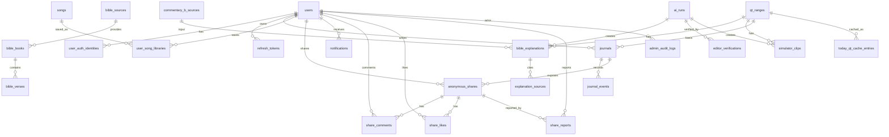

# ERD 문서 — QT-AI v2.3 기준

> **문서 버전:** v0.2
> **작성일:** 2026-05-15
> **기준 문서:** `07_요구사항_정의서.md` v2.3
> **문서 역할:** QT-AI v1의 논리 데이터 모델, 주요 테이블, 관계, 제약 기준 관리
> **연관 문서:** `03_아키텍처_정의서.md`, `04_API_명세서.md`, `05_시퀀스_다이어그램.md`, `06_화면_기능_정의서.md`, `07_요구사항_정의서.md`, `18_코드_품질_게이트.md`, `23_도메인_용어사전.md`

---

## 변경 이력

| 버전 | 날짜 | 작성자 | 주요 변경 |
| --- | --- | --- | --- |
| v0.1 | 2026-05-15 | Codex | `07` v2.3 기준으로 논리 ERD 초안 작성 |
| v0.2 | 2026-05-15 | Codex | `04` v0.2 기준으로 Today QT 캐시 상태, 묵상·익명 나눔, 신고 처리, 관리자 운영 컬럼·상태값 정합화 |

---

## 1. 문서 목적과 경계

이 문서는 구현 저장소의 DB 설계 기준을 정리한다. 실제 마이그레이션 파일명, 인덱스 세부 문법, FK 이름은 구현 저장소에서 확정한다.

| 구분 | 이 문서에서 관리 | 다른 문서에서 관리 |
| --- | --- | --- |
| 논리 테이블 | 포함 | 물리 DDL은 구현 저장소 |
| 주요 컬럼 | 포함 | 컬럼 타입 세부 튜닝은 구현 저장소 |
| 관계·제약 | 포함 | API 요청/응답은 `04_API_명세서.md` |
| 데이터 사용 금지 | 포함 | 금지 표현과 용어는 `23_도메인_용어사전.md` |

---

## 2. ERD 개요

---

## 3. 공통 컬럼 기준

| 컬럼 | 기준 |
| --- | --- |
| `id` | BIGINT 또는 UUID 중 구현 저장소에서 통일. 문서 예시는 BIGINT 기준 |
| `created_at` | 생성 시각, KST 표시가 필요해도 DB는 UTC 저장 권장 |
| `updated_at` | 수정 시각 |
| `deleted_at` | 삭제 복구 또는 감사가 필요한 테이블에만 사용 |
| `created_by` | 관리자·시스템 작업 추적이 필요한 테이블에 사용 |
| `updated_by` | 관리자 수정 가능 테이블에 사용 |

---

## 4. 인증·사용자

| 테이블 | 주요 컬럼 | 설명 |
| --- | --- | --- |
| `users` | `id`, `display_name`, `email`, `role`, `status`, `created_at`, `updated_at` | 일반 사용자와 관리자 계정 |
| `user_auth_identities` | `id`, `user_id`, `provider`, `provider_user_id`, `email` | Google OAuth 연결 정보 |
| `refresh_tokens` | `id`, `user_id`, `jti`, `expires_at`, `revoked_at`, `revoked_reason` | Refresh Token 블랙리스트와 만료 관리 |

| 제약 | 기준 |
| --- | --- |
| 권한 | `USER`, `ADMIN`을 구분한다. 배치/AI 작업은 사용자 row가 아니라 `SYSTEM` 작업으로 기록한다. |
| 사용자 상태 | `ACTIVE`, `SUSPENDED`를 기본으로 한다. 계정 탈퇴 상태는 MVP에서 쓰지 않는다. |
| Refresh Token | `jti` 기준으로 블랙리스트 캐시와 DB 만료 정보를 함께 관리한다. |
| 교회 인증 | 교회 인증 관련 테이블은 MVP에서 만들지 않는다. |
| 계정 탈퇴 | MVP 제외. 삭제 상태 컬럼은 후속 버전에서 검토한다. |

---

## 5. 성경·QT 데이터

| 테이블 | 주요 컬럼 | 설명 |
| --- | --- | --- |
| `bible_sources` | `id`, `repo_url`, `license`, `translation_name`, `attribution`, `redistribution_allowed`, `checked_at`, `checked_by` | GitHub 공개 JSON 소스 검토 표 |
| `bible_books` | `id`, `source_id`, `book_code`, `name_ko`, `name_en`, `book_order` | 성경 권 목록 |
| `bible_verses` | `id`, `source_id`, `book_code`, `chapter`, `verse`, `ordinal`, `text`, `language` | 절 단위 성경 본문 |
| `qt_ranges` | `id`, `qt_date`, `book_code`, `chapter_start`, `verse_start`, `chapter_end`, `verse_end`, `start_ordinal`, `end_ordinal`, `published_at`, `collected_at`, `status` | 오늘 QT 본문 범위 |
| `today_qt_cache_entries` | `id`, `qt_range_id`, `qt_date`, `served_qt_date`, `cache_key`, `cache_status`, `source`, `stale_reason`, `payload_hash`, `refreshed_at`, `expires_at`, `next_refresh_at` | Today QT 캐시 관리용 메타데이터 |

| 제약 | 기준 |
| --- | --- |
| 금지 번역본 | 개역개정, ESV, NIV는 적재하지 않는다. |
| 소스 검토 | `repo_url`, `license`, `translation_name`, `attribution`, `redistribution_allowed`가 없으면 적재하지 않는다. |
| QT 시각 | 공개 시각은 00:00 KST, 수집 배치 시각은 04:00 KST로 통일한다. |
| 범위 저장 | 성서 유니온에서 본문 텍스트가 아니라 본문 범위 정보만 수집한다. |
| 캐시 상태 | API 응답의 `cache.cacheStatus`와 맞춰 `HIT`, `MISS`, `STALE_FALLBACK`, `EMPTY`를 사용한다. |
| 이전 캐시 | 00:00~04:00 KST 또는 수집 실패 시 `served_qt_date`가 요청일과 다를 수 있다. |
| 준비 중 | 기존 캐시도 없으면 `cache_status=EMPTY`, `stale_reason=NO_CACHE`로 표현한다. |

---

## 6. 해설·AI 산출물

| 테이블 | 주요 컬럼 | 설명 |
| --- | --- | --- |
| `commentary_a_references` | `id`, `qt_range_id`, `reference_name`, `access_scope`, `checked_at` | 최신 한국어 주석 검증 참조. 사용자 노출 금지 |
| `commentary_b_sources` | `id`, `source_name`, `license`, `text_ref`, `public_domain`, `checked_at` | 영어 원문 주석 입력 소스 |
| `ai_runs` | `id`, `qt_range_id`, `run_type`, `prompt_version`, `input_hash`, `model`, `status`, `failed_reason`, `started_at`, `finished_at`, `actor_type` | AI 실행 이력 |
| `editor_verifications` | `id`, `ai_run_id`, `result`, `score`, `summary`, `verified_by`, `verified_at` | 편집자 에이전트 검증 결과 |
| `bible_explanations` | `id`, `qt_range_id`, `ai_run_id`, `summary`, `background`, `terms`, `explanation`, `tone`, `status`, `published_at` | 사용자 노출 C 테이블 해설 |
| `explanation_sources` | `id`, `explanation_id`, `source_type`, `source_label`, `attribution` | 해설 하단 출처 표시 |

| 제약 | 기준 |
| --- | --- |
| A 테이블 | 사용자 API와 화면에 노출하지 않는다. |
| C 테이블 | 사용자에게 노출되는 해설은 C 테이블만 사용한다. |
| AI run 상태 | `PENDING`, `RUNNING`, `SUCCEEDED`, `FAILED`, `REJECTED`, `NEEDS_REVIEW`를 사용한다. |
| 관리자 재생성 | 기존 산출물을 덮어쓰지 않고 새 version 또는 신규 `ai_runs` row로 기록한다. |
| LLM 호출 | 사용자 요청 경로에서 호출하지 않는다. 04:00 KST 배치 또는 관리자 트리거만 허용한다. |
| 저작권 표현 | "저작권 문제 없음"이 아니라 "저작권 리스크를 낮춘다"로 표현한다. |

---

## 7. 묵상·나눔

| 테이블 | 주요 컬럼 | 설명 |
| --- | --- | --- |
| `journals` | `id`, `user_id`, `qt_range_id`, `status`, `feeling`, `memory_verse`, `application`, `prayer`, `visibility`, `created_at`, `updated_at` | 오늘 QT 기준 묵상 노트 |
| `journal_events` | `id`, `journal_id`, `event_type`, `event_id`, `payload`, `created_at` | 묵상 노트 변경 이력 |
| `journal_calendar_days` | `id`, `user_id`, `journal_date`, `has_journal`, `journal_id`, `refreshed_at` | 묵상 달력 조회 캐시 또는 뷰 |
| `anonymous_shares` | `id`, `journal_id`, `user_id`, `status`, `shared_at`, `hidden_at`, `hidden_by`, `deleted_at` | 선택적 익명 공유 |
| `share_comments` | `id`, `share_id`, `user_id`, `body`, `created_at`, `deleted_at` | 공유 글 댓글 |
| `share_likes` | `id`, `share_id`, `user_id`, `created_at` | 좋아요 |
| `share_reports` | `id`, `share_id`, `reporter_id`, `reason`, `status`, `action`, `memo`, `handled_by`, `handled_at`, `created_at` | 신고 |

| 제약 | 기준 |
| --- | --- |
| 묵상 기준 | 자유 본문이 아니라 오늘 QT 기준으로 생성한다. |
| 묵상 상태 | `DRAFT`, `SAVED`를 사용한다. AI 세션과 연결하지 않는다. |
| 공개 기본값 | 기본값은 비공개다. 사용자가 선택한 경우에만 익명 공유한다. |
| 공개 상태 | `journals.visibility`는 `PRIVATE`, `SHARED`를 사용한다. |
| 공유 상태 | `anonymous_shares.status`는 `PUBLIC`, `HIDDEN`, `DELETED`를 사용한다. |
| 작성자 보호 | 사용자 API 응답에는 공유 작성자의 `user_id`, `display_name`, `email`을 노출하지 않는다. |
| 신고 상태 | `share_reports.status`는 `PENDING`, `RESOLVED`, `REJECTED`, `HIDDEN`을 사용한다. |
| 좋아요 중복 | `share_likes`는 `share_id + user_id` 중복 저장을 막는다. |
| 글자 수 | 사용자 입력 글자 수 제한은 두지 않는다. 악성 요청 방어는 공통 정책으로 처리한다. |
| 달력 | 묵상 노트 생성·수정·삭제 시 달력 캐시를 무효화한다. |

---

## 8. 찬양·알림·시뮬레이터

| 테이블 | 주요 컬럼 | 설명 |
| --- | --- | --- |
| `songs` | `id`, `title`, `artist`, `external_ref`, `metadata`, `status`, `created_by`, `updated_by`, `created_at`, `updated_at` | 운영자 사전 큐레이션 찬양 메타데이터 |
| `user_song_libraries` | `id`, `user_id`, `song_id`, `created_at` | 사용자의 내 찬양 목록 |
| `simulator_clips` | `id`, `qt_range_id`, `ai_run_id`, `status`, `clip_ref`, `failure_reason`, `updated_by`, `updated_at` | 본문 장면 클립 상태 |
| `notifications` | `id`, `user_id`, `type`, `title`, `body`, `read_at`, `created_at` | 인앱 알림 |

| 제약 | 기준 |
| --- | --- |
| 찬양 | AI 추천, 가사 저장, 음원 저장을 하지 않는다. |
| 찬양 상태 | `songs.status`는 `ACTIVE`, `INACTIVE`, `DELETED`를 사용한다. |
| 찬양 참조 | 사용자 라이브러리는 가사·음원이 아니라 `song_id` 참조만 저장한다. |
| 찬양 중복 | `user_song_libraries`는 `user_id + song_id` 중복 저장을 막는다. |
| 시뮬레이터 상태 | `READY`, `MISSING`, `FAILED`, `DISABLED` 중 하나다. |
| Today QT 100% | 클립이 없더라도 시뮬레이터 상태값은 항상 반환한다. |

---

## 9. 관리자·감사·이벤트 재처리

| 테이블 | 주요 컬럼 | 설명 |
| --- | --- | --- |
| `admin_audit_logs` | `id`, `actor_id`, `actor_type`, `action`, `target_type`, `target_id`, `result`, `summary`, `created_at` | 관리자·SYSTEM 작업 감사 로그 |
| `event_failure_logs` | `id`, `event_id`, `event_type`, `aggregate_type`, `aggregate_id`, `error_message`, `retryable`, `created_at`, `resolved_at` | 인프로세스 이벤트 핸들러 실패 로그 |

| 제약 | 기준 |
| --- | --- |
| 관리자 API | `ADMIN` 권한만 접근 가능하다. |
| 감사 대상 | QT 범위, C 해설, AI 재생성, 시뮬레이터 상태, 신고 처리, 찬양 큐레이션 변경은 감사 로그 대상이다. |
| 배치·AI 작업 | 실제 실행 주체는 `SYSTEM`으로 기록한다. |
| 이벤트 실패 | "유실률 0%"가 아니라 핸들러 실패 로그와 재처리 가능성을 관리한다. |

---

## 10. 현재 상태

| 항목 | 상태 |
| --- | --- |
| ERD 문서 | 이 문서에서 v0.2로 API·화면·시퀀스 명칭 정합화 |
| 기준 요구사항 | `07_요구사항_정의서.md` v2.3 유지 |
| API 명세서 연계 | `04_API_명세서.md` v0.2 기준 반영 |
| 시퀀스 다이어그램 연계 | `05_시퀀스_다이어그램.md` v0.2 기준 반영 |
| 화면 기능 정의서 연계 | `06_화면_기능_정의서.md` v0.2 기준 반영 |
| 다음 권장 작업 | 별도 구현 GitHub 기준 실제 담당 경로와 PR 단위 확정 |
