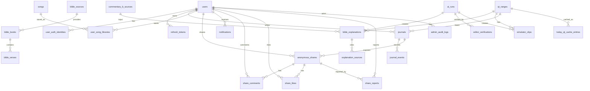

# ERD 문서 — QT-AI v2.3 기준

> **문서 버전:** v0.3
> **작성일:** 2026-05-15
> **기준 문서:** `07_요구사항_정의서.md` v2.3
> **문서 역할:** QT-AI v1의 논리 데이터 모델, 주요 테이블, 관계, 제약 기준 관리
> **연관 문서:** `03_아키텍처_정의서.md`, `04_API_명세서.md`, `05_시퀀스_다이어그램.md`, `06_화면_기능_정의서.md`, `07_요구사항_정의서.md`, `18_코드_품질_게이트.md`, `23_도메인_용어사전.md`

---

## 변경 이력

| 버전 | 날짜 | 작성자 | 주요 변경 |
| --- | --- | --- | --- |
| v0.1 | 2026-05-15 | Codex | `07` v2.3 기준으로 논리 ERD 초안 작성 |
| v0.2 | 2026-05-15 | Codex | `04` v0.2 기준으로 Today QT 캐시 상태, 묵상·익명 나눔, 신고 처리, 관리자 운영 컬럼·상태값 정합화 |
| v0.3 | 2026-05-15 | Codex | 구현자가 각 컬럼에 저장되는 값을 확인할 수 있도록 테이블별 컬럼 상세 정의 추가 |

---

## 1. 문서 목적과 경계

이 문서는 구현 저장소의 DB 설계 기준을 정리한다. 실제 마이그레이션 파일명, 인덱스 세부 문법, FK 이름은 구현 저장소에서 확정한다.

| 구분 | 이 문서에서 관리 | 다른 문서에서 관리 |
| --- | --- | --- |
| 논리 테이블 | 포함 | 물리 DDL은 구현 저장소 |
| 주요 컬럼 | 포함 | 컬럼 타입 세부 튜닝은 구현 저장소 |
| 관계·제약 | 포함 | API 요청/응답은 `04_API_명세서.md` |
| 데이터 사용 금지 | 포함 | 금지 표현과 용어는 `23_도메인_용어사전.md` |

---

## 2. ERD 개요

---

## 3. 공통 컬럼 기준

| 컬럼 | 기준 |
| --- | --- |
| `id` | BIGINT 또는 UUID 중 구현 저장소에서 통일. 문서 예시는 BIGINT 기준 |
| `created_at` | 생성 시각, KST 표시가 필요해도 DB는 UTC 저장 권장 |
| `updated_at` | 수정 시각 |
| `deleted_at` | 삭제 복구 또는 감사가 필요한 테이블에만 사용 |
| `created_by` | 관리자·시스템 작업 추적이 필요한 테이블에 사용 |
| `updated_by` | 관리자 수정 가능 테이블에 사용 |

---

## 4. 인증·사용자

| 테이블 | 주요 컬럼 | 설명 |
| --- | --- | --- |
| `users` | `id`, `display_name`, `email`, `role`, `status`, `created_at`, `updated_at` | 일반 사용자와 관리자 계정 |
| `user_auth_identities` | `id`, `user_id`, `provider`, `provider_user_id`, `email` | Google OAuth 연결 정보 |
| `refresh_tokens` | `id`, `user_id`, `jti`, `expires_at`, `revoked_at`, `revoked_reason` | Refresh Token 블랙리스트와 만료 관리 |

| 제약 | 기준 |
| --- | --- |
| 권한 | `USER`, `ADMIN`을 구분한다. 배치/AI 작업은 사용자 row가 아니라 `SYSTEM` 작업으로 기록한다. |
| 사용자 상태 | `ACTIVE`, `SUSPENDED`를 기본으로 한다. 계정 탈퇴 상태는 MVP에서 쓰지 않는다. |
| Refresh Token | `jti` 기준으로 블랙리스트 캐시와 DB 만료 정보를 함께 관리한다. |
| 교회 인증 | 교회 인증 관련 테이블은 MVP에서 만들지 않는다. |
| 계정 탈퇴 | MVP 제외. 삭제 상태 컬럼은 후속 버전에서 검토한다. |

### 4.1 인증·사용자 컬럼 상세

#### `users`

| 컬럼 | 저장 값 | 비고 |
| --- | --- | --- |
| `id` | 사용자 식별자 | 내부 FK 기준 |
| `display_name` | 화면에 표시할 사용자 이름 또는 닉네임 | 공유 API에서는 작성자 식별 정보로 노출하지 않음 |
| `email` | OAuth 제공자로부터 받은 이메일 | 로그인·관리자 식별용. 익명 나눔 응답에 노출 금지 |
| `role` | 권한 값 | `USER`, `ADMIN` |
| `status` | 계정 사용 상태 | `ACTIVE`, `SUSPENDED` |
| `created_at` | 계정 생성 시각 | UTC 저장 권장 |
| `updated_at` | 계정 정보 수정 시각 | UTC 저장 권장 |

#### `user_auth_identities`

| 컬럼 | 저장 값 | 비고 |
| --- | --- | --- |
| `id` | OAuth 연동 식별자 | 내부 PK |
| `user_id` | 연결된 사용자 ID | `users.id` 참조 |
| `provider` | 인증 제공자 | v1은 `GOOGLE` 기준 |
| `provider_user_id` | 제공자에서 발급한 사용자 고유 ID | 동일 provider 안에서 unique |
| `email` | 제공자가 반환한 이메일 | 사용자 계정 연결 확인용 |

#### `refresh_tokens`

| 컬럼 | 저장 값 | 비고 |
| --- | --- | --- |
| `id` | Refresh Token 기록 식별자 | 내부 PK |
| `user_id` | 토큰 소유 사용자 ID | `users.id` 참조 |
| `jti` | JWT ID 또는 토큰 고유 식별자 | 블랙리스트·중복 폐기 기준 |
| `expires_at` | 토큰 만료 시각 | UTC 저장 권장 |
| `revoked_at` | 토큰 폐기 시각 | 로그아웃·강제 폐기 시 기록 |
| `revoked_reason` | 폐기 사유 | 예: `LOGOUT`, `ROTATED`, `ADMIN_REVOKED` |

---

## 5. 성경·QT 데이터

| 테이블 | 주요 컬럼 | 설명 |
| --- | --- | --- |
| `bible_sources` | `id`, `repo_url`, `license`, `translation_name`, `attribution`, `redistribution_allowed`, `checked_at`, `checked_by` | GitHub 공개 JSON 소스 검토 표 |
| `bible_books` | `id`, `source_id`, `book_code`, `name_ko`, `name_en`, `book_order` | 성경 권 목록 |
| `bible_verses` | `id`, `source_id`, `book_code`, `chapter`, `verse`, `ordinal`, `text`, `language` | 절 단위 성경 본문 |
| `qt_ranges` | `id`, `qt_date`, `book_code`, `chapter_start`, `verse_start`, `chapter_end`, `verse_end`, `start_ordinal`, `end_ordinal`, `published_at`, `collected_at`, `status` | 오늘 QT 본문 범위 |
| `today_qt_cache_entries` | `id`, `qt_range_id`, `qt_date`, `served_qt_date`, `cache_key`, `cache_status`, `source`, `stale_reason`, `payload_hash`, `refreshed_at`, `expires_at`, `next_refresh_at` | Today QT 캐시 관리용 메타데이터 |

| 제약 | 기준 |
| --- | --- |
| 금지 번역본 | 개역개정, ESV, NIV는 적재하지 않는다. |
| 소스 검토 | `repo_url`, `license`, `translation_name`, `attribution`, `redistribution_allowed`가 없으면 적재하지 않는다. |
| QT 시각 | 공개 시각은 00:00 KST, 수집 배치 시각은 04:00 KST로 통일한다. |
| 범위 저장 | 성서 유니온에서 본문 텍스트가 아니라 본문 범위 정보만 수집한다. |
| 캐시 상태 | API 응답의 `cache.cacheStatus`와 맞춰 `HIT`, `MISS`, `STALE_FALLBACK`, `EMPTY`를 사용한다. |
| 이전 캐시 | 00:00~04:00 KST 또는 수집 실패 시 `served_qt_date`가 요청일과 다를 수 있다. |
| 준비 중 | 기존 캐시도 없으면 `cache_status=EMPTY`, `stale_reason=NO_CACHE`로 표현한다. |

### 5.1 성경·QT 컬럼 상세

#### `bible_sources`

| 컬럼 | 저장 값 | 비고 |
| --- | --- | --- |
| `id` | 성경 JSON 소스 검토 식별자 | 내부 PK |
| `repo_url` | 원본 GitHub 저장소 URL | 소스 추적 필수 |
| `license` | 원본 라이선스명 또는 라이선스 URL | 라이선스 확인 전 적재 금지 |
| `translation_name` | 번역본명 | 개역개정, ESV, NIV 금지 |
| `attribution` | 사용자 화면 또는 문서에 표시할 출처 표기 문구 | 출처 표기 방식 확인 결과 |
| `redistribution_allowed` | 재배포 가능 여부 | `true`일 때만 사용 가능 |
| `checked_at` | 소스 검토 완료 시각 | 라이선스 검토 시점 |
| `checked_by` | 소스 검토 담당자 또는 시스템 식별자 | 관리자 또는 `SYSTEM` |

#### `bible_books`

| 컬럼 | 저장 값 | 비고 |
| --- | --- | --- |
| `id` | 성경 권 식별자 | 내부 PK |
| `source_id` | 성경 소스 ID | `bible_sources.id` 참조 |
| `book_code` | 권 코드 | 예: `GEN`, `EXO`, `MAT` 등 구현 저장소에서 통일 |
| `name_ko` | 한국어 권명 | UI 표시용 |
| `name_en` | 영어 권명 | 검색·출처 표시 보조 |
| `book_order` | 성경 권 순서 | 정렬 기준 |

#### `bible_verses`

| 컬럼 | 저장 값 | 비고 |
| --- | --- | --- |
| `id` | 절 식별자 | 내부 PK |
| `source_id` | 성경 소스 ID | `bible_sources.id` 참조 |
| `book_code` | 권 코드 | `bible_books.book_code`와 정합 |
| `chapter` | 장 번호 | 1부터 시작 |
| `verse` | 절 번호 | 1부터 시작 |
| `ordinal` | 권 안에서 절을 일렬로 정렬하기 위한 순번 | 본문 범위 조회 최적화 |
| `text` | 허용된 번역본의 절 본문 텍스트 | 개역개정, ESV, NIV 저장 금지 |
| `language` | 본문 언어 코드 | 예: `ko`, `en` |

#### `qt_ranges`

| 컬럼 | 저장 값 | 비고 |
| --- | --- | --- |
| `id` | QT 본문 범위 식별자 | 내부 PK |
| `qt_date` | QT 기준 날짜 | KST 날짜 기준 |
| `book_code` | QT 본문 권 코드 | `bible_books.book_code`와 정합 |
| `chapter_start` | 시작 장 | 범위 정보만 저장 |
| `verse_start` | 시작 절 | 범위 정보만 저장 |
| `chapter_end` | 종료 장 | 다중 장 범위 지원 |
| `verse_end` | 종료 절 | 범위 정보만 저장 |
| `start_ordinal` | 시작 절 ordinal | 범위 조회 기준 |
| `end_ordinal` | 종료 절 ordinal | 범위 조회 기준 |
| `published_at` | 성서 유니온 공개 시각 | 00:00 KST 기준 |
| `collected_at` | 우리 시스템 수집 완료 시각 | 04:00 KST 배치 기준 |
| `status` | QT 범위 수집 상태 | 예: `READY`, `MISSING`, `FAILED`, `DISABLED` |

#### `today_qt_cache_entries`

| 컬럼 | 저장 값 | 비고 |
| --- | --- | --- |
| `id` | Today QT 캐시 기록 식별자 | 내부 PK |
| `qt_range_id` | 실제 응답에 사용한 QT 범위 ID | `qt_ranges.id` 참조, 준비 중이면 null 가능 |
| `qt_date` | 사용자가 요청한 QT 날짜 | KST 기준 |
| `served_qt_date` | 실제 응답에 사용한 QT 날짜 | 00:00~04:00 또는 실패 fallback 시 이전 날짜 가능 |
| `cache_key` | 캐시 키 | 사용자/언어/날짜 조건을 포함할 수 있음 |
| `cache_status` | 캐시 응답 상태 | `HIT`, `MISS`, `STALE_FALLBACK`, `EMPTY` |
| `source` | 캐시 데이터 출처 | 예: `DB`, `CACHE`, `STALE_CACHE`, `NONE` |
| `stale_reason` | 이전 캐시 또는 빈 응답 사유 | 예: `BEFORE_COLLECTION`, `COLLECTION_FAILED`, `NO_CACHE` |
| `payload_hash` | 응답 payload 해시 | 변경 감지·중복 갱신 방지 |
| `refreshed_at` | 캐시가 마지막으로 갱신된 시각 | UTC 저장 권장 |
| `expires_at` | 캐시 만료 예정 시각 | UTC 저장 권장 |
| `next_refresh_at` | 다음 갱신 예정 시각 | 04:00 KST 배치 기준 계산 |

---

## 6. 해설·AI 산출물

| 테이블 | 주요 컬럼 | 설명 |
| --- | --- | --- |
| `commentary_a_references` | `id`, `qt_range_id`, `reference_name`, `access_scope`, `checked_at` | 최신 한국어 주석 검증 참조. 사용자 노출 금지 |
| `commentary_b_sources` | `id`, `source_name`, `license`, `text_ref`, `public_domain`, `checked_at` | 영어 원문 주석 입력 소스 |
| `ai_runs` | `id`, `qt_range_id`, `run_type`, `prompt_version`, `input_hash`, `model`, `status`, `failed_reason`, `started_at`, `finished_at`, `actor_type` | AI 실행 이력 |
| `editor_verifications` | `id`, `ai_run_id`, `result`, `score`, `summary`, `verified_by`, `verified_at` | 편집자 에이전트 검증 결과 |
| `bible_explanations` | `id`, `qt_range_id`, `ai_run_id`, `summary`, `background`, `terms`, `explanation`, `tone`, `status`, `published_at` | 사용자 노출 C 테이블 해설 |
| `explanation_sources` | `id`, `explanation_id`, `source_type`, `source_label`, `attribution` | 해설 하단 출처 표시 |

| 제약 | 기준 |
| --- | --- |
| A 테이블 | 사용자 API와 화면에 노출하지 않는다. |
| C 테이블 | 사용자에게 노출되는 해설은 C 테이블만 사용한다. |
| AI run 상태 | `PENDING`, `RUNNING`, `SUCCEEDED`, `FAILED`, `REJECTED`, `NEEDS_REVIEW`를 사용한다. |
| 관리자 재생성 | 기존 산출물을 덮어쓰지 않고 새 version 또는 신규 `ai_runs` row로 기록한다. |
| LLM 호출 | 사용자 요청 경로에서 호출하지 않는다. 04:00 KST 배치 또는 관리자 트리거만 허용한다. |
| 저작권 표현 | "저작권 문제 없음"이 아니라 "저작권 리스크를 낮춘다"로 표현한다. |

### 6.1 해설·AI 산출물 컬럼 상세

#### `commentary_a_references`

| 컬럼 | 저장 값 | 비고 |
| --- | --- | --- |
| `id` | A 참조 기록 식별자 | 내부 PK |
| `qt_range_id` | 연결된 QT 범위 ID | `qt_ranges.id` 참조 |
| `reference_name` | 최신 한국어 주석 참조명 | 검증 참조용. 사용자 노출 금지 |
| `access_scope` | 접근 범위 | 예: `INTERNAL_ONLY`, `ADMIN_ONLY` |
| `checked_at` | 참조 검토 시각 | 사용자 노출 여부 검증 시점 |

#### `commentary_b_sources`

| 컬럼 | 저장 값 | 비고 |
| --- | --- | --- |
| `id` | B 소스 식별자 | 내부 PK |
| `source_name` | 영어 원문 주석 소스명 | C 생성 입력 출처 |
| `license` | 소스 라이선스 | 저작권 리스크 검토 기준 |
| `text_ref` | 원문 위치 또는 참조 키 | 원문 전체를 직접 노출하지 않기 위한 참조 |
| `public_domain` | 퍼블릭 도메인 여부 | `true` 또는 `false` |
| `checked_at` | 소스 검토 완료 시각 | 라이선스 확인 시점 |

#### `ai_runs`

| 컬럼 | 저장 값 | 비고 |
| --- | --- | --- |
| `id` | AI 실행 기록 식별자 | 내부 PK |
| `qt_range_id` | 대상 QT 범위 ID | `qt_ranges.id` 참조 |
| `run_type` | 실행 유형 | 예: `EXPLANATION_GENERATE`, `EXPLANATION_REGENERATE`, `SIMULATOR_GENERATE` |
| `prompt_version` | 사용한 프롬프트 버전 | 재현·비교 기준 |
| `input_hash` | 입력 데이터 해시 | 중복 실행 방지·재현성 확인 |
| `model` | 호출 모델명 | 예: DeepSeek 모델명 |
| `status` | 실행 상태 | `PENDING`, `RUNNING`, `SUCCEEDED`, `FAILED`, `REJECTED`, `NEEDS_REVIEW` |
| `failed_reason` | 실패 또는 반려 사유 | 실패 시 재처리 판단 기준 |
| `started_at` | 실행 시작 시각 | UTC 저장 권장 |
| `finished_at` | 실행 종료 시각 | UTC 저장 권장 |
| `actor_type` | 실행 주체 유형 | `SYSTEM`, `ADMIN`만 허용. 사용자 요청 경로 금지 |

#### `editor_verifications`

| 컬럼 | 저장 값 | 비고 |
| --- | --- | --- |
| `id` | 편집자 검증 기록 식별자 | 내부 PK |
| `ai_run_id` | 검증 대상 AI 실행 ID | `ai_runs.id` 참조 |
| `result` | 검증 결과 | 예: `APPROVED`, `REJECTED`, `NEEDS_REVIEW` |
| `score` | 검증 점수 | 사실 정합성·말투 판단 보조 |
| `summary` | 검증 요약 | 반려 사유 또는 보완 사항 |
| `verified_by` | 검증 주체 | 편집자 에이전트 또는 관리자 식별자 |
| `verified_at` | 검증 완료 시각 | UTC 저장 권장 |

#### `bible_explanations`

| 컬럼 | 저장 값 | 비고 |
| --- | --- | --- |
| `id` | C 해설 식별자 | 내부 PK |
| `qt_range_id` | 대상 QT 범위 ID | `qt_ranges.id` 참조 |
| `ai_run_id` | 해설을 만든 AI 실행 ID | `ai_runs.id` 참조 |
| `summary` | 본문 요약 | 사용자 노출 C 해설 일부 |
| `background` | 배경 설명 | 사용자 이해를 돕는 쉬운 한국어 설명 |
| `terms` | 어려운 용어 풀이 | JSON 또는 별도 구조는 구현 저장소에서 확정 |
| `explanation` | 본문 해설 본문 | B를 AI가 번역·재해석한 사용자 노출본 |
| `tone` | 해설 말투 기준 | 예: `EASY_KO`, `PASTORAL_SAFE` |
| `status` | 해설 공개 상태 | 예: `DRAFT`, `PUBLISHED`, `REJECTED`, `HIDDEN` |
| `published_at` | 사용자 공개 시각 | 검증 통과 후 기록 |

#### `explanation_sources`

| 컬럼 | 저장 값 | 비고 |
| --- | --- | --- |
| `id` | 해설 출처 기록 식별자 | 내부 PK |
| `explanation_id` | 연결된 C 해설 ID | `bible_explanations.id` 참조 |
| `source_type` | 출처 유형 | 예: `COMMENTARY_B`, `BIBLE_SOURCE`, `EDITOR_NOTE` |
| `source_label` | 사용자 또는 관리자에게 표시할 출처명 | 저작권 리스크를 낮추기 위한 출처 표기 |
| `attribution` | 출처 표기 문구 | 라이선스 기준에 맞춰 작성 |

---

## 7. 묵상·나눔

| 테이블 | 주요 컬럼 | 설명 |
| --- | --- | --- |
| `journals` | `id`, `user_id`, `qt_range_id`, `status`, `feeling`, `memory_verse`, `application`, `prayer`, `visibility`, `created_at`, `updated_at` | 오늘 QT 기준 묵상 노트 |
| `journal_events` | `id`, `journal_id`, `event_type`, `event_id`, `payload`, `created_at` | 묵상 노트 변경 이력 |
| `journal_calendar_days` | `id`, `user_id`, `journal_date`, `has_journal`, `journal_id`, `refreshed_at` | 묵상 달력 조회 캐시 또는 뷰 |
| `anonymous_shares` | `id`, `journal_id`, `user_id`, `status`, `shared_at`, `hidden_at`, `hidden_by`, `deleted_at` | 선택적 익명 공유 |
| `share_comments` | `id`, `share_id`, `user_id`, `body`, `created_at`, `deleted_at` | 공유 글 댓글 |
| `share_likes` | `id`, `share_id`, `user_id`, `created_at` | 좋아요 |
| `share_reports` | `id`, `share_id`, `reporter_id`, `reason`, `status`, `action`, `memo`, `handled_by`, `handled_at`, `created_at` | 신고 |

| 제약 | 기준 |
| --- | --- |
| 묵상 기준 | 자유 본문이 아니라 오늘 QT 기준으로 생성한다. |
| 묵상 상태 | `DRAFT`, `SAVED`를 사용한다. AI 세션과 연결하지 않는다. |
| 공개 기본값 | 기본값은 비공개다. 사용자가 선택한 경우에만 익명 공유한다. |
| 공개 상태 | `journals.visibility`는 `PRIVATE`, `SHARED`를 사용한다. |
| 공유 상태 | `anonymous_shares.status`는 `PUBLIC`, `HIDDEN`, `DELETED`를 사용한다. |
| 작성자 보호 | 사용자 API 응답에는 공유 작성자의 `user_id`, `display_name`, `email`을 노출하지 않는다. |
| 신고 상태 | `share_reports.status`는 `PENDING`, `RESOLVED`, `REJECTED`, `HIDDEN`을 사용한다. |
| 좋아요 중복 | `share_likes`는 `share_id + user_id` 중복 저장을 막는다. |
| 글자 수 | 사용자 입력 글자 수 제한은 두지 않는다. 악성 요청 방어는 공통 정책으로 처리한다. |
| 달력 | 묵상 노트 생성·수정·삭제 시 달력 캐시를 무효화한다. |

### 7.1 묵상·나눔 컬럼 상세

#### `journals`

| 컬럼 | 저장 값 | 비고 |
| --- | --- | --- |
| `id` | 묵상 노트 식별자 | 내부 PK |
| `user_id` | 작성 사용자 ID | `users.id` 참조 |
| `qt_range_id` | 묵상 기준 QT 범위 ID | 오늘 QT 기준. 자유 본문 생성 금지 |
| `status` | 묵상 작성 상태 | `DRAFT`, `SAVED` |
| `feeling` | 느낀 점 | 사용자 입력 |
| `memory_verse` | 기억할 구절 | 사용자 입력. 성경 본문 원문 자동 저장 목적 아님 |
| `application` | 적용할 점 | 사용자 입력 |
| `prayer` | 기도 | 사용자 입력 |
| `visibility` | 공개 범위 | `PRIVATE`, `SHARED` |
| `created_at` | 묵상 생성 시각 | UTC 저장 권장 |
| `updated_at` | 묵상 수정 시각 | UTC 저장 권장 |

#### `journal_events`

| 컬럼 | 저장 값 | 비고 |
| --- | --- | --- |
| `id` | 묵상 이벤트 기록 식별자 | 내부 PK |
| `journal_id` | 대상 묵상 ID | `journals.id` 참조 |
| `event_type` | 이벤트 유형 | 예: `CREATED`, `UPDATED`, `DELETED`, `SHARED`, `UNSHARED` |
| `event_id` | 이벤트 고유 ID | 중복 처리 방지·재처리 기준 |
| `payload` | 이벤트 처리에 필요한 최소 JSON | 민감 정보·불필요한 원문 저장 금지 |
| `created_at` | 이벤트 발생 기록 시각 | UTC 저장 권장 |

#### `journal_calendar_days`

| 컬럼 | 저장 값 | 비고 |
| --- | --- | --- |
| `id` | 달력 일자 캐시 식별자 | 내부 PK |
| `user_id` | 대상 사용자 ID | `users.id` 참조 |
| `journal_date` | 달력 표시 날짜 | KST 기준 날짜 |
| `has_journal` | 해당 날짜 묵상 존재 여부 | 달력 빠른 조회용 |
| `journal_id` | 연결된 묵상 ID | 없으면 null 가능 |
| `refreshed_at` | 캐시 또는 뷰 갱신 시각 | 묵상 변경 시 갱신 |

#### `anonymous_shares`

| 컬럼 | 저장 값 | 비고 |
| --- | --- | --- |
| `id` | 익명 나눔 식별자 | 내부 PK |
| `journal_id` | 공유한 묵상 ID | `journals.id` 참조 |
| `user_id` | 원 작성자 사용자 ID | 내부 관리용. 사용자 API 응답 노출 금지 |
| `status` | 공유 상태 | `PUBLIC`, `HIDDEN`, `DELETED` |
| `shared_at` | 공유 시작 시각 | UTC 저장 권장 |
| `hidden_at` | 숨김 처리 시각 | 관리자 또는 신고 처리 시 기록 |
| `hidden_by` | 숨김 처리자 ID | 관리자 ID 또는 `SYSTEM` |
| `deleted_at` | 삭제 처리 시각 | 사용자 삭제 또는 관리자 처리 |

#### `share_comments`

| 컬럼 | 저장 값 | 비고 |
| --- | --- | --- |
| `id` | 댓글 식별자 | 내부 PK |
| `share_id` | 대상 익명 나눔 ID | `anonymous_shares.id` 참조 |
| `user_id` | 댓글 작성 사용자 ID | 사용자 API에서 이메일·실명 노출 금지 |
| `body` | 댓글 본문 | 사용자 입력 |
| `created_at` | 댓글 작성 시각 | UTC 저장 권장 |
| `deleted_at` | 댓글 삭제 시각 | 삭제되지 않았으면 null |

#### `share_likes`

| 컬럼 | 저장 값 | 비고 |
| --- | --- | --- |
| `id` | 좋아요 식별자 | 내부 PK |
| `share_id` | 대상 익명 나눔 ID | `anonymous_shares.id` 참조 |
| `user_id` | 좋아요 누른 사용자 ID | `share_id + user_id` unique |
| `created_at` | 좋아요 생성 시각 | UTC 저장 권장 |

#### `share_reports`

| 컬럼 | 저장 값 | 비고 |
| --- | --- | --- |
| `id` | 신고 식별자 | 내부 PK |
| `share_id` | 신고 대상 익명 나눔 ID | `anonymous_shares.id` 참조 |
| `reporter_id` | 신고 사용자 ID | `users.id` 참조 |
| `reason` | 신고 사유 코드 또는 사용자 입력 사유 | 구현 저장소에서 enum 확정 |
| `status` | 신고 처리 상태 | `PENDING`, `RESOLVED`, `REJECTED`, `HIDDEN` |
| `action` | 관리자 처리 결과 | 예: `NO_ACTION`, `HIDE_SHARE`, `DELETE_COMMENT` |
| `memo` | 관리자 처리 메모 | 내부 운영용 |
| `handled_by` | 처리 관리자 ID | `users.id` 참조, 미처리면 null |
| `handled_at` | 처리 완료 시각 | 미처리면 null |
| `created_at` | 신고 접수 시각 | UTC 저장 권장 |

---

## 8. 찬양·알림·시뮬레이터

| 테이블 | 주요 컬럼 | 설명 |
| --- | --- | --- |
| `songs` | `id`, `title`, `artist`, `external_ref`, `metadata`, `status`, `created_by`, `updated_by`, `created_at`, `updated_at` | 운영자 사전 큐레이션 찬양 메타데이터 |
| `user_song_libraries` | `id`, `user_id`, `song_id`, `created_at` | 사용자의 내 찬양 목록 |
| `simulator_clips` | `id`, `qt_range_id`, `ai_run_id`, `status`, `clip_ref`, `failure_reason`, `updated_by`, `updated_at` | 본문 장면 클립 상태 |
| `notifications` | `id`, `user_id`, `type`, `title`, `body`, `read_at`, `created_at` | 인앱 알림 |

| 제약 | 기준 |
| --- | --- |
| 찬양 | AI 추천, 가사 저장, 음원 저장을 하지 않는다. |
| 찬양 상태 | `songs.status`는 `ACTIVE`, `INACTIVE`, `DELETED`를 사용한다. |
| 찬양 참조 | 사용자 라이브러리는 가사·음원이 아니라 `song_id` 참조만 저장한다. |
| 찬양 중복 | `user_song_libraries`는 `user_id + song_id` 중복 저장을 막는다. |
| 시뮬레이터 상태 | `READY`, `MISSING`, `FAILED`, `DISABLED` 중 하나다. |
| Today QT 100% | 클립이 없더라도 시뮬레이터 상태값은 항상 반환한다. |

### 8.1 찬양·알림·시뮬레이터 컬럼 상세

#### `songs`

| 컬럼 | 저장 값 | 비고 |
| --- | --- | --- |
| `id` | 찬양 식별자 | 내부 PK |
| `title` | 찬양 제목 | 운영자 큐레이션 메타데이터 |
| `artist` | 아티스트 또는 팀명 | 운영자 큐레이션 메타데이터 |
| `external_ref` | 외부 플랫폼 참조 키 또는 검색용 식별자 | 직접 YouTube URL 입력 저장용이 아님 |
| `metadata` | 장르, 분위기, 태그 등 운영 메타데이터 | 가사·음원 저장 금지 |
| `status` | 찬양 노출 상태 | `ACTIVE`, `INACTIVE`, `DELETED` |
| `created_by` | 생성 관리자 ID 또는 `SYSTEM` | 운영자 큐레이션 추적 |
| `updated_by` | 마지막 수정 관리자 ID 또는 `SYSTEM` | 운영자 큐레이션 추적 |
| `created_at` | 생성 시각 | UTC 저장 권장 |
| `updated_at` | 수정 시각 | UTC 저장 권장 |

#### `user_song_libraries`

| 컬럼 | 저장 값 | 비고 |
| --- | --- | --- |
| `id` | 사용자 찬양 저장 식별자 | 내부 PK |
| `user_id` | 저장한 사용자 ID | `users.id` 참조 |
| `song_id` | 저장한 찬양 ID | `songs.id` 참조 |
| `created_at` | 내 찬양 목록에 추가한 시각 | `user_id + song_id` unique |

#### `simulator_clips`

| 컬럼 | 저장 값 | 비고 |
| --- | --- | --- |
| `id` | 시뮬레이터 클립 식별자 | 내부 PK |
| `qt_range_id` | 대상 QT 범위 ID | `qt_ranges.id` 참조 |
| `ai_run_id` | 클립 생성과 연결된 AI 실행 ID | 없거나 수동 상태면 null 가능 |
| `status` | 클립 상태 | `READY`, `MISSING`, `FAILED`, `DISABLED` |
| `clip_ref` | 클립 파일 또는 외부 저장소 참조 키 | 클립이 `READY`일 때만 필수 |
| `failure_reason` | 생성 실패 또는 비활성 사유 | `FAILED`, `DISABLED` 판단 근거 |
| `updated_by` | 상태를 변경한 관리자 ID 또는 `SYSTEM` | 운영 추적 |
| `updated_at` | 마지막 상태 변경 시각 | UTC 저장 권장 |

#### `notifications`

| 컬럼 | 저장 값 | 비고 |
| --- | --- | --- |
| `id` | 알림 식별자 | 내부 PK |
| `user_id` | 알림 수신 사용자 ID | `users.id` 참조 |
| `type` | 알림 유형 | 예: `JOURNAL_REMINDER`, `SHARE_COMMENT`, `SYSTEM_NOTICE` |
| `title` | 알림 제목 | 사용자 노출 텍스트 |
| `body` | 알림 본문 | 사용자 노출 텍스트 |
| `read_at` | 읽음 처리 시각 | 읽지 않았으면 null |
| `created_at` | 알림 생성 시각 | UTC 저장 권장 |

---

## 9. 관리자·감사·이벤트 재처리

| 테이블 | 주요 컬럼 | 설명 |
| --- | --- | --- |
| `admin_audit_logs` | `id`, `actor_id`, `actor_type`, `action`, `target_type`, `target_id`, `result`, `summary`, `created_at` | 관리자·SYSTEM 작업 감사 로그 |
| `event_failure_logs` | `id`, `event_id`, `event_type`, `aggregate_type`, `aggregate_id`, `error_message`, `retryable`, `created_at`, `resolved_at` | 인프로세스 이벤트 핸들러 실패 로그 |

| 제약 | 기준 |
| --- | --- |
| 관리자 API | `ADMIN` 권한만 접근 가능하다. |
| 감사 대상 | QT 범위, C 해설, AI 재생성, 시뮬레이터 상태, 신고 처리, 찬양 큐레이션 변경은 감사 로그 대상이다. |
| 배치·AI 작업 | 실제 실행 주체는 `SYSTEM`으로 기록한다. |
| 이벤트 실패 | "유실률 0%"가 아니라 핸들러 실패 로그와 재처리 가능성을 관리한다. |

### 9.1 관리자·감사·이벤트 재처리 컬럼 상세

#### `admin_audit_logs`

| 컬럼 | 저장 값 | 비고 |
| --- | --- | --- |
| `id` | 감사 로그 식별자 | 내부 PK |
| `actor_id` | 작업자 사용자 ID | 관리자면 `users.id`, 시스템 작업이면 null 가능 |
| `actor_type` | 작업 주체 유형 | `ADMIN`, `SYSTEM` |
| `action` | 수행한 작업 | 예: `QT_RANGE_UPDATE`, `EXPLANATION_REGENERATE`, `SHARE_HIDE`, `SONG_UPDATE` |
| `target_type` | 대상 리소스 유형 | 예: `QT_RANGE`, `EXPLANATION`, `SIMULATOR_CLIP`, `SHARE_REPORT`, `SONG` |
| `target_id` | 대상 리소스 ID | 대상 테이블의 PK |
| `result` | 작업 결과 | 예: `SUCCESS`, `FAILED` |
| `summary` | 작업 요약 | 관리자 화면 감사 로그 표시용 |
| `created_at` | 감사 로그 생성 시각 | UTC 저장 권장 |

#### `event_failure_logs`

| 컬럼 | 저장 값 | 비고 |
| --- | --- | --- |
| `id` | 이벤트 실패 로그 식별자 | 내부 PK |
| `event_id` | 실패한 이벤트 고유 ID | 중복 재처리 방지 기준 |
| `event_type` | 이벤트 유형 | 예: `JournalChangedEvent`, `ShareReportedEvent` |
| `aggregate_type` | 이벤트가 속한 aggregate 유형 | 예: `JOURNAL`, `SHARE`, `SONG` |
| `aggregate_id` | aggregate 식별자 | 관련 도메인 row ID |
| `error_message` | 실패 메시지 요약 | 민감 정보 제외 |
| `retryable` | 재처리 가능 여부 | `true`이면 운영 재처리 대상 |
| `created_at` | 실패 기록 시각 | UTC 저장 권장 |
| `resolved_at` | 재처리 완료 또는 무시 처리 시각 | 미해결이면 null |

---

## 10. 현재 상태

| 항목 | 상태 |
| --- | --- |
| ERD 문서 | 이 문서에서 v0.3으로 각 컬럼 저장 값 설명까지 보강 |
| 기준 요구사항 | `07_요구사항_정의서.md` v2.3 유지 |
| API 명세서 연계 | `04_API_명세서.md` v0.2 기준 반영 |
| 시퀀스 다이어그램 연계 | `05_시퀀스_다이어그램.md` v0.2 기준 반영 |
| 화면 기능 정의서 연계 | `06_화면_기능_정의서.md` v0.2 기준 반영 |
| 다음 권장 작업 | 별도 구현 GitHub 기준 실제 담당 경로와 PR 단위 확정 |
