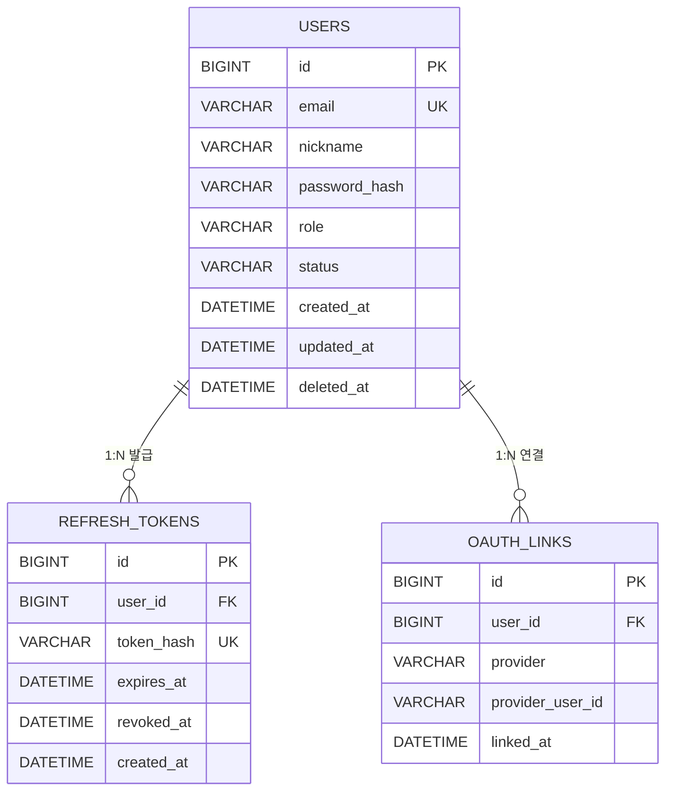
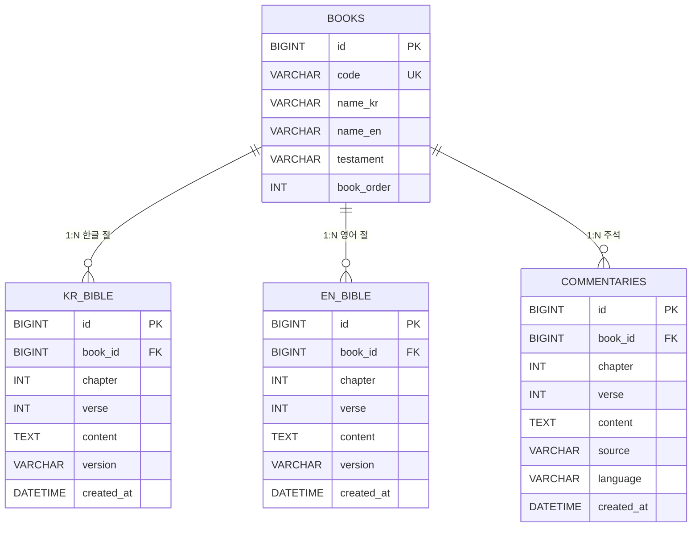
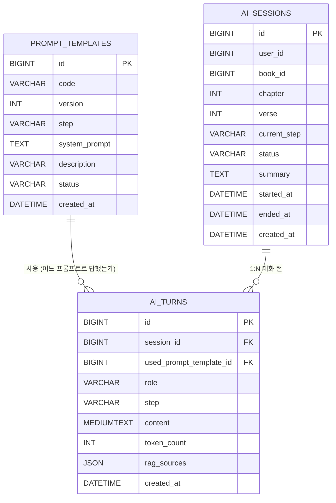
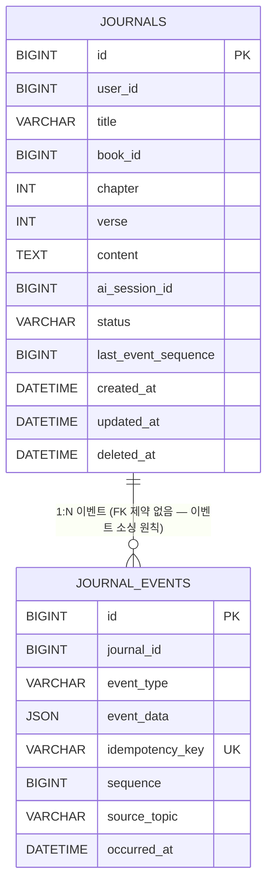
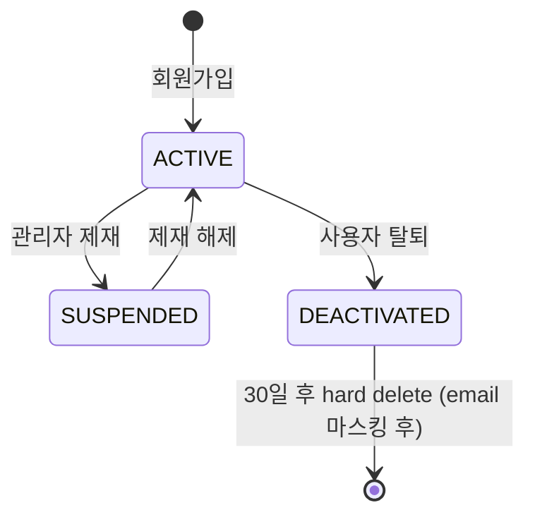
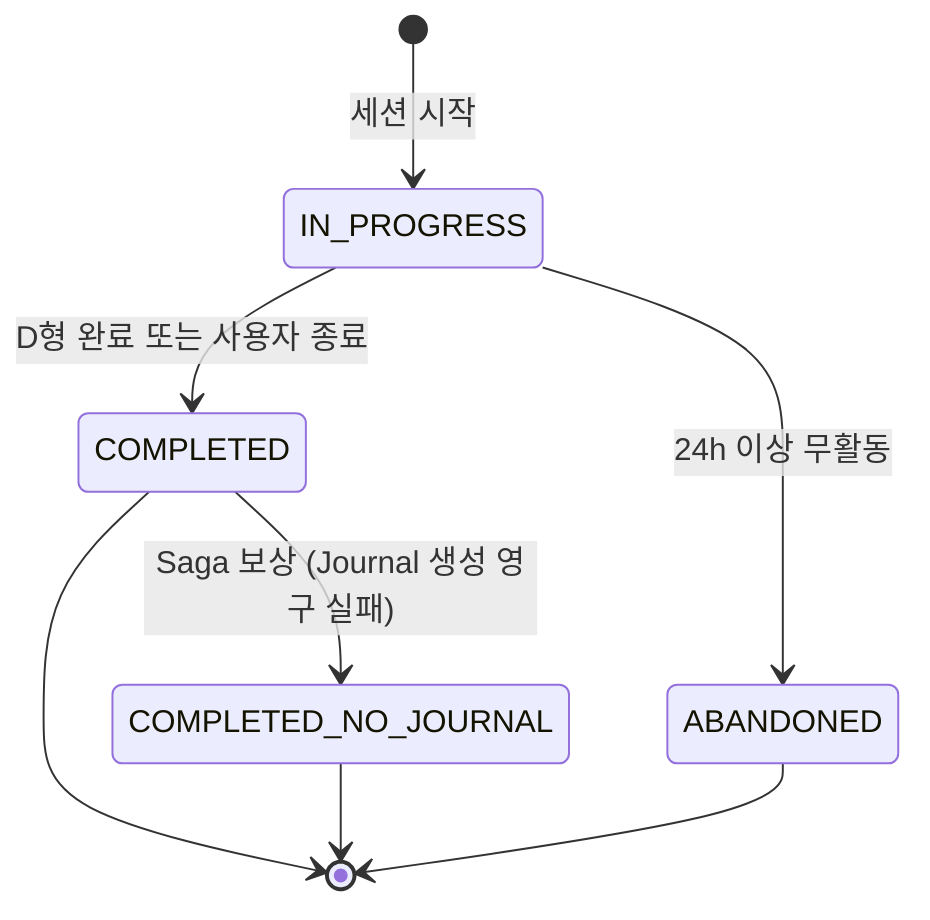
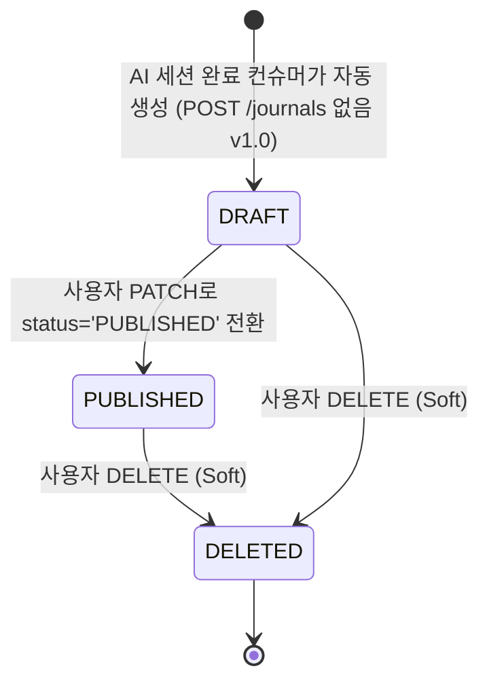

# 📖 QT-AI (큐티 AI 앱) — ERD 문서 v1.1

> **문서 버전:** v1.1
> **작성일:** 2026-05-06 (v1.0) / 2026-05-06 (v1.1 — 25항목 일괄 패치)
> **연관 문서:** [01_프로젝트_계획서 v1.3](./01_프로젝트_계획서.md) / 03 아키텍처 정의서 / 04 API 명세서
> **MSA 데이터 원칙:** **Database per Service** — 각 서비스가 자기 DB 소유, 서비스 간 직접 JOIN 금지, 비동기 동기화는 Kafka 이벤트로

---

## 📌 변경 이력

| 버전 | 날짜 | 작성자 | 주요 변경 |
| --- | --- | --- | --- |
| v1.0 | 2026-05-06 | 강태오 | 초기 작성 — 4개 서비스 DB 분리, ChromaDB 별도, Kafka 이벤트 연결 |
| v1.1 | 2026-05-06 | 강태오 | **3차 검토 결과 25항목 일괄 패치** — PROMPT_TEMPLATES UK 정정 / AI_TURNS·AI_SESSIONS 추적 컬럼 추가 / JOURNAL_EVENTS sequence 메커니즘 / utf8mb4 표준 / MEDIUMTEXT / email 재가입 정책 / DRAFT 명칭 분리 / 토픽 표 보강 (Schema subject·DLQ) / Schema Registry 명시 / NOTIFICATION 정책 / Flyway / Outbox v1.0 한계 / event_data 예시 / 다이어그램 보강 |
| v1.1.1 | 2026-05-06 | 강태오 | 03번 v1.1 동기화 — § 1.1 다이어그램에 Auth Redis-WS (refresh blacklist), Bible Redis-Cache 분리 표기 / § 2.3 REFRESH_TOKENS Redis blacklist 정책 노트 추가 |
| v1.2 | 2026-05-07 | 강태오 | **외부 검토 9항목 일괄 패치** — § 6.1 토픽 표 8번째 추가 (`journal.creation.failed` Saga 보상) + `user.activity.tracked` 멱등성 키 형식 04번과 통일 (`read.passage:{user_id}:{book}:{ch}:{v}:{epoch_minute}`) + envelope에 `idempotencyKey` 필드 명시 / § 7.6 JOURNALS.status 다이어그램 정정 (PUBLISHED → DRAFT 화살표 제거 + "사용자 직접 작성" 제거 — 04번 § 7.4 INVALID_STATUS_TRANSITION 정책 정합) |

---

## 목차

1. [데이터 아키텍처 개요](#1-데이터-아키텍처-개요)
2. [Auth/User Service ERD](#2-authuser-service-erd) — 이지윤
3. [Bible Service ERD](#3-bible-service-erd) — 김태혁
4. [AI/RAG Service ERD](#4-airag-service-erd) — 강상민
5. [Journal Service ERD](#5-journal-service-erd) — 이승욱
6. [서비스 간 연결 (Kafka 이벤트)](#6-서비스-간-연결-kafka-이벤트)
7. [상태 코드 정의](#7-상태-코드-정의)
8. [공통 패턴](#8-공통-패턴) — BaseEntity / Soft Delete / 멱등성 키 / Charset / Migration
9. [인덱스 전략](#9-인덱스-전략)
10. [ChromaDB 벡터 스토어 (별도)](#10-chromadb-벡터-스토어-별도)
11. [설계 결정 사항 & 주의사항](#11-설계-결정-사항--주의사항)

---

## 1. 데이터 아키텍처 개요

### 1.1 Database per Service 원칙

```
┌──────────────────┐  ┌──────────────────┐  ┌──────────────────┐  ┌──────────────────┐
│ Auth/User        │  │ Bible            │  │ AI/RAG           │  │ Journal          │
│ Service          │  │ Service          │  │ Service          │  │ Service          │
│                  │  │                  │  │                  │  │                  │
│ MySQL: auth_db   │  │ MySQL: bible_db  │  │ MySQL: ai_db     │  │ MySQL: journal_db│
│ + Redis-WS       │  │ + Redis-Cache    │  │ + ChromaDB       │  │                  │
│  (refresh        │  │  (passage 24h    │  │                  │  │                  │
│   blacklist)     │  │   TTL)           │  │                  │  │                  │
│ - USERS          │  │ - BOOKS          │  │ - PROMPT_TEMPLATE│  │ - JOURNALS       │
│ - REFRESH_TOKENS │  │ - KR_BIBLE       │  │ - AI_SESSIONS    │  │ - JOURNAL_EVENTS │
│ - OAUTH_LINKS    │  │ - EN_BIBLE       │  │ - AI_TURNS       │  │                  │
│                  │  │ - COMMENTARIES   │  │ (벡터: ChromaDB) │  │                  │
└──────────────────┘  └──────────────────┘  └──────────────────┘  └──────────────────┘

┌──────────────────┐  ┌──────────────────────────┐
│ API Gateway      │  │ BFF Aggregator           │   ← DB 없음
│ (DB 없음)         │  │ + Redis-WS               │     (Auth와 같은 인스턴스 공유,
│                  │  │  (WS 세션 레지스트리)     │      keyspace prefix로 격리)
└──────────────────┘  └──────────────────────────┘

  ※ Redis 인스턴스 분리 — 03번 § 1.1:
     - Redis-Cache: Bible 전용 (cache:* prefix)
     - Redis-WS:    Auth refresh blacklist (auth:*) + BFF WS 세션 (ws:*)

         ↓ 이벤트                 ↑ 컨슈머
   ┌─────────────────────────────────────────────────┐
   │  Kafka  (Schema Registry로 스키마 관리)           │
   │  topics: user.deactivated / user.activity.tracked│
   │          ai.session.completed / journal.created  │
   │          journal.updated / journal.deleted       │
   │          notification.requested                  │
   │  + 각 토픽의 DLQ: {topic}.DLQ                    │
   └─────────────────────────────────────────────────┘
```

### 1.2 서비스 간 데이터 참조 원칙

> **절대 금지:** 서비스 A의 DB에서 서비스 B의 DB로 직접 JOIN, 직접 SELECT, FK 외래키
>
> **허용:**
> - 비동기 데이터 동기화 → **Kafka 이벤트** (eventual consistency, Schema Registry 검증)
> - 실시간 데이터 조회 → **API 호출** (BFF Aggregator가 병렬 호출)
> - 외부 ID 참조 → **DB 컬럼은 단순 BIGINT, FK 제약 없음** (예: `Journal.user_id`는 Auth Service의 `users.id` 값을 저장하지만 FK 제약 없음)

### 1.3 BFF Aggregator의 역할

- **자체 DB 없음.** 6 service의 데이터를 조합해서 단일 응답 DTO 반환.
- 입체적 묵상 화면 같은 다중 데이터 화면은 BFF가 Bible + Commentary를 `CompletableFuture`로 병렬 호출.
- Notification Aggregator 기능 포함 (§ 6.4 참조).

### 1.4 Gateway의 역할

- **자체 DB 없음.** JWT 검증·라우팅·Rate Limit·SSE 패스스루.
- JWT 검증에 필요한 공개키는 K8s Secret에 적재.

---

## 2. Auth/User Service ERD

> **Owner:** 이지윤 / **DB schema:** `auth_db` / **외부 노출 ID:** `users.id` (다른 서비스가 참조)

### 2.1 다이어그램



### 2.2 USERS — 회원

| 컬럼 | 타입 | NULL | 기본값 | PK/FK/UK | 설명 |
| --- | --- | --- | --- | --- | --- |
| id | BIGINT | N | AUTO_INCREMENT | PK | 외부 노출 ID (다른 서비스가 참조) |
| email | VARCHAR(254) | N | — | UK | 로그인 ID, RFC 5321 max 254 |
| nickname | VARCHAR(50) | N | — | | 표시 이름 |
| password_hash | VARCHAR(100) | Y | NULL | | bcrypt cost=12 (소셜 전용 사용자는 NULL) |
| role | VARCHAR(20) | N | 'ROLE_USER' | | § 7.3 참조 |
| status | VARCHAR(20) | N | 'ACTIVE' | | § 7.1 참조 |
| created_at | DATETIME(6) | N | CURRENT_TIMESTAMP(6) | | BaseEntity |
| updated_at | DATETIME(6) | Y | NULL | | BaseEntity |
| deleted_at | DATETIME(6) | Y | NULL | | Soft Delete (§ 8.2) |

**인덱스**
- `uk_users_email` UNIQUE ON (email)
- `idx_users_status` ON (status)
- `idx_users_deleted_at` ON (deleted_at)

#### 2.2.1 이메일 재가입 정책 (v1.0)

> 탈퇴(deleted_at IS NOT NULL) 사용자가 같은 email로 재가입 시 UNIQUE 충돌 → 다음 정책으로 회피.

**v1.0 default — 탈퇴 시 email 마스킹:**
- `deactivate()` 호출 시 email을 `u_{id}_deactivated_{epoch_ms}@deleted.local` 형식으로 UPDATE
- 원본 email은 `JOURNAL_EVENTS` 또는 별도 audit 로그에 보존 (감사 목적)
- 결과: UNIQUE 충돌 없음, 같은 email 재가입 시 새 user 행 생성

**대안 (v1.1 검토):**
- 30일 grace 기간 후 hard delete → 그 후 재가입 허용
- 또는 `email + status` 복합 UNIQUE (status='ACTIVE'에서만 unique)

ADR 후보 0010.

### 2.3 REFRESH_TOKENS — 리프레시 토큰

| 컬럼 | 타입 | NULL | 기본값 | PK/FK/UK | 설명 |
| --- | --- | --- | --- | --- | --- |
| id | BIGINT | N | AUTO_INCREMENT | PK | |
| user_id | BIGINT | N | — | FK → USERS.id | |
| token_hash | VARCHAR(100) | N | — | UK | SHA-256 해시 (원본 토큰은 저장 X) |
| expires_at | DATETIME(6) | N | — | | 만료 시각 (기본 14일) |
| revoked_at | DATETIME(6) | Y | NULL | | 폐기 시각 (로그아웃·재발급·rotation 시) |
| created_at | DATETIME(6) | N | CURRENT_TIMESTAMP(6) | | BaseEntity |

> **Refresh Blacklist (Redis-WS):** 로그아웃·rotation 시 `auth:refresh:revoked:{jti}` key 등록 (TTL = refresh 만료까지). DB의 `revoked_at` 컬럼은 감사용, 실시간 차단은 Redis로. **Access Token은 blacklist 없음** — 만료(30분)까지 유효.

**Token Rotation 정책 (v1.0):** Refresh 호출 시 기존 토큰 `revoked_at` 세팅 + 새 토큰 발급. 만료된 토큰은 야간 배치로 hard delete (90일 보관).

**인덱스**
- `uk_refresh_tokens_hash` UNIQUE ON (token_hash)
- `idx_refresh_tokens_user_id_expires` ON (user_id, expires_at)

### 2.4 OAUTH_LINKS — 소셜 로그인 연결

| 컬럼 | 타입 | NULL | 기본값 | PK/FK/UK | 설명 |
| --- | --- | --- | --- | --- | --- |
| id | BIGINT | N | AUTO_INCREMENT | PK | |
| user_id | BIGINT | N | — | FK → USERS.id | |
| provider | VARCHAR(20) | N | — | | 'GOOGLE' (v1.0 1종) |
| provider_user_id | VARCHAR(100) | N | — | | 외부 ID (Google sub) |
| linked_at | DATETIME(6) | N | CURRENT_TIMESTAMP(6) | | |

**인덱스**
- `uk_oauth_links_provider_user` UNIQUE ON (provider, provider_user_id)
- `idx_oauth_links_user_id` ON (user_id)

---

## 3. Bible Service ERD

> **Owner:** 김태혁 / **DB schema:** `bible_db` + Redis 캐시 (`passage:{book}:{ch}:{v}`, TTL 24h)
>
> **데이터 출처:** § [01번 § 3.1 데이터 저작권 표](./01_프로젝트_계획서.md) — KJV (PD) + Matthew Henry (PD) + 개역한글(출처 표기) + 한글 주석 더미데이터

### 3.1 다이어그램



### 3.2 BOOKS — 성경 책 메타

| 컬럼 | 타입 | NULL | 기본값 | PK/FK/UK | 설명 |
| --- | --- | --- | --- | --- | --- |
| id | BIGINT | N | AUTO_INCREMENT | PK | |
| code | VARCHAR(10) | N | — | UK | 'GEN', 'EXO', 'MAT' (3-letter 표준 약어) |
| name_kr | VARCHAR(20) | N | — | | '창세기' |
| name_en | VARCHAR(50) | N | — | | 'Genesis' |
| testament | VARCHAR(2) | N | — | | 'OT' (구약) / 'NT' (신약) |
| book_order | INT | N | — | | 1~66 (정경 순서) |

**시드 데이터:** 66권 — **Flyway migration 시드 SQL** (`V1__seed_books.sql`)로 W0에 일괄 적재 (66 행은 즉시 가능).

### 3.3 KR_BIBLE — 한글 성경 (개역한글)

| 컬럼 | 타입 | NULL | 기본값 | PK/FK/UK | 설명 |
| --- | --- | --- | --- | --- | --- |
| id | BIGINT | N | AUTO_INCREMENT | PK | |
| book_id | BIGINT | N | — | FK → BOOKS.id | |
| chapter | INT | N | — | | 장 |
| verse | INT | N | — | | 절 |
| content | TEXT | N | — | | 본문 |
| version | VARCHAR(20) | N | 'REVISED' | | 'REVISED' (개역한글) |
| created_at | DATETIME(6) | N | CURRENT_TIMESTAMP(6) | | BaseEntity |

**인덱스**
- `uk_kr_bible_book_ch_v_ver` UNIQUE ON (book_id, chapter, verse, version)
- `idx_kr_bible_lookup` ON (book_id, chapter, verse) — 다중 JOIN 핵심

**ETL 시점:** **W1** (약 31,000 절). Flyway repeatable migration 또는 별도 ETL 스크립트.

### 3.4 EN_BIBLE — 영어 성경 (KJV)

| 컬럼 | 타입 | NULL | 기본값 | PK/FK/UK | 설명 |
| --- | --- | --- | --- | --- | --- |
| id | BIGINT | N | AUTO_INCREMENT | PK | |
| book_id | BIGINT | N | — | FK → BOOKS.id | |
| chapter | INT | N | — | | |
| verse | INT | N | — | | |
| content | TEXT | N | — | | |
| version | VARCHAR(20) | N | 'KJV' | | 'KJV' (Public Domain) |
| created_at | DATETIME(6) | N | CURRENT_TIMESTAMP(6) | | |

**인덱스**
- `uk_en_bible_book_ch_v_ver` UNIQUE ON (book_id, chapter, verse, version)
- `idx_en_bible_lookup` ON (book_id, chapter, verse)

**ETL 시점:** **W1** (약 31,000 절).

### 3.5 COMMENTARIES — 주석

| 컬럼 | 타입 | NULL | 기본값 | PK/FK/UK | 설명 |
| --- | --- | --- | --- | --- | --- |
| id | BIGINT | N | AUTO_INCREMENT | PK | |
| book_id | BIGINT | N | — | FK → BOOKS.id | |
| chapter | INT | N | — | | |
| verse | INT | N | — | | |
| content | TEXT | N | — | | |
| source | VARCHAR(50) | N | — | | 'MATTHEW_HENRY' (PD) / 'DUMMY_KR' (더미) |
| language | VARCHAR(2) | N | — | | 'EN' / 'KR' |
| created_at | DATETIME(6) | N | CURRENT_TIMESTAMP(6) | | |

**인덱스**
- `idx_commentaries_lookup` ON (book_id, chapter, verse, language) — 다중 JOIN 핵심
- `idx_commentaries_source` ON (source)

**ETL 시점:** **W1** (Matthew Henry PD + 더미 한글 주석).

> **다중 JOIN 패턴:** `KR_BIBLE` + `EN_BIBLE` + `COMMENTARIES` 를 `(book_id, chapter, verse)` 동일 인덱스로 JOIN. 핫셋(자주 조회되는 100절)은 Redis 캐시.

---

## 4. AI/RAG Service ERD

> **Owner:** 강상민 / **DB schema:** `ai_db` (메타·로그) + ChromaDB (벡터 스토어, § 10)
>
> **비즈니스 책임:** 큐티 A~D형 프롬프트 설계 / 신학 가드레일 / RAG 출처 인용 강제

### 4.1 다이어그램



> **다이어그램 정정 (v1.1):** `PROMPT_TEMPLATES.code`의 단독 UK 표기 제거. 실제 UNIQUE는 `(code, version)` 복합 — 같은 code의 v1, v2가 공존해야 하므로 단독 UK는 부정확.

### 4.2 PROMPT_TEMPLATES — 큐티 A~D 프롬프트 템플릿

| 컬럼 | 타입 | NULL | 기본값 | PK/FK/UK | 설명 |
| --- | --- | --- | --- | --- | --- |
| id | BIGINT | N | AUTO_INCREMENT | PK | |
| code | VARCHAR(50) | N | — | | 'A_OBSERVATION', 'B_INTERPRETATION', 'C_APPLICATION', 'D_DECISION' |
| version | INT | N | 1 | | 프롬프트 개정 버전 |
| step | VARCHAR(2) | N | — | | 'A', 'B', 'C', 'D' |
| system_prompt | TEXT | N | — | | LLM 시스템 프롬프트 본문 |
| description | VARCHAR(500) | Y | NULL | | 사용 의도 설명 |
| status | VARCHAR(20) | N | 'ACTIVE' | | § 7.4 참조 |
| created_at | DATETIME(6) | N | CURRENT_TIMESTAMP(6) | | |

**인덱스**
- `uk_prompt_templates_code_version` UNIQUE ON (code, version) — 같은 code의 다른 version은 공존
- `idx_prompt_templates_step_status` ON (step, status)

### 4.3 AI_SESSIONS — AI 대화 세션

| 컬럼 | 타입 | NULL | 기본값 | PK/FK/UK | 설명 |
| --- | --- | --- | --- | --- | --- |
| id | BIGINT | N | AUTO_INCREMENT | PK | 외부 노출 ID (Journal이 참조) |
| user_id | BIGINT | N | — | | Auth Service `users.id` 참조 (FK 제약 없음) |
| book_id | BIGINT | N | — | | Bible Service `books.id` 참조 (FK 제약 없음) |
| chapter | INT | N | — | | |
| verse | INT | N | — | | |
| current_step | VARCHAR(2) | N | 'A' | | 진행 중인 큐티 단계 |
| status | VARCHAR(20) | N | 'IN_PROGRESS' | | § 7.5 참조 |
| **summary** | TEXT | Y | NULL | | **세션 종료 시 자동 생성된 요약** (별도 요약 prompt 또는 마지막 ASSISTANT 턴 가공). `ai.session.completed` 이벤트의 summary 필드 source. |
| started_at | DATETIME(6) | N | CURRENT_TIMESTAMP(6) | | |
| ended_at | DATETIME(6) | Y | NULL | | 완료 시각 |
| created_at | DATETIME(6) | N | CURRENT_TIMESTAMP(6) | | BaseEntity |

**인덱스**
- `idx_ai_sessions_user_id_started` ON (user_id, started_at DESC) — 사용자별 최근 세션 조회
- `idx_ai_sessions_status` ON (status)
- `idx_ai_sessions_passage` ON (book_id, chapter, verse)

### 4.4 AI_TURNS — 대화 턴 (질문 + 응답 단위)

| 컬럼 | 타입 | NULL | 기본값 | PK/FK/UK | 설명 |
| --- | --- | --- | --- | --- | --- |
| id | BIGINT | N | AUTO_INCREMENT | PK | |
| session_id | BIGINT | N | — | FK → AI_SESSIONS.id | |
| **used_prompt_template_id** | BIGINT | Y | NULL | FK → PROMPT_TEMPLATES.id | **이 턴에 적용된 프롬프트 템플릿 (role=ASSISTANT 시 권장, USER/SYSTEM은 NULL).** 프롬프트 개정 후 회귀 분석에 필수. |
| role | VARCHAR(20) | N | — | | 'USER' / 'ASSISTANT' / 'SYSTEM' |
| step | VARCHAR(2) | **Y** | **NULL** | | 'A','B','C','D' (role=SYSTEM 시 NULL) |
| content | **MEDIUMTEXT** | N | — | | **메시지 본문 (LLM 응답이 길어 16MB까지 허용).** SSE 스트리밍 완료 후 적재 |
| token_count | INT | Y | NULL | | LLM 토큰 사용량 (요금·메트릭) |
| rag_sources | JSON | Y | NULL | | ChromaDB에서 인용한 출처 배열 (§ 10.3) |
| created_at | DATETIME(6) | N | CURRENT_TIMESTAMP(6) | | |

**인덱스**
- `idx_ai_turns_session_id_created` ON (session_id, created_at) — 세션별 시간순 조회
- `idx_ai_turns_role` ON (role)
- `idx_ai_turns_template_id` ON (used_prompt_template_id) — 프롬프트 버전별 회귀 분석

> **신학 가드레일:** ASSISTANT 턴에 `rag_sources` 가 비어 있으면 PR 머지 금지 (강상민 검수, [§ 10.3 환각 체크리스트](./01_프로젝트_계획서.md)).

---

## 5. Journal Service ERD

> **Owner:** 이승욱 / **DB schema:** `journal_db`
>
> **이벤트 소싱 패턴:** `JOURNAL_EVENTS`가 변경 이력의 source of truth, `JOURNALS`는 재구성 가능한 read model.

### 5.1 다이어그램



### 5.2 JOURNALS — 묵상 노트 (read model)

| 컬럼 | 타입 | NULL | 기본값 | PK/FK/UK | 설명 |
| --- | --- | --- | --- | --- | --- |
| id | BIGINT | N | AUTO_INCREMENT | PK | |
| user_id | BIGINT | N | — | | Auth Service `users.id` 참조 (FK 제약 없음) |
| title | VARCHAR(200) | N | — | | **자동 생성: `'{name_kr} {chapter}:{verse} 묵상'` (예: '창세기 1:1 묵상').** 사용자가 수동 변경 가능. `name_kr`은 BFF가 Bible Service에서 조회 후 저장 |
| book_id | BIGINT | N | — | | Bible Service 참조 (FK 제약 없음) |
| chapter | INT | N | — | | |
| verse | INT | N | — | | |
| content | TEXT | N | — | | 묵상 노트 본문 (사용자 메모) |
| ai_session_id | BIGINT | Y | NULL | | AI Service `ai_sessions.id` 참조 (FK 제약 없음) |
| status | VARCHAR(20) | N | 'DRAFT' | | § 7.6 참조 |
| **last_event_sequence** | BIGINT | N | 0 | | **JOURNAL_EVENTS.sequence 부여 시 atomic 증분용 카운터** (§ 5.4 참조) |
| created_at | DATETIME(6) | N | CURRENT_TIMESTAMP(6) | | BaseEntity |
| updated_at | DATETIME(6) | Y | NULL | | BaseEntity |
| deleted_at | DATETIME(6) | Y | NULL | | Soft Delete |

**인덱스**
- `idx_journals_user_id_created` ON (user_id, created_at DESC) — 마이페이지 리스트
- `idx_journals_user_id_status` ON (user_id, status)
- `idx_journals_passage` ON (book_id, chapter, verse) — 인기 구절 통계용
- `idx_journals_ai_session_id` ON (ai_session_id) — AI 대화 → Journal 연결 조회

### 5.3 JOURNAL_EVENTS — 이벤트 소싱 스토어 (source of truth)

| 컬럼 | 타입 | NULL | 기본값 | PK/FK/UK | 설명 |
| --- | --- | --- | --- | --- | --- |
| id | BIGINT | N | AUTO_INCREMENT | PK | |
| journal_id | BIGINT | N | — | | journals.id 참조 (FK 제약은 두지 않음 — 이벤트 소싱 원칙: journal 하드 삭제되어도 이벤트 보존) |
| event_type | VARCHAR(50) | N | — | | 'CREATED' / 'UPDATED' / 'PUBLISHED' / 'DELETED' / 'RESTORED' |
| event_data | JSON | N | — | | 변경 전후 스냅샷 또는 델타 (§ 5.5 예시) |
| idempotency_key | VARCHAR(100) | N | — | UK | Kafka 컨슈머 멱등성 키 (외부 이벤트 중복 방지) |
| sequence | BIGINT | N | — | | journal 내 이벤트 순서 (1부터 시작, journal 단위 증가) |
| source_topic | VARCHAR(100) | Y | NULL | | 외부 Kafka 토픽 (예: 'ai.session.completed') |
| occurred_at | DATETIME(6) | N | CURRENT_TIMESTAMP(6) | | |

**인덱스**
- `uk_journal_events_idempotency` UNIQUE ON (idempotency_key) — **외부 이벤트 멱등성 핵심**
- `uk_journal_events_journal_seq` UNIQUE ON (journal_id, sequence) — **순서 무결성 핵심**
- `idx_journal_events_occurred_at` ON (occurred_at) — 시간 순 통계

> **이승욱 작업 카드 6개 디테일 항목** (운영 노트 § 3 참조): ① JOURNAL_EVENTS 적재 ② JOURNALS read model 재구성 ③ idempotency_key 멱등성 ④ DLQ 설정 ⑤ 재처리 시나리오 ⑥ 통합 테스트.

### 5.4 JOURNAL_EVENTS.sequence 부여 메커니즘

> `sequence`는 journal 단위로 1부터 증가. 단순 AUTO_INCREMENT는 전역 ID라 부적절. 다음 패턴으로 atomic 증분 보장.

**v1.0 표준 — DB 락 + 카운터:**

```java
@Transactional
public void appendEvent(Long journalId, EventType type, JsonNode data, String idempotencyKey) {
    // 1. JOURNALS 행 잠금 + last_event_sequence 증가
    Journal journal = journalRepository.findByIdForUpdate(journalId)
        .orElseThrow();  // SELECT ... FOR UPDATE
    
    long nextSeq = journal.getLastEventSequence() + 1;
    journal.setLastEventSequence(nextSeq);
    
    // 2. JOURNAL_EVENTS INSERT (idempotency_key UNIQUE 제약 + (journal_id, sequence) UNIQUE 제약)
    JournalEvent event = JournalEvent.builder()
        .journalId(journalId)
        .eventType(type)
        .eventData(data)
        .idempotencyKey(idempotencyKey)
        .sequence(nextSeq)
        .build();
    journalEventRepository.save(event);
    
    // 3. 같은 트랜잭션에서 read model 갱신 (또는 별도 컨슈머)
    journal.applyEvent(event);
}
```

**왜 이 방식인가:**
- `idempotency_key UNIQUE` — 외부 이벤트 중복 방어 (DUPLICATE 시 트랜잭션 롤백 → 정상 무시)
- `(journal_id, sequence) UNIQUE` — race condition 시 한 트랜잭션만 성공
- `SELECT FOR UPDATE` — 동시 INSERT 시 sequence 충돌 차단

**대안 (v1.1 검토):** Outbox 패턴 + 이벤트 소비자가 sequence 부여. ADR 후보 0011.

### 5.5 JOURNAL_EVENTS.event_data JSON 스키마 예시

#### 5.5.1 `CREATED` 이벤트

```json
{
  "journal_id": 1234,
  "user_id": 5678,
  "passage": {
    "book_id": 1,
    "book_code": "GEN",
    "chapter": 1,
    "verse": 1
  },
  "ai_session_id": 9012,
  "title": "창세기 1:1 묵상",
  "content_initial": "태초에 하나님이 천지를 창조하시니라. 묵상 시작..."
}
```

#### 5.5.2 `UPDATED` 이벤트

```json
{
  "journal_id": 1234,
  "delta": {
    "title": {"old": "창세기 1:1 묵상", "new": "창세기 1:1 — 시작"},
    "content": {"old": "...", "new": "..."}
  },
  "updated_by": 5678
}
```

#### 5.5.3 `PUBLISHED` / `DELETED` / `RESTORED`

```json
// PUBLISHED
{ "journal_id": 1234, "from_status": "DRAFT", "by_user_id": 5678 }

// DELETED (soft)
{ "journal_id": 1234, "by_user_id": 5678, "soft_delete": true }

// RESTORED
{ "journal_id": 1234, "from_status": "DELETED", "by_user_id": 5678 }
```

---

## 6. 서비스 간 연결 (Kafka 이벤트)

### 6.1 토픽 정의

| 토픽 | Producer | Consumer | 페이로드 핵심 필드 | 멱등성 키 | Schema Subject | DLQ 토픽 |
| --- | --- | --- | --- | --- | --- | --- |
| `user.activity.tracked` | BFF Aggregator | Journal Service | `user_id`, `activity_type`, `passage`, `occurred_at`, **`idempotencyKey`** | `read.passage:{user_id}:{book}:{ch}:{v}:{epoch_minute}` (READ_PASSAGE) ⭐v1.2 | `user.activity.tracked-value` | `user.activity.tracked.DLQ` |
| `user.deactivated` | Auth Service | AI, Journal | `user_id`, `deactivated_at` | `user.deactivated:{user_id}` | `user.deactivated-value` | `user.deactivated.DLQ` |
| `ai.session.completed` | AI Service | Journal Service | `session_id`, `user_id`, `passage`, `final_step`, `summary` | `ai.session.completed:{session_id}` | `ai.session.completed-value` | `ai.session.completed.DLQ` |
| `journal.created` | Journal Service | Notification Aggregator (BFF), 통계(v1.1) | `journal_id`, `user_id`, `passage`, `created_at` | `journal.created:{journal_id}` | `journal.created-value` | `journal.created.DLQ` |
| `journal.updated` | Journal Service | 통계(v1.1) | `journal_id`, `delta`, `updated_at` | `journal.updated:{journal_id}:{seq}` | `journal.updated-value` | `journal.updated.DLQ` |
| `journal.deleted` | Journal Service | 통계(v1.1) | `journal_id`, `deleted_at` | `journal.deleted:{journal_id}` | `journal.deleted-value` | `journal.deleted.DLQ` |
| `notification.requested` | (다수 서비스) | Notification Aggregator (BFF의 일부) | `user_id`, `type`, `payload` | `{type}:{user_id}:{occurred_at}` | `notification.requested-value` | `notification.requested.DLQ` |
| **`journal.creation.failed`** ⭐v1.2 | **Journal Service (@DltHandler)** | **AI Service** (Saga 보상) | `session_id`, `original_idempotency_key`, `error`, `failed_at` | `journal.creation.failed:{session_id}` | `journal.creation.failed-value` | `journal.creation.failed.DLQ` |

> **Schema Registry:** Confluent Schema Registry 또는 Apicurio Registry를 W1 Lock-in 3번에서 셋업. 모든 토픽은 위 `Schema Subject`로 등록. **검증 실패 메시지는 producer에서 reject** (DLQ 전송 X — DLQ는 컨슈머 처리 실패용).

### 6.2 이벤트 페이로드 표준 (전 토픽 공통)

```json
{
  "eventId": "evt_01HZX...",          // ULID, 메시지 식별자
  "eventType": "ai.session.completed",
  "eventVersion": 1,                   // 스키마 버전 (Schema Registry subject 버전과 일치)
  "schemaSubject": "ai.session.completed-value",  // Registry 검증
  "idempotencyKey": "...",             // ⭐ v1.2 — 컨슈머 멱등성 키 (§ 6.1 표 형식)
  "occurredAt": "2026-05-26T14:30:00Z",
  "traceId": "trace_abc...",           // 분산 트레이싱 propagation
  "producerService": "ai-service",     // 디버깅·감사
  "data": { ... }                      // 토픽별 본문
}
```

> **`eventId` vs `idempotencyKey` (v1.2):** `eventId`는 메시지 단위 식별자(ULID, 매 발행마다 새로움). `idempotencyKey`는 비즈니스 의미 단위 (같은 사용자가 같은 분에 같은 구절을 읽으면 같은 키 → 컨슈머가 dedup). 둘 다 필수.

**스키마 형식:** v1.0은 **JSON Schema** (Apicurio 기본). v1.1에 Avro 검토 (성능·압축 ↑).

### 6.3 Saga 패턴 적용 시나리오

> **시나리오:** 사용자가 AI 대화를 완료하면 Journal 노트가 자동 생성되어야 함. 둘 중 하나가 실패하면 보상 트랜잭션 필요.

```
[1] AI Service: AI_SESSIONS.status = 'COMPLETED' (로컬 트랜잭션 + summary 생성)
[2] AI Service: ai.session.completed 이벤트 발행 (v1.0: direct publish)
[3] Journal Service: 컨슈머 수신 → JOURNALS 자동 생성 (DRAFT) + JOURNAL_EVENTS CREATED 적재 (멱등성 키 검증)
[4] 영구 실패 시: journal.creation.failed 이벤트 발행 → AI Service가 status = COMPLETED_NO_JOURNAL 마킹

실패 시:
- [3] 1차 실패: Journal Service 자동 재시도 (3회) → 영구 실패 시 DLQ + journal.creation.failed
- [2] 발행 실패: v1.0 한계 — 이벤트 유실 가능 (§ 11.2 Outbox 한계)
```

**v1.0 Outbox 미적용의 알려진 한계:** AI_SESSIONS 트랜잭션 커밋 후 Kafka publish 실패 시 이벤트 유실. 대응:
1. Producer 발행 실패는 ERROR 로그 + Prometheus 메트릭(`kafka_publish_failure_total`) 알림
2. 운영자가 AI_SESSIONS 중 status=COMPLETED인데 24h 이상 Journal 없는 행을 배치로 보상 발행
3. **W4 부하 테스트에서 publish 실패율 검증 필수**
4. v1.1 Outbox 패턴으로 본질 해결

### 6.4 Notification 처리 정책 (v1.0)

> **v1.0 default — Stateless WebSocket Push.** 별도 NOTIFICATION_LOG 테이블 없음.

**흐름:**
```
[Producer] → notification.requested 이벤트 발행
    ↓ Kafka
[Notification Aggregator (BFF의 일부)] 컨슈머 수신
    ↓ WebSocket 활성 세션 조회 (Redis pub/sub 또는 in-memory)
[활성] WebSocket 즉시 푸시 + ack 무관 (best-effort)
[비활성] 폐기 (사용자가 다음 활동에서 자연 인지)
```

**v1.1 검토:** NOTIFICATION_LOG 테이블 + 재시도·읽음 추적·푸시 알림(FCM) 통합. ADR 후보 0012.

---

## 7. 상태 코드 정의

### 7.1 USERS.status



| 상태 | 설명 | 다음 상태 | 전이 트리거 |
| --- | --- | --- | --- |
| ACTIVE | 정상 | SUSPENDED, DEACTIVATED | — |
| SUSPENDED | 제재 | ACTIVE | 관리자 (ROLE_ADMIN) |
| DEACTIVATED | 탈퇴 (email 마스킹 + soft delete) | (30일 후 hard delete 후보) | 사용자 본인 → `user.deactivated` 이벤트 발행 |

### 7.2 (예약) 향후 회원 부가 상태

> v1.0에서는 `status` 단일 컬럼으로 충분. v1.1에서 이메일 인증·OTP 등 추가 시 별도 테이블 분리 검토.

### 7.3 USERS.role

| 코드 | 설명 | 주요 권한 |
| --- | --- | --- |
| ROLE_USER | 일반 회원 | 본인 데이터 CRUD, AI 대화, Journal |
| ROLE_ADMIN | 관리자 | 대시보드, 통계, 사용자 제재 |

**v1.0 첫 ROLE_ADMIN 부여:** Flyway 시드 SQL (`V2__seed_admin.sql`)로 강태오 계정 1개 부여. 추가 부여는 운영자가 직접 `UPDATE users SET role='ROLE_ADMIN' WHERE id=...` (관리 화면은 v1.1).

### 7.4 PROMPT_TEMPLATES.status

> **명칭 변경 (v1.1):** `DRAFT` → `EDITING` (JOURNALS.status의 DRAFT와 명칭 충돌 회피)

| 상태 | 설명 |
| --- | --- |
| ACTIVE | 현재 사용 중 (각 step당 1건이 권장) |
| DEPRECATED | 사용 중지 (이력은 보존) |
| EDITING | 작성·검수 중 (서비스 노출 X) |

### 7.5 AI_SESSIONS.status



| 상태 | 설명 | 다음 상태 | 전이 트리거 |
| --- | --- | --- | --- |
| IN_PROGRESS | 진행 중 | COMPLETED, ABANDONED | — |
| COMPLETED | 완료 (D형 도달 또는 사용자 종료) | COMPLETED_NO_JOURNAL | 사용자 액션 또는 step=D 확정 |
| ABANDONED | 무활동 폐기 | — | 배치 (24h 이상 무활동) |
| COMPLETED_NO_JOURNAL | 완료했으나 Journal 생성 영구 실패 | — | Saga 보상 (§ 6.3) |

### 7.6 JOURNALS.status (v1.2 정정 — 04번 § 7.4 정합)



| 상태 | 설명 | 다음 상태 | 전이 트리거 |
| --- | --- | --- | --- |
| DRAFT | 임시 저장 | PUBLISHED, DELETED | AI 세션 완료 컨슈머가 자동 생성 (`ai.session.completed:{session_id}` 멱등성 키) |
| PUBLISHED | 정식 저장 | DELETED only | 사용자 PATCH. **PUBLISHED → DRAFT 금지 (04번 § 7.4 `INVALID_STATUS_TRANSITION` 422)** |
| DELETED | Soft 삭제 | (30일 후 hard delete 후보) | 사용자 DELETE |

> **v1.2 정정 사유:** v1.1까지는 다이어그램에 `PUBLISHED → DRAFT` 화살표 + "사용자 직접 작성"이 명시되어 있었으나 04번 § 7.1 (POST /journals 없음 v1.0) + § 7.4 (`INVALID_STATUS_TRANSITION` 422)와 모순. 04번을 정답으로 02번 정정. v1.1에 사용자가 발행 후 다시 편집하려면 새 PATCH로 `content`만 수정 가능 (status는 PUBLISHED 유지).

---

## 8. 공통 패턴

### 8.1 BaseEntity (전 서비스 공통)

> 모든 엔티티에 공통으로 적용하는 생성일·수정일 자동 관리 패턴.

```java
@MappedSuperclass
@EntityListeners(AuditingEntityListener.class)
@Getter
public abstract class BaseEntity {

    @CreatedDate
    @Column(name = "created_at", updatable = false)
    private LocalDateTime createdAt;

    @LastModifiedDate
    @Column(name = "updated_at")
    private LocalDateTime updatedAt;
}
```

각 서비스 Application 클래스에 `@EnableJpaAuditing` 활성화 필수.

#### 8.1.1 배포 방식 (v1.0)

> **v1.0 default — 소스 복사 (carbon copy):** 강태오가 표준 BaseEntity를 작성하고 6 service에 동일 코드를 복사. 변경 시 강태오가 6 service 동시 sync 책임.
>
> **v1.1 검토:** 별도 maven artifact (`qt-ai-common`)로 분리 → 의존성 버전 관리 + nexus 배포. ADR 후보 0009.

**DB 컬럼 기준**

| 컬럼 | 타입 | NULL | 기본값 | 설명 |
| --- | --- | --- | --- | --- |
| created_at | DATETIME(6) | N | CURRENT_TIMESTAMP(6) | 자동 삽입 |
| updated_at | DATETIME(6) | Y | NULL | 자동 갱신 |

### 8.2 Soft Delete 적용 엔티티

| 서비스 | 엔티티 | 적용 여부 | 이유 |
| --- | --- | --- | --- |
| Auth | USERS | ✅ | 탈퇴 후 30일 복구 가능, 감사 이력 |
| Auth | REFRESH_TOKENS | ❌ | revoked_at 컬럼으로 폐기 추적 |
| Auth | OAUTH_LINKS | ❌ | hard delete (재연결 시 새로 생성) |
| Bible | BOOKS | ❌ | 정적 메타 데이터 (66권 고정), 삭제 시나리오 없음 |
| Bible | KR_BIBLE / EN_BIBLE / COMMENTARIES | ❌ | 정적 데이터, 삭제 자체가 드묾 |
| AI | AI_SESSIONS / AI_TURNS | ❌ | 로그 성격, 보존 |
| AI | PROMPT_TEMPLATES | ❌ | status='DEPRECATED'로 대체 |
| Journal | JOURNALS | ✅ | 사용자 삭제 후 30일 복구 가능 + 감사 |
| Journal | JOURNAL_EVENTS | ❌ | 이벤트 소싱 — 절대 삭제 X |

**구현 예 (USERS):**

```java
@Entity
@Table(name = "users")
@SQLRestriction("deleted_at IS NULL")  // SELECT 시 자동 필터
public class User extends BaseEntity {

    @Id @GeneratedValue(strategy = GenerationType.IDENTITY)
    private Long id;

    // ... 다른 필드

    @Column(name = "deleted_at")
    private LocalDateTime deletedAt;

    public void deactivate() {
        // email 마스킹 (재가입 UNIQUE 충돌 회피, § 2.2.1)
        long epoch = System.currentTimeMillis();
        this.email = "u_" + this.id + "_deactivated_" + epoch + "@deleted.local";
        this.deletedAt = LocalDateTime.now();
        this.status = UserStatus.DEACTIVATED;
        // user.deactivated 이벤트 발행은 Service 레이어에서
    }
}
```

### 8.3 Kafka 컨슈머 멱등성 키 표준

> 1차(HMS) 트랜잭션 누락 + (신규) Kafka 멱등성 누락 가드레일.

**규칙:**
1. 모든 Kafka 컨슈머는 처리 시 **idempotency_key** 를 검사한다.
2. 멱등성 키는 토픽별로 표준 정의 (§ 6.1 표).
3. 검사 방법: 컨슈머 측 DB(예: `JOURNAL_EVENTS.idempotency_key UNIQUE`)에 INSERT 시도 → DUPLICATE KEY 발생 시 무시 (skip).

```java
@KafkaListener(topics = "ai.session.completed")
public void handle(SessionCompletedEvent event) {
    String idempotencyKey = "ai.session.completed:" + event.getSessionId();
    try {
        journalService.createFromAiSession(event, idempotencyKey);
    } catch (DataIntegrityViolationException e) {
        log.info("Duplicate event skipped: {}", idempotencyKey);  // 정상 무시
    }
}
```

### 8.4 Charset · Collation 표준 (전 서비스 강제)

> 한글·이모지·다국어 문자 누락 방지.

| 항목 | 표준 |
| --- | --- |
| Database charset | `utf8mb4` |
| Database collation | `utf8mb4_unicode_ci` |
| Connection URL | `useUnicode=true&characterEncoding=utf8mb4` |
| MySQL 서버 설정 | `character-set-server=utf8mb4`, `collation-server=utf8mb4_unicode_ci` |

**Flyway migration 첫 줄에 강제:**

```sql
-- V1__init.sql 첫 줄
CREATE DATABASE IF NOT EXISTS auth_db
  CHARACTER SET utf8mb4
  COLLATE utf8mb4_unicode_ci;

USE auth_db;

-- 모든 CREATE TABLE에 명시
CREATE TABLE users (
  ...
) ENGINE=InnoDB DEFAULT CHARSET=utf8mb4 COLLATE=utf8mb4_unicode_ci;
```

### 8.5 DB 마이그레이션 표준 — Flyway

> 각 서비스가 자기 `db/migration` 디렉토리에서 독립 관리.

**디렉토리 구조 (서비스별):**

```
{service}-service/src/main/resources/db/migration/
├── V1__init.sql                 # 초기 스키마
├── V2__seed_master.sql          # 시드 데이터 (BOOKS·관리자 계정 등)
├── V3__add_summary_to_sessions.sql  # 컬럼 추가
└── R__rebuild_views.sql         # repeatable (뷰·인덱스 재생성)
```

**원칙:**
- `V{n}__{이름}.sql` — 한 번만 실행 (versioned)
- `R__{이름}.sql` — 매번 실행 (repeatable, 뷰 등)
- 운영 배포 시 자동 실행 (`spring.flyway.enabled=true`)
- 시드 데이터는 idempotent SQL (`INSERT IGNORE` 또는 `ON DUPLICATE KEY UPDATE`)

---

## 9. 인덱스 전략

### 9.1 설계 원칙

| 원칙 | 설명 |
| --- | --- |
| 조회 빈도 | WHERE / ORDER BY 자주 쓰이는 컬럼 |
| 카디널리티 | 다양한 값일수록 인덱스 효과 큼 |
| 복합 인덱스 | 함께 쓰이는 컬럼 묶음. 동등 조건 먼저, 범위 조건 뒤 |
| 쓰기 비용 | 인덱스 ↑ → INSERT/UPDATE 성능 ↓ |
| 페이징 | `ORDER BY {col} DESC LIMIT N` 패턴은 `(col)` 인덱스 필수 |

### 9.2 핵심 인덱스 요약 (서비스별)

| 서비스 | 테이블 | 컬럼 | 종류 | 이유 |
| --- | --- | --- | --- | --- |
| Auth | USERS | email | UNIQUE | 로그인·중복 검증 |
| Auth | REFRESH_TOKENS | (user_id, expires_at) | INDEX | 사용자별 활성 토큰 조회 |
| Bible | BOOKS | code | UNIQUE | 책 코드 조회·시드 idempotency |
| Bible | KR_BIBLE | (book_id, chapter, verse) | INDEX | 다중 JOIN 핵심 |
| Bible | EN_BIBLE | (book_id, chapter, verse) | INDEX | 다중 JOIN 핵심 |
| Bible | COMMENTARIES | (book_id, chapter, verse, language) | INDEX | 언어별 주석 조회 |
| AI | PROMPT_TEMPLATES | (code, version) | UNIQUE | 프롬프트 버전 관리 |
| AI | PROMPT_TEMPLATES | (step, status) | INDEX | step별 ACTIVE 프롬프트 조회 |
| AI | AI_SESSIONS | (user_id, started_at DESC) | INDEX | 사용자 최근 세션 |
| AI | AI_TURNS | (session_id, created_at) | INDEX | 세션별 시간순 |
| AI | AI_TURNS | used_prompt_template_id | INDEX | 프롬프트별 응답 회귀 분석 |
| Journal | JOURNALS | (user_id, created_at DESC) | INDEX | 마이페이지 리스트 |
| Journal | JOURNALS | (book_id, chapter, verse) | INDEX | 인기 구절 통계 |
| Journal | JOURNAL_EVENTS | idempotency_key | UNIQUE | **외부 이벤트 멱등성 핵심** |
| Journal | JOURNAL_EVENTS | (journal_id, sequence) | UNIQUE | **순서 무결성 + replay** |

### 9.3 Bible Service 캐시 전략 (Redis)

| 키 패턴 | TTL | 무효화 트리거 | 설명 |
| --- | --- | --- | --- |
| `passage:{book}:{ch}:{v}` | 24h | (없음 — 정적 데이터) | 입체 화면용 통합 응답 캐시 |
| `passage:hot100` | 1h | 통계 배치 | Top 100 핫셋 ID 리스트 |

**캐시 히트율 목표:** ≥ 60% (Hot 100구절 기준, [01번 § 11.2](./01_프로젝트_계획서.md) 참조)

---

## 10. ChromaDB 벡터 스토어 (별도)

> **Owner:** 강상민 / **컨테이너:** AI Service와 같은 Pod 또는 별도 StatefulSet (W1 결정)
>
> ChromaDB는 RDBMS가 아니므로 ERD가 아닌 **Collection 스키마**로 정의.

### 10.1 Collection 정의

#### 10.1.1 `commentary_embeddings`

| 필드 | 타입 | 설명 |
| --- | --- | --- |
| id | string | `commentary:{commentary_id}` |
| embedding | vector(1536) | text-embedding-3-small 등 (W0 모델 결정) |
| metadata.book_id | int | Bible Service 참조 |
| metadata.chapter | int | |
| metadata.verse | int | |
| metadata.source | string | 'MATTHEW_HENRY' / 'DUMMY_KR' |
| metadata.language | string | 'EN' / 'KR' |
| document | string | 원문 텍스트 (인용 시 사용) |

#### 10.1.2 `dummy_paper_embeddings` (v1.0 더미)

| 필드 | 타입 | 설명 |
| --- | --- | --- |
| id | string | `paper:{paper_id}` |
| embedding | vector(1536) | |
| metadata.title | string | |
| metadata.author | string | |
| metadata.related_passages | array<string> | 'GEN:1:1' 등 |
| document | string | 더미 본문 |

### 10.2 ETL 흐름 (W1)

```
[Bible Service] COMMENTARIES 적재 완료 (W1)
    ↓
[AI Service] 배치 잡: 신규 commentary 임베딩 생성 → ChromaDB upsert
    ↓
[AI Service] 묵상 대화 시 RAG 조회 시 사용
```

### 10.3 RAG 출처 인용 표준 (신학 가드레일)

> 강상민 owner — 모든 ASSISTANT 턴은 인용한 ChromaDB 문서를 `AI_TURNS.rag_sources` JSON에 기록한다.

```json
{
  "rag_sources": [
    {
      "collection": "commentary_embeddings",
      "id": "commentary:1234",
      "score": 0.87,
      "snippet": "Matthew Henry on Genesis 1:1: ..."
    }
  ]
}
```

`rag_sources` 가 비어 있는 ASSISTANT 턴은 **신학적 환각 가능성** — PR 머지 금지 ([01번 § 10.3 환각 체크리스트](./01_프로젝트_계획서.md)).

---

## 11. 설계 결정 사항 & 주의사항

### 11.1 핵심 설계 결정 (ADR 후보)

1. **Database per Service** (ADR 0003) — 각 서비스가 자기 DB schema를 소유. 서비스 간 직접 JOIN·FK 절대 금지.
2. **이벤트 소싱은 Journal Service에만** (ADR 0004) — 큐티 기록은 변경 이력이 핵심 자산.
3. **외부 ID는 단순 BIGINT 컬럼, FK 제약 없음** (ADR 0005)
4. **소프트 딜리트는 USERS와 JOURNALS만** (ADR 0006) — 30일 복구 + 감사 가치.
5. **Kafka 멱등성 키는 컨슈머 측 UNIQUE 제약으로 강제** (ADR 0007)
6. **PROMPT_TEMPLATES는 DB로 관리, 코드 하드코딩 X** (ADR 0008)
7. **BaseEntity 배포는 v1.0 소스 복사** (ADR 0009) — 강태오 sync 책임. v1.1에 maven artifact 분리.
8. **이메일 재가입 정책 — 탈퇴 시 email 마스킹** (ADR 0010) — `u_{id}_deactivated_{epoch}@deleted.local`.
9. **JOURNAL_EVENTS.sequence 부여 — JOURNALS.last_event_sequence 컬럼 + SELECT FOR UPDATE** (ADR 0011)
10. **Notification은 v1.0 stateless WebSocket Push** (ADR 0012) — 별도 NOTIFICATION_LOG 없음.

### 11.2 MVP 범위에서 의도적으로 제외한 설계 요소

#### 11.2.1 Outbox 패턴 (v1.1 이관) + v1.0 한계

> v1.0은 Kafka direct publish + 컨슈머 멱등성으로 충분. **단, 다음 한계를 인지하고 운영.**

**v1.0 한계:** AI_SESSIONS 트랜잭션 커밋 후 Kafka publish 실패 시 이벤트 유실 가능.

**v1.0 대응:**
1. Producer 발행 실패 → ERROR 로그 + Prometheus 메트릭 알림 (`kafka_publish_failure_total`)
2. AI_SESSIONS 중 status=COMPLETED인데 24h 이상 Journal 없는 행 배치 보상 발행
3. **W4 부하 테스트에서 publish 실패율 검증 필수** (§ [01번 § 5.5](./01_프로젝트_계획서.md))

**v1.1 본질 해결:** Outbox 패턴 + Debezium CDC 또는 폴링 기반.

#### 11.2.2 기타 v1.0 제외

- **CQRS 분리 read/write 모델** — Journal에 read model 1개만, 별도 write 모델 없음.
- **다국어 UI 데이터 (`i18n`)** — 한국어 UI만, 메시지 카탈로그 별도 테이블 없음.
- **태그·카테고리 분류 (Journal)** — Journal에 tags 컬럼 없음. v1.1.
- **NOTIFICATION_LOG 테이블** — v1.0 stateless. 발송 이력·읽음 추적은 v1.1.
- **결제·구독 도메인** — 전체 제외 (v2.0).
- **공동체 (소그룹·댓글)** — 전체 제외 (v2.0).

### 11.3 1차(HMS) 실패 패턴 ↔ ERD 가드레일 매핑

| 1차 실패 | 이번 ERD 가드레일 |
| --- | --- |
| 트랜잭션 누락 | BaseEntity + JPA `@Transactional` 표준 + Saga 패턴 명시 (§ 6.3) + JOURNAL_EVENTS sequence 트랜잭션 (§ 5.4) |
| Spring Boot 메서드 환각 | BOM 의존성 픽스 + `@SQLRestriction` 같은 Jakarta 표준 사용 |
| 평문 시크릿 커밋 | DB 비밀번호·Anthropic 키 모두 K8s Secret. ERD 컬럼에 평문 토큰 저장 X (`token_hash` 만 저장) |
| (신규) Kafka 멱등성 누락 | `JOURNAL_EVENTS.idempotency_key UNIQUE` 강제 (§ 8.3) + `(journal_id, sequence) UNIQUE` |
| (신규) 신학적 오류 | `rag_sources` 빈 ASSISTANT 턴 머지 금지 (§ 10.3) |
| (신규) 한글 깨짐 | utf8mb4 / utf8mb4_unicode_ci 강제 (§ 8.4) |
| (신규) Outbox 미적용 이벤트 유실 | Producer 메트릭 알림 + 24h 보상 배치 + W4 부하 테스트 검증 (§ 11.2.1) |

### 11.4 JPA 엔티티 패키지 구조 (서비스별)

#### 11.4.1 도메인 서비스 (Auth, Bible, AI, Journal)

```
{service}-service/
└── src/main/java/com/qtai/{service}/
    └── domain/
        ├── {entity1}/
        │   ├── {Entity1}.java
        │   ├── {Entity1}Repository.java
        │   └── {Entity1}Service.java
        └── {entity2}/
            ├── {Entity2}.java
            └── ...
```

**예시 (Journal Service):**

```
journal-service/src/main/java/com/qtai/journal/domain/
├── journal/
│   ├── Journal.java
│   ├── JournalRepository.java
│   ├── JournalService.java
│   └── JournalEventListener.java   # Kafka 컨슈머
└── event/
    ├── JournalEvent.java
    ├── JournalEventRepository.java
    └── JournalEventStore.java
```

#### 11.4.2 인프라 서비스 (Gateway, BFF Aggregator) — 패키지 예외

> 도메인 모델이 없으므로 `domain/` 디렉토리 없음.

```
gateway/src/main/java/com/qtai/gateway/
├── config/        # Route 정의, JWT 필터
├── filter/        # 요청·응답 필터
└── exception/

bff-aggregator/src/main/java/com/qtai/bff/
├── usecase/       # UseCase 패턴 (Clean Architecture)
├── client/        # 외부 서비스 RestClient
├── dto/           # 응답 DTO
└── config/
```

---

## 📋 전체 테이블 요약

| # | 서비스 | 테이블 | Owner | 주요 외부 참조 (FK 제약 없음) | 주요 컬럼 변경 (v1.1) |
| --- | --- | --- | --- | --- | --- |
| 1 | Auth | USERS | 이지윤 | (외부 노출) | email 재가입 정책 |
| 2 | Auth | REFRESH_TOKENS | 이지윤 | users.id | — |
| 3 | Auth | OAUTH_LINKS | 이지윤 | users.id | — |
| 4 | Bible | BOOKS | 김태혁 | — | — |
| 5 | Bible | KR_BIBLE | 김태혁 | books.id | — |
| 6 | Bible | EN_BIBLE | 김태혁 | books.id | — |
| 7 | Bible | COMMENTARIES | 김태혁 | books.id | — |
| 8 | AI | PROMPT_TEMPLATES | 강상민 | — | status DRAFT→EDITING |
| 9 | AI | AI_SESSIONS | 강상민 | (외부 참조) auth.users.id, bible.books.id | **summary 컬럼 추가** |
| 10 | AI | AI_TURNS | 강상민 | ai_sessions.id, prompt_templates.id | **used_prompt_template_id 추가, content MEDIUMTEXT, step nullable** |
| 11 | Journal | JOURNALS | 이승욱 | (외부 참조) auth.users.id, bible.books.id, ai.ai_sessions.id | **last_event_sequence 컬럼 추가** |
| 12 | Journal | JOURNAL_EVENTS | 이승욱 | journals.id (유연 결합) | (journal_id, sequence) UNIQUE 추가 |
| — | AI | (ChromaDB) commentary_embeddings | 강상민 | bible.commentaries.id | — |
| — | AI | (ChromaDB) dummy_paper_embeddings | 강상민 | — | — |

**총 12개 RDBMS 테이블 + 2개 ChromaDB Collection**

---

## 📋 v1.0 → v1.1 패치 항목 25개 요약

**🔴 필수 수정 (정확성·구현 시 막힘) — 9개**
1. § 4.1 PROMPT_TEMPLATES UK 다이어그램 정정 (code 단독 UK 제거)
2. § 4.4 AI_TURNS에 `used_prompt_template_id` FK 추가
3. § 4.3 AI_SESSIONS에 `summary` 컬럼 추가
4. § 5.4 JOURNAL_EVENTS.sequence 부여 메커니즘 명시 (last_event_sequence + FOR UPDATE)
5. § 3.2~3.5 BOOKS는 W0, KR_BIBLE/EN_BIBLE/COMMENTARIES는 W1 ETL로 정정
6. § 8.4 utf8mb4 / utf8mb4_unicode_ci 표준 명시
7. § 4.4 AI_TURNS.content TEXT → MEDIUMTEXT
8. § 4.4 AI_TURNS.step nullable
9. § 2.2.1 USERS.email 재가입 정책 (마스킹)

**🟡 일관성·완결성 보강 — 8개**
10. § 7.4 PROMPT_TEMPLATES.status DRAFT → EDITING (JOURNALS와 명칭 분리)
11. 01번 § 1.4 Kafka 토픽 4개 → 7개로 동기화 (별도 commit)
12. § 8.2 BOOKS 행 추가
13. § 9.2 PROMPT_TEMPLATES, BOOKS, AI_TURNS.template_id 인덱스 추가
14. § 6.2 Schema Registry + producerService + schemaSubject 명시
15. § 7.5 AI_SESSIONS 다이어그램에 COMPLETED_NO_JOURNAL 전이 추가
16. § 6.4 Notification v1.0 stateless 정책 명시
17. § 6.1 토픽 표에 Schema Subject + DLQ 토픽 컬럼 추가

**🟢 선택적 개선 — 8개**
18. § 11.2.1 Outbox v1.0 한계 + 운영 대응 명시
19. § 7.3 ROLE_ADMIN 첫 부여 방법 (Flyway 시드)
20. § 8.1.1 BaseEntity 배포 방식 (v1.0 소스 복사 / v1.1 maven artifact)
21. § 11.4.2 인프라 서비스(Gateway, BFF) 패키지 구조 예외
22. § 5.2 JOURNALS.title 자동 생성 규칙 (`name_kr` 사용)
23. § 8.5 Flyway 마이그레이션 표준
24. § 5.5 JOURNAL_EVENTS.event_data JSON 스키마 예시 4종
25. § 1.1 다이어그램에 BFF/Gateway 추가 (DB 없음 표시)

---

> **다음 작성 문서:** `03_아키텍처_정의서.md` → 서비스 경계·책임 분리·통신 패턴·Foundation Lock-in 아키텍처 청사진
