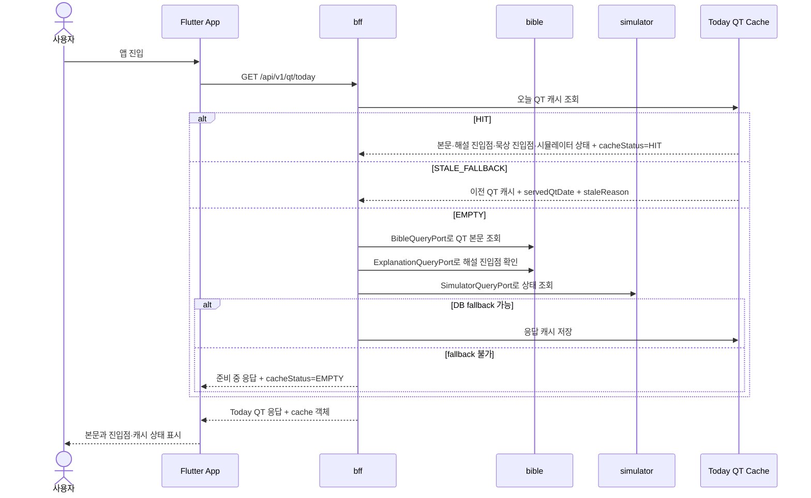
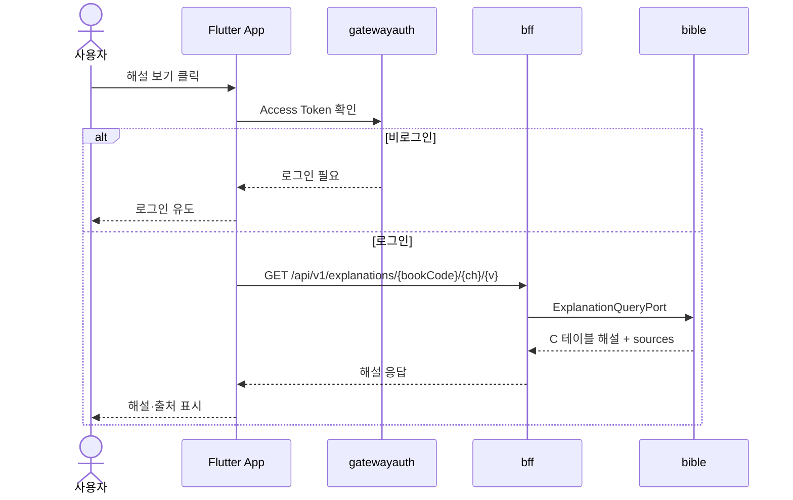
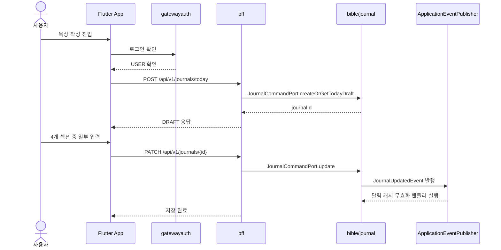
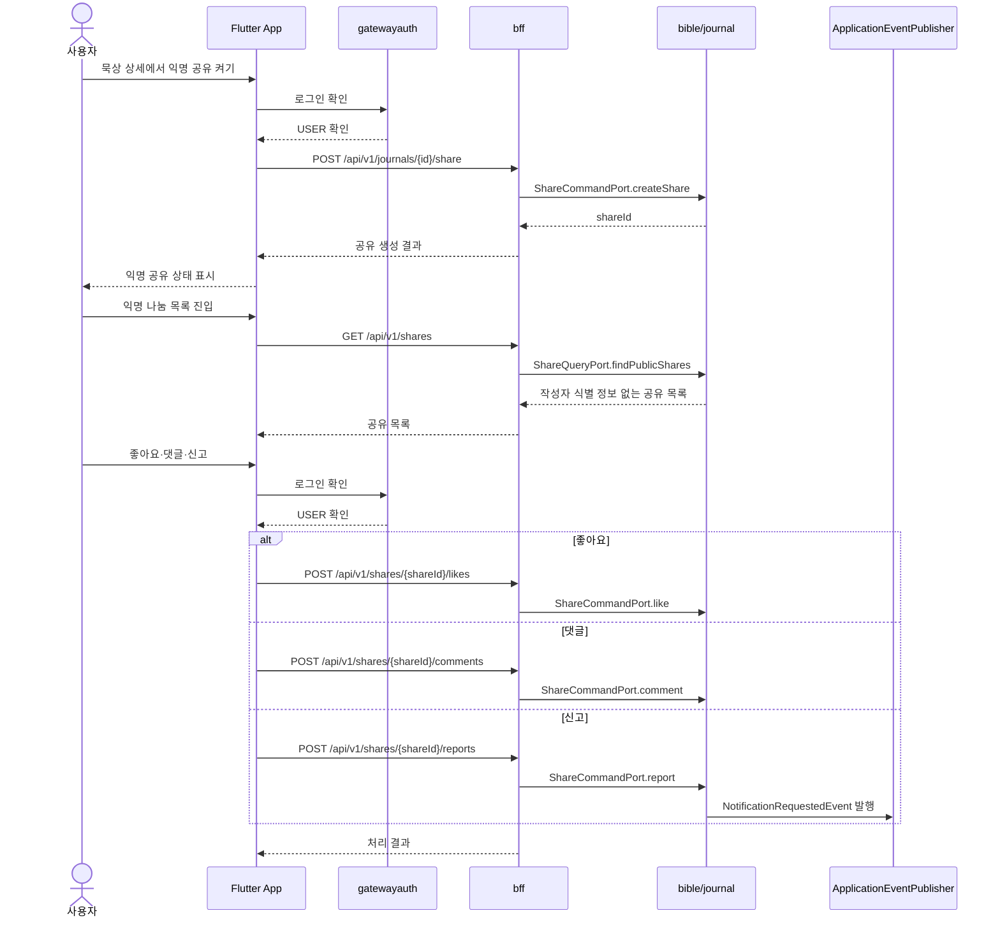
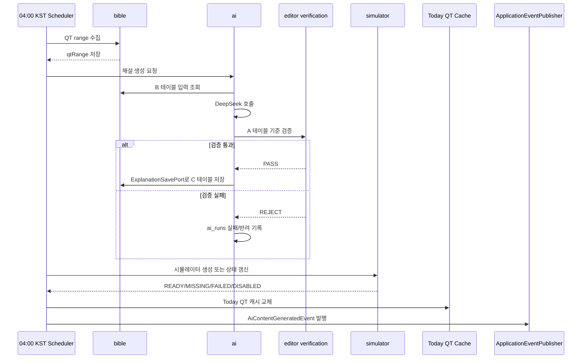
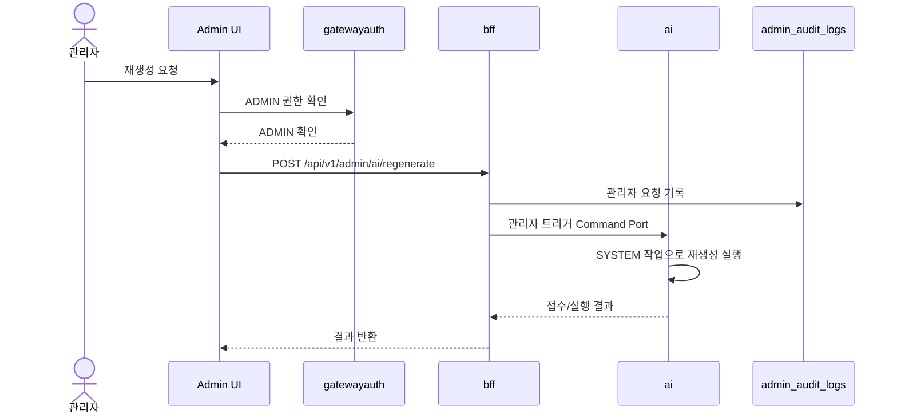
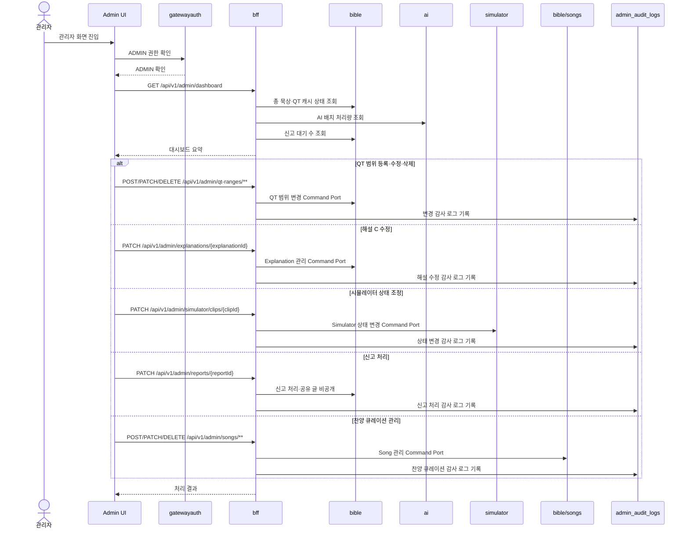
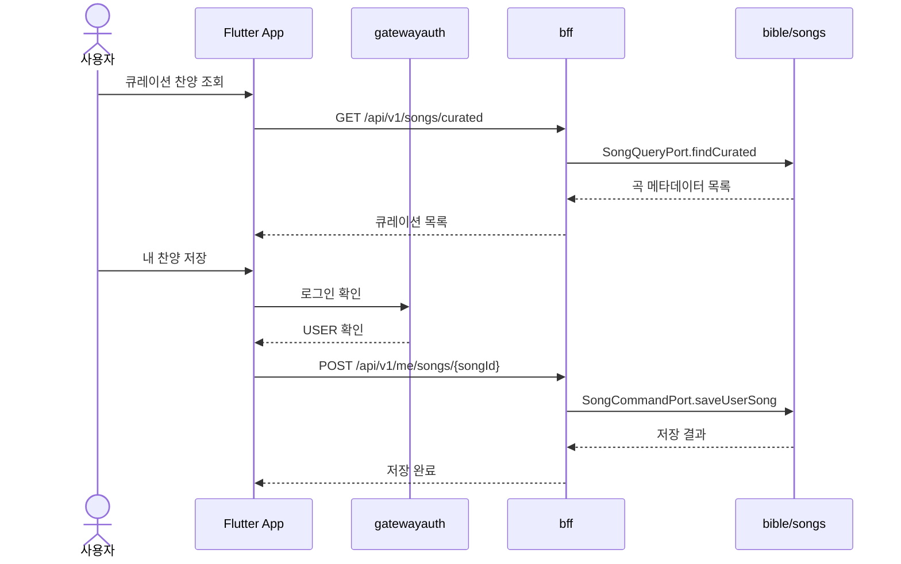

# 시퀀스 다이어그램 — QT-AI v2.3 기준

> **문서 버전:** v0.2
> **작성일:** 2026-05-15
> **기준 문서:** `07_요구사항_정의서.md` v2.3
> **문서 역할:** 주요 사용자·배치·관리자 흐름의 호출 순서 관리
> **연관 문서:** `03_아키텍처_정의서.md`, `04_API_명세서.md`, `07_요구사항_정의서.md`, `06_화면_기능_정의서.md`, `25_기능_명세서.md`

---

## 변경 이력

| 버전 | 날짜 | 작성자 | 주요 변경 |
| --- | --- | --- | --- |
| v0.1 | 2026-05-15 | Codex | 주요 흐름 시퀀스 다이어그램 초안 작성 |
| v0.2 | 2026-05-15 | Codex | Today QT 캐시 상태 응답, 익명 나눔, 관리자 운영 흐름을 `04_API_명세서.md` v0.2와 정합화 |

---

## 1. 문서 목적과 경계

이 문서는 구현 전에 팀이 같은 흐름을 보고 개발할 수 있도록 주요 호출 순서를 정의한다. API 상세 요청/응답은 `04_API_명세서.md`, 데이터 구조는 `02_ERD_문서.md`가 책임진다.

| 구분 | 이 문서에서 관리 | 다른 문서에서 관리 |
| --- | --- | --- |
| 호출 순서 | 포함 | API 필드 상세는 `04` |
| 배치 흐름 | 포함 | DB 테이블 상세는 `02` |
| 화면 이동 | 요약만 포함 | 스토리보드는 `08_스토리보드.md`에서 관리 |
| 도메인 경계 | 요약만 포함 | 상세 규칙은 `03` |

---

## 2. Today QT 조회

| 기준 | 내용 |
| --- | --- |
| 00:00~04:00 | 새 범위 수집 전이므로 `STALE_FALLBACK`으로 이전에 준비된 캐시를 제공할 수 있다. |
| Today QT 100% | 본문, 해설 진입점, 묵상 진입점, 시뮬레이터 상태값을 반환한다. |
| 캐시 상태 | `HIT`, `MISS`, `STALE_FALLBACK`, `EMPTY` 중 하나를 `cache.cacheStatus`로 반환한다. |
| 캐시 없음 | 기존 캐시도 없으면 준비 중 상태를 표시한다. |
| 시뮬레이터 | `READY`가 아니면 버튼을 비활성화한다. |
| 금지 | 사용자 요청 처리 중 LLM을 호출하지 않는다. |

---

## 3. 해설 보기

| 기준 | 내용 |
| --- | --- |
| 사용자 노출 | C 테이블만 노출한다. |
| 비공개 | A 테이블 원문과 B 테이블 원문은 사용자 화면에 직접 노출하지 않는다. |
| AI 호출 | 해설 보기 시점에 LLM을 호출하지 않는다. |

---

## 4. 묵상 DRAFT 생성·자동 저장

| 기준 | 내용 |
| --- | --- |
| 생성 기준 | 오늘 QT 기준으로만 DRAFT를 생성한다. |
| 저장 기준 | 4개 섹션 중 최소 1개 이상 입력하면 저장 대상이다. |
| 이벤트 실패 | 핸들러 실패 로그와 재처리 근거를 남긴다. |
| 금지 | AI가 묵상 내용을 대신 생성·수정·요약하지 않는다. |

---

## 5. 익명 나눔 공개·반응·신고

| 기준 | 내용 |
| --- | --- |
| 공유 방식 | 사용자가 명시적으로 선택한 묵상만 익명 공유한다. |
| 작성자 보호 | 공유 글 응답에는 `userId`, 이메일, 닉네임 등 작성자 식별 정보를 싣지 않는다. |
| 조회 | 공유 목록과 상세 조회는 PUBLIC 가능하다. |
| 반응 | 좋아요, 댓글 작성, 신고는 USER 권한이 필요하다. |
| 관리자 연계 | 신고된 글은 관리자 신고 관리 대상으로 전달한다. |
| 제외 | 팔로우, 랭킹, 실시간 댓글 피드, 세분화된 공개 범위는 v1에서 제외한다. |

---

## 6. 04:00 KST AI 배치

| 기준 | 내용 |
| --- | --- |
| 실행 시점 | 매일 04:00 KST 수집 배치 이후 실행한다. |
| 실행 주체 | 사용자 계정이 아니라 `SYSTEM` 작업으로 기록한다. |
| 실패 | 실패 로그를 남기고 가능한 상태값을 반환한다. |
| 금지 | RAG, ChromaDB, vector DB, Elasticsearch를 사용하지 않는다. |

---

## 7. 관리자 AI 재생성

| 기준 | 내용 |
| --- | --- |
| 접수 권한 | `ADMIN`만 요청 가능하다. |
| 실행 기록 | 실제 배치·AI 작업은 `SYSTEM`으로 기록한다. |
| 감사 로그 | 요청과 결과를 감사 로그에 남긴다. |
| 금지 | 사용자 요청 경로에서 LLM을 호출하지 않는다. |

---

## 8. 관리자 운영

| 기준 | 내용 |
| --- | --- |
| 권한 | `/api/v1/admin/**`는 `ADMIN`만 접근 가능하다. |
| 대시보드 | 총 묵상 횟수, AI 배치 처리량, 신고 대기 수, Today QT 캐시 상태를 표시한다. |
| 감사 로그 | QT 범위, C 해설, 시뮬레이터 상태, 신고, 찬양 변경은 감사 로그 대상이다. |
| A 테이블 | 사용자 화면과 사용자 API에는 A 테이블 원문을 노출하지 않는다. |
| 제외 | 교회 인증, AI 찬양 추천, 사용자 AI Q&A 기능은 관리자 화면에도 만들지 않는다. |

---

## 9. 찬양 큐레이션 저장

| 기준 | 내용 |
| --- | --- |
| 조회 | 큐레이션 목록 조회는 PUBLIC이다. |
| 저장 | 내 찬양 저장·제거는 USER 권한이다. |
| 금지 | AI 찬양 추천, 가사 저장, 음원 저장, 사용자 직접 URL 입력은 MVP 제외다. |

---

## 10. 현재 상태

| 항목 | 상태 |
| --- | --- |
| 시퀀스 다이어그램 | 이 문서에서 v0.2로 API·화면 매핑 보강 |
| ERD 문서 연계 | `02_ERD_문서.md` v0.2 기준 반영 |
| 기준 요구사항 | `07_요구사항_정의서.md` v2.3 유지 |
| API 명세서 연계 | `04_API_명세서.md` v0.2 기준 반영 |
| 화면 기능 정의서 연계 | `06_화면_기능_정의서.md` v0.2 기준 반영 |
| 다음 권장 작업 | 별도 구현 GitHub 기준 실제 담당 경로와 PR 단위 확정 |
