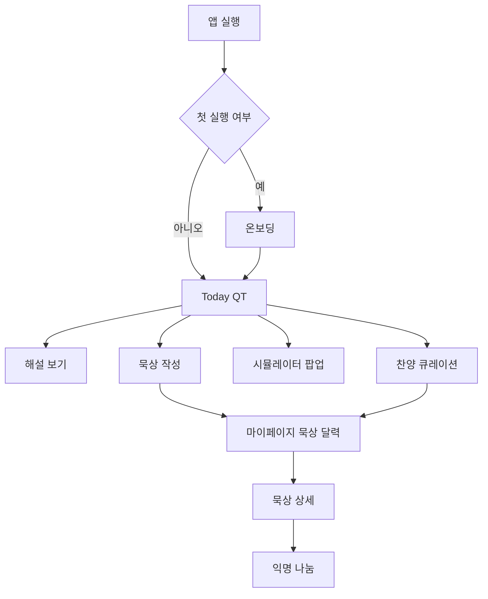
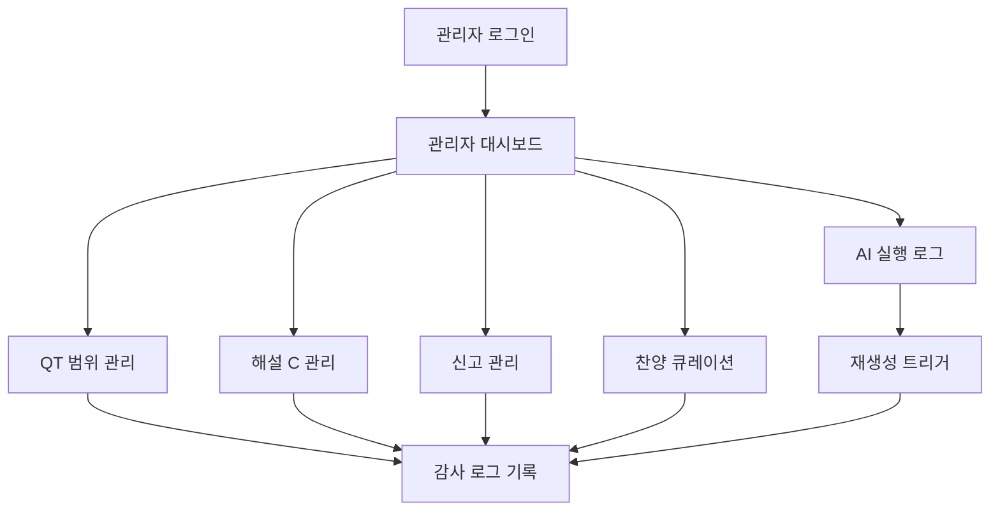

# 스토리보드 - QT-AI v2.3 기준

> **문서 버전:** v0.1
> **작성일:** 2026-05-15
> **기준 문서:** `07_요구사항_정의서.md` v2.3
> **문서 역할:** 사용자·관리자 화면 이동 흐름, 화면별 주요 상태, 시연 흐름 관리
> **연관 문서:** `04_API_명세서.md`, `05_시퀀스_다이어그램.md`, `06_화면_기능_정의서.md`, `15_사용자_메뉴얼.md`, `19_시연_준비_가이드.md`

---

## 변경 이력

| 버전 | 날짜 | 작성자 | 주요 변경 |
| --- | --- | --- | --- |
| v0.1 | 2026-05-15 | Codex | 템플릿 번호 기준 스토리보드 신규 작성 |

---

## 1. 문서 목적과 경계

이 문서는 화면을 어떤 순서로 보여주고, 사용자가 어떤 흐름으로 이동하는지 정리한다. 화면의 기능 상세는 `06_화면_기능_정의서.md`, API 호출 상세는 `04_API_명세서.md`가 책임진다.

| 구분 | 이 문서에서 관리 | 다른 문서에서 관리 |
| --- | --- | --- |
| 화면 이동 흐름 | 포함 | 화면별 버튼 상세는 `06` |
| 주요 상태 | 포함 | 상태값 정의는 `23` |
| 시연 순서 | 요약 포함 | 리허설 체크는 `19` |
| API 요청/응답 | 포함하지 않음 | `04` |

---

## 2. 전체 사용자 흐름

---

## 3. 사용자 화면 스토리보드

| 순서 | 화면 | 사용자 목적 | 주요 표시 | 다음 이동 |
| --- | --- | --- | --- | --- |
| 1 | 온보딩 | QT가 무엇인지 이해 | QT 안내, 오늘 QT 시작 | Today QT |
| 2 | Today QT | 오늘 본문 확인 | 한글 본문, 영어 펼침, 해설·묵상·시뮬레이터 진입점 | 해설, 묵상, 찬양, 시뮬레이터 |
| 3 | 해설 보기 | 쉬운 해설 확인 | C 테이블 해설, 요약, 단어, 출처 | Today QT |
| 4 | 묵상 작성 | 개인 묵상 기록 | 느낀 점, 기억할 구절, 적용, 기도 | 묵상 상세, 마이페이지 |
| 5 | 마이페이지 | 기록과 찬양 확인 | 묵상 달력, 묵상 목록, 내 찬양 목록 | 묵상 상세 |
| 6 | 묵상 상세 | 기록 확인·수정 | 본문 정보, 4개 섹션, 공개 토글 | 익명 나눔 |
| 7 | 익명 나눔 | 선택 공유 | 공유 글, 좋아요, 댓글, 신고 | 묵상 상세 |
| 8 | 찬양 큐레이션 | 찬양 저장 | 운영자 큐레이션 목록, 저장 버튼 | 마이페이지 |
| 9 | 시뮬레이터 팝업 | 본문 장면 확인 | 사전 생성 클립, 닫기 | Today QT |

---

## 4. 핵심 상태 규칙

| 화면 | 상태 | 처리 |
| --- | --- | --- |
| Today QT | 00:00~04:00 | 이전 캐시를 보여줄 수 있다. |
| Today QT | 캐시 없음 | 준비 중 상태와 재시도 안내를 표시한다. |
| 해설 보기 | 비로그인 | 로그인 유도 후 원래 본문으로 복귀한다. |
| 묵상 작성 | 자동 저장 실패 | 실패 상태를 표시하고 재시도 가능하게 둔다. |
| 시뮬레이터 | `READY` | 보기 버튼 활성화 |
| 시뮬레이터 | `MISSING`, `FAILED`, `DISABLED` | 보기 버튼 비활성화 |
| 찬양 | 비로그인 저장 시도 | 로그인 유도 |

---

## 5. 관리자 화면 흐름

| 화면 | 주요 작업 | 필수 조건 |
| --- | --- | --- |
| 관리자 대시보드 | 상태 요약 확인 | `ADMIN` |
| QT 범위 관리 | 범위 등록·수정 | 감사 로그 |
| 해설 C 관리 | 사용자 노출 해설 검토 | A/B 원문 사용자 노출 금지 |
| AI 실행 로그 | 실패 확인, 재생성 | 사용자 요청 경로 LLM 호출 금지 |
| 신고 관리 | 신고 처리 | 처리 결과 감사 로그 |
| 찬양 큐레이션 | 곡 메타데이터 등록 | 가사·음원 저장 금지 |

---

## 6. 현재 상태

| 항목 | 상태 |
| --- | --- |
| 스토리보드 | 이 문서에서 v0.1 신규 작성 |
| 기준 요구사항 | `07_요구사항_정의서.md` v2.3 유지 |
| 다음 권장 작업 | 별도 구현 GitHub 기준 실제 담당 경로와 PR 단위 확정 |
