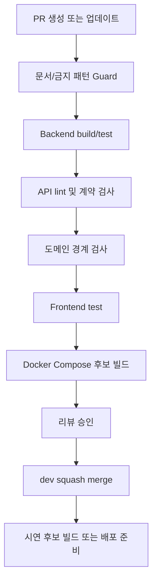

# CI/CD 파이프라인 정의서 - QT-AI v0.1

> **문서 버전:** v0.1
> **작성일:** 2026-05-15
> **문서 파일:** `20_CICD_파이프라인.md`
> **기준 문서:** `07_요구사항_정의서.md` v2.3
> **템플릿 원본:** `20_CICD_파이프라인_template.md`
> **연관 문서:** `09_Git_규칙.md`, `10_환경_설정.md`, `11_테스트_전략서.md`, `14_배포_가이드.md`, `18_코드_품질_게이트.md`, `22_구현_저장소_반영_체크리스트.md`
> **문서 역할:** 구현 저장소의 GitHub Actions, 품질 게이트, 배포 후보 빌드 기준을 정의한다.

---

## 1. 목적과 경계

이 문서는 구현 저장소에 적용할 CI/CD 기준을 정의한다. 실제 워크플로우 파일은 구현 저장소에서 작성하되, 어떤 검사가 필수이고 어떤 기술을 막아야 하는지는 이 문서를 따른다.

| 구분 | 이 문서에서 관리 | 다른 문서에서 관리 |
| --- | --- | --- |
| CI 단계 | 포함 | 테스트 상세 전략은 `11_테스트_전략서.md` |
| 품질 게이트 연결 | 포함 | 세부 금지 패턴은 `18_코드_품질_게이트.md` |
| 배포 후보 빌드 | 포함 | 운영 절차는 `14_배포_가이드.md`, `16_운영_메뉴얼.md` |
| 브랜치/PR 규칙 | 요약만 포함 | `09_Git_규칙.md` |
| 실제 Secret 값 | 포함하지 않음 | 구현 저장소 GitHub Secrets |
| 실제 실행 결과 | 포함하지 않음 | `13_테스트_보고서.md` |

---

## 2. 파이프라인 원칙

| 원칙 | 기준 |
| --- | --- |
| PR 우선 | 모든 기능 변경은 `dev` 대상 PR에서 CI를 통과해야 한다. |
| 빠른 실패 | 금지 기술, 금지 API, 금지 데이터는 빌드보다 먼저 검사한다. |
| 단일 백엔드 | v1 백엔드는 단일 `qtai-server` 기준으로 빌드한다. |
| Docker Compose | 배포 후보 빌드는 Docker Compose 기준으로 검증한다. |
| 단계적 도입 | W1은 build/test/guard, W2는 API/domain, W3는 coverage/integration, W4는 E2E/deploy 후보로 확장한다. |
| 가짜 성공 금지 | 구현 저장소에서 실제로 실행 가능한 명령만 CI에 넣는다. |

---

## 3. 전체 흐름



---

## 4. 필수 워크플로우

| 파일 | 트리거 | 목적 | 상태 |
| --- | --- | --- | --- |
| `.github/workflows/ci.yml` | PR to `dev`, push to `dev` | 빌드, 테스트, 금지 패턴, API 계약, 도메인 경계 검사 | 필수 |
| `.github/workflows/docs-guard.yml` | PR to `dev` | 문서 기준, 금지 문구, Markdown 구조 검사 | 권장 |
| `.github/workflows/docker-compose-check.yml` | push to `dev`, 수동 실행 | Docker Compose 시연 후보 빌드 확인 | W3 이후 |
| `.github/workflows/release-candidate.yml` | 수동 실행 | W4~W5 시연 후보 산출물 생성 | W4 이후 |

운영 자동 배포는 MVP 필수 범위가 아니다. W4까지는 "시연 후보 빌드"를 만드는 데 집중하고, 운영 배포 자동화는 구현 저장소 상태에 따라 수동 승인 단계로 둔다.

---

## 5. `ci.yml` 기준

### 5.1 트리거

```yaml
name: CI

on:
  pull_request:
    branches: [dev, master, main]
  push:
    branches: [dev, master, main]

concurrency:
  group: ci-${{ github.ref }}
  cancel-in-progress: true
```

### 5.2 권장 Job 구성

| Job | 필수 여부 | 목적 | 실패 시 |
| --- | --- | --- | --- |
| `guard` | 필수 | 금지 기술·API·데이터·Secret 평문 검사 | PR 머지 차단 |
| `backend-test` | 필수 | `qtai-server` build/test | PR 머지 차단 |
| `api-contract` | 필수 | OpenAPI 또는 API 문서 lint | PR 머지 차단 |
| `domain-boundary` | W1 이후 필수 | 도메인 간 직접 import 차단 | PR 머지 차단 |
| `frontend-test` | Flutter 경로 생성 후 필수 | Flutter test/analyze | PR 머지 차단 |
| `docker-compose-check` | W3 이후 필수 | Docker Compose 설정과 이미지 빌드 확인 | 시연 후보 빌드 차단 |

---

## 6. Guard 검사

CI에서 가장 먼저 실행한다. 금지 항목이 발견되면 빌드까지 가지 않고 실패시킨다.

```bash
scan_paths=()
for path in qtai-server flutter-app apis infra .github/workflows db data; do
  [ -e "$path" ] && scan_paths+=("$path")
done

[ ${#scan_paths[@]} -eq 0 ] && exit 0

! rg -n "Kafka|KafkaTemplate|Kubernetes|Helm|/ai/sessions|SSE|RAG|ChromaDB|vector DB|Elasticsearch|개역개정|ESV|NIV" "${scan_paths[@]}"
```

| 검사 대상 | 금지 기준 | 허용 대안 |
| --- | --- | --- |
| Kafka, KafkaTemplate | v1 MVP 금지 | Spring `ApplicationEventPublisher` |
| Kubernetes, Helm | v1 MVP 금지 | Docker Compose |
| 사용자 AI Q&A, SSE, `/ai/sessions/**` | v2.1에서 제거 | AI 배치 또는 관리자 트리거 |
| RAG, ChromaDB, vector DB, Elasticsearch | 사용 금지 | MySQL 8.0 + RDB 인덱스 |
| 개역개정, ESV, NIV | 저장·응답 금지 | 라이선스 확인된 GitHub 공개 JSON |
| 평문 Secret | 코드·YAML 저장 금지 | GitHub Secrets, `.env.example` |

> 예외: `.github/pull_request_template.md`처럼 금지 항목을 체크리스트로 설명하는 문서성 파일은 Requirements Guard에서 제외한다. GitHub 설정 검사는 `.github/workflows`만 대상으로 삼는다.

---

## 7. Backend CI 기준

구현 저장소 구조가 확정되면 아래 두 방식 중 하나로 고정한다.

| 구조 | 명령 |
| --- | --- |
| 루트 Gradle 프로젝트 | `./gradlew clean test` |
| `qtai-server/` 하위 프로젝트 | `./gradlew -p qtai-server clean test` |

최소 검사:

```powershell
./gradlew clean test
./gradlew test jacocoTestReport
```

| 항목 | 기준 |
| --- | --- |
| JDK | Java 21 |
| Spring Boot | 3.x |
| DB 테스트 | MySQL 8.0 또는 Testcontainers/MySQL 호환 환경 |
| AI 호출 | 테스트에서 실제 DeepSeek 호출 금지, mock 또는 fake client 사용 |
| Secret | CI 로그에 Secret 출력 금지 |

---

## 8. API 계약 검사

외부 공개 API와 내부 도메인 Interface를 분리해 검사한다.

| 구분 | 검사 기준 |
| --- | --- |
| 외부 공개 API | `/api/v1/**` OpenAPI 또는 API 명세와 Controller 경로 일치 |
| 관리자 API | `/api/v1/admin/**`는 `ADMIN` 권한 기준 확인 |
| 사용자 AI 경로 | `/ai/sessions/**` 사용자 API가 없어야 함 |
| 내부 Interface | Java Interface 또는 DTO 계약으로만 도메인 간 통신 |
| 에러 응답 | 공통 에러 응답 형식 유지 |

권장 명령:

```powershell
npx spectral lint apis/bff/openapi.yaml
```

OpenAPI 파일 위치가 확정되지 않은 동안에는 `04_API_명세서.md`와 Controller 경로를 비교하는 문서 검사를 먼저 둔다.

---

## 9. 도메인 경계 검사

| 도메인 | 직접 import 금지 대상 |
| --- | --- |
| `bible` | `ai`, `simulator` 내부 Entity/Service/Repository |
| `ai` | `bible`, `simulator` 내부 Entity/Service/Repository |
| `simulator` | `bible`, `ai` 내부 Entity/Service/Repository |
| `bff` | Repository 직접 접근 |
| `gatewayauth` | 도메인 비즈니스 Repository 직접 접근 |

권장 방식:

| 방식 | 기준 |
| --- | --- |
| ArchUnit | 패키지 import 금지 규칙을 테스트로 작성 |
| Spring Modulith | 모듈 경계 검증이 가능하면 보조로 사용 |
| rg guard | 초기에는 문자열 기반 직접 import 검사를 병행 |

---

## 10. Frontend CI 기준

Flutter 앱 경로가 생긴 뒤 필수로 전환한다.

```powershell
flutter pub get
flutter analyze
flutter test
```

| 검사 | 기준 |
| --- | --- |
| Today QT 화면 | 비로그인 미리보기 가능 |
| 로그인 유도 | 저장·해설·찬양·달력 액션에서만 유도 |
| 시뮬레이터 | `READY` 외 상태 버튼 비활성화 |
| 금지 UI | AI 질문하기, AI 찬양 추천, 교회 인증 버튼 없음 |
| 관리자 화면 | P0 운영 메뉴 접근 권한 표시 |

---

## 11. Docker Compose 후보 빌드

v1 배포 기준은 Docker Compose다. Kubernetes/Helm은 CI/CD 목표에 넣지 않는다.

```powershell
docker compose config
docker compose build
docker compose up -d
docker compose ps
```

| 항목 | 기준 |
| --- | --- |
| 구성 검증 | `docker compose config` 통과 |
| 빌드 | `qtai-server` 이미지 빌드 가능 |
| DB | MySQL 8.0 컨테이너 연결 가능 |
| 환경 변수 | `.env.example` 기준으로 누락 항목 확인 |
| 종료 | 시연 후 `docker compose down` 가능 |

---

## 12. Branch Protection 기준

| 항목 | 기준 |
| --- | --- |
| 대상 브랜치 | `dev`, `main` |
| PR 필수 | 직접 push 금지 |
| 리뷰 | 최소 1명 이상 승인, 경계 변경은 Lead 포함 |
| Status check | `guard`, `backend-test`, `api-contract` 필수 |
| 최신화 | 머지 전 최신 `dev` 반영 |
| 대화 해결 | unresolved comment가 있으면 머지 금지 |
| Merge 방식 | squash merge |

---

## 13. Secret과 환경 분리

| Secret | 용도 | 기준 |
| --- | --- | --- |
| `DEEPSEEK_API_KEY` | AI 배치/관리자 트리거 | 사용자 요청 경로에서 사용 금지 |
| `JWT_SECRET` | 토큰 서명 | 평문 커밋 금지 |
| `GOOGLE_CLIENT_ID` | Google OAuth | 환경별 분리 |
| `GOOGLE_CLIENT_SECRET` | Google OAuth | GitHub Secrets |
| `MYSQL_PASSWORD` | DB 접속 | `.env.example`에는 placeholder만 |

CI 로그에서 Secret을 출력하지 않는다. `.env`, `application-prod.yml`, private key 파일은 커밋 금지 대상이다.

---

## 14. 단계별 도입 일정

| 시점 | 도입 항목 | 완료 기준 |
| --- | --- | --- |
| W1 | `ci.yml` build/test, guard, Branch Protection | PR에서 금지 패턴과 기본 테스트가 차단됨 |
| W2 | API 계약 검사, 도메인 경계 검사 | Today QT 핵심 API 데모 전 계약 위반 차단 |
| W3 | Frontend test, integration test, coverage | Feature Freeze 전 주요 기능 테스트 통과 |
| W4 | Docker Compose 후보 빌드, E2E, 성능 측정 | 시연 후보 빌드 기준 통과 |
| W5 | release candidate 수동 실행, 백업 산출물 | 리허설 2회 성공 |

---

## 15. 실패 시 처리

| 실패 항목 | 1차 조치 | 기록 위치 |
| --- | --- | --- |
| Guard 실패 | 금지 기술·API·데이터 제거 또는 문서 예외 경로 분리 | PR 본문 |
| Backend test 실패 | 실패 테스트와 재현 명령 기록 | `13_테스트_보고서.md` |
| API lint 실패 | 명세와 Controller 중 기준 문서에 맞지 않는 쪽 수정 | `04_API_명세서.md` |
| 도메인 경계 실패 | 직접 import 제거, Interface/DTO로 전환 | PR 본문 |
| Docker Compose 실패 | `.env.example`, 포트, healthcheck 확인 | `14_배포_가이드.md` |
| Secret 탐지 | 즉시 Secret 폐기/재발급, 히스토리 제거 여부 판단 | Lead 확인 |

---

## 16. 체크리스트

| 항목 | 상태 |
| --- | --- |
| `ci.yml` build/test 기준 정의 | 완료 |
| 금지 패턴 guard 기준 정의 | 완료 |
| API 계약 검사 기준 정의 | 완료 |
| 도메인 경계 검사 기준 정의 | 완료 |
| Flutter CI 기준 정의 | 완료 |
| Docker Compose 후보 빌드 기준 정의 | 완료 |
| Branch Protection 기준 정의 | 완료 |
| 실제 구현 저장소 워크플로우 파일 작성 | `.github/workflows/qt-ai-ci.yml` 1차 작성 완료 |
| 실제 CI 실행 결과 기록 | TODO |

---

## 17. 현재 상태

| 항목 | 상태 |
| --- | --- |
| CI/CD 파이프라인 문서 | v0.1 신규 작성 |
| 템플릿 반영 | `20_CICD_파이프라인_template.md` 구조를 QT-AI 기준으로 변환 |
| 구현 저장소 반영 | `.github/workflows/qt-ai-ci.yml` 1차 작성 완료. 구현 코드 경로가 생기면 backend/API/Flutter job이 실제 실행됨 |
| 다음 권장 작업 | 커밋/푸시 |
