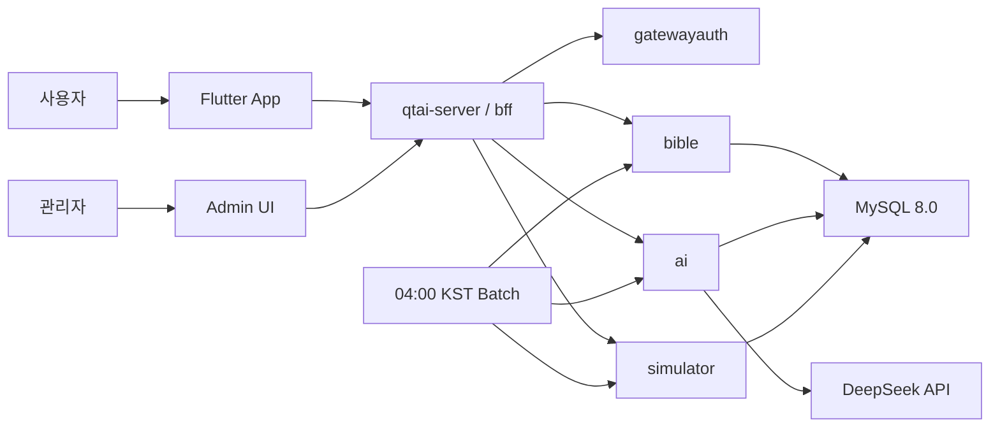

# 포트폴리오 README 작성 기준 - QT-AI v0.1

> **문서 버전:** v0.1
> **작성일:** 2026-05-15
> **기준 문서:** `07_요구사항_정의서.md` v2.3
> **템플릿 원본:** `18_포트폴리오_README_template.md`
> **번호 처리:** 기존 `18_코드_품질_게이트.md`를 유지하고, 포트폴리오 README는 `26_포트폴리오_README.md`로 분리한다.
> **문서 역할:** 구현 저장소 README 또는 발표용 포트폴리오 README에 옮길 내용의 기준 틀을 관리한다.

---

## 1. 문서 목적과 경계

이 문서는 QT-AI 프로젝트를 외부에 소개할 때 사용할 README의 기준 틀이다. 요구사항, API, ERD, 화면 정의를 새로 정의하지 않고, 이미 확정된 문서의 내용을 포트폴리오 관점으로 요약한다.

| 구분 | 이 문서에서 관리 | 다른 문서에서 관리 |
| --- | --- | --- |
| 프로젝트 소개 문구 | 포함 | 상세 범위는 `01_프로젝트_계획서.md` |
| 주요 기능 요약 | 포함 | 원본 요구사항은 `07_요구사항_정의서.md` |
| 기술 스택 요약 | 포함 | 설계 결정은 `03_아키텍처_정의서.md` |
| API 상세 | 포함하지 않음 | `04_API_명세서.md` |
| DB 상세 | 포함하지 않음 | `02_ERD_문서.md` |
| 품질 지표 기준 | 요약만 포함 | `18_코드_품질_게이트.md` |
| 실제 성과 수치 | 구현 후 기입 | 테스트 결과는 `13_테스트_보고서.md` |

---

## 2. README 핵심 메시지

| 항목 | 내용 |
| --- | --- |
| 프로젝트명 | QT-AI |
| 한 줄 소개 | 매일 QT 본문을 기준으로 성경 본문, 쉬운 해설, 묵상 기록, 시뮬레이터 상태를 한 화면에서 제공하는 큐티 앱 |
| 핵심 가치 | 초심자가 오늘 본문을 바로 읽고, 필요한 해설만 열람하며, 묵상 기록까지 이어갈 수 있게 한다. |
| 핵심 차별점 | 사용자 실시간 AI Q&A가 아니라 사전 생성·검증된 AI 해설과 시뮬레이터 상태를 제공한다. |
| MVP 기준 | Today QT, 성경 본문, 해설 C, 묵상, 찬양 큐레이션, 관리자 운영, 시뮬레이터 상태 |
| Out-Scope | 사용자 AI Q&A, 챗봇, SSE, Kafka, Kubernetes, Helm, RAG, vector DB, AI 찬양 추천, 교회 인증 |

---

## 3. 한눈에 보기

| 항목 | 내용 |
| --- | --- |
| 개발 기간 | 2026-05-12 ~ 2026-06-17 |
| 팀 구성 | 6명 |
| 개발 방식 | 주차별 게이트, PR 검증, 문서 기준 우선, AI 에이전트 보조 |
| 백엔드 구조 | 단일 `qtai-server` Modular Monolith |
| 프론트엔드 | Flutter 앱, 관리자 화면은 Flutter Web 또는 별도 웹 화면 |
| 데이터베이스 | MySQL 8.0 |
| 배포 기준 | Docker Compose |
| AI 사용 | DeepSeek API, 04:00 KST 배치 또는 관리자 트리거 전용 |
| 핵심 품질 목표 | Today QT 첫 응답 P95 500ms 이하, Today QT 캐시 히트율 95% 이상 |

---

## 4. 주요 기능

| 기능 | README에 보여줄 포인트 | 기준 문서 |
| --- | --- | --- |
| Today QT | 00:00 KST 공개 본문 범위를 04:00 KST 배치로 수집하고, 본문·해설·묵상 진입점·시뮬레이터 상태를 반환 | `07_요구사항_정의서.md` F-01 |
| 성경 본문 | 한글/영어 성경 JSON 데이터를 절 단위로 적재해 조회 | `07_요구사항_정의서.md` F-01 |
| AI 해설 | B 테이블 원문을 AI가 재해석하고 편집자 에이전트 검증 후 C 테이블만 사용자에게 노출 | `07_요구사항_정의서.md` F-02 |
| 묵상 노트 | 오늘 QT 본문 기준 DRAFT 생성, 4개 섹션 자동 저장, 묵상 달력 연계 | `07_요구사항_정의서.md` F-03, F-13 |
| 찬양 큐레이션 | AI 추천이 아니라 운영자가 등록한 곡 메타데이터를 사용자가 내 목록에 저장 | `07_요구사항_정의서.md` F-09 |
| 시뮬레이터 | `READY`, `MISSING`, `FAILED`, `DISABLED` 상태를 반환하고 READY일 때만 보기 버튼 활성화 | `07_요구사항_정의서.md` F-12 |
| 관리자 운영 | Today QT, 해설 C, AI 로그, 시뮬레이터 상태, 신고, 찬양 큐레이션 관리 | `07_요구사항_정의서.md` F-06 |

---

## 5. 기술 스택

| 영역 | 스택 |
| --- | --- |
| Backend | Java 21, Spring Boot 3.x, Spring Security, Spring Data JPA |
| Architecture | 단일 `qtai-server` Modular Monolith, 도메인 패키지 격리, 내부 Java Interface |
| Database | MySQL 8.0 |
| Cache | Caffeine 1차, Redis 검토 |
| Event | Spring `ApplicationEventPublisher` |
| AI | DeepSeek API(OpenAI 호환), Spring `RestClient` |
| Frontend | Flutter, Flutter Web 또는 별도 관리자 웹 |
| DevOps | Docker Compose, GitHub Actions |
| Quality | JUnit, ArchUnit 또는 Spring Modulith 경계 검증, gitleaks, 금지 패턴 검사 |

### 금지 스택

| 금지 항목 | README 표기 방식 |
| --- | --- |
| Kafka | v1에서는 사용하지 않음. Spring `ApplicationEventPublisher` 사용 |
| Kubernetes, Helm | v1에서는 사용하지 않음. Docker Compose 사용 |
| RAG, ChromaDB, vector DB, Elasticsearch | 사용하지 않음. RDB 인덱스 기반 조회 |
| 사용자 AI Q&A, SSE, `/ai/sessions/**` | 제공하지 않음. AI는 배치·관리자 트리거 전용 |
| 개역개정, ESV, NIV | 사용 금지 데이터로 명시 |

---

## 6. 시스템 아키텍처 요약

| 설계 핵심 | 설명 |
| --- | --- |
| Modular Monolith | 하나의 `qtai-server` 안에서 도메인을 패키지와 Interface로 분리 |
| 외부 API와 내부 Interface 분리 | `/api/v1/**` 공개 API와 내부 Java Interface를 섞지 않음 |
| 사전 생성 AI | 사용자 요청에서 LLM을 호출하지 않고 배치/관리자 트리거로 산출물 생성 |
| 상태 기반 시뮬레이터 | 클립 유무와 실패 상태를 API 상태값으로 표현해 UI가 안전하게 비활성화 가능 |

---

## 7. 기술적 도전과 포트폴리오 서술 포인트

| 도전 | 문제 | 해결 방향 | README 증거 |
| --- | --- | --- | --- |
| Today QT 기준 시각 | 성서 유니온 공개 00:00과 우리 시스템 수집 04:00 사이의 데이터 정합성 | 04:00 배치 전까지 전날 캐시 유지, 배치 후 새 콘텐츠 교체 | 캐시 정책, 배치 로그, Today QT 응답 |
| AI 저작권 리스크 | 원문 주석을 직접 노출하면 저작권 리스크가 큼 | B 원문을 AI가 재해석하고 C 테이블만 노출, 출처 메타데이터 표시 | A/B/C 구조, 편집자 검증 로그 |
| 도메인 경계 | 6명이 동시에 작업하면 도메인 import가 섞일 위험 | 패키지 격리, 내부 Interface, PR 자동 검증 | ArchUnit 또는 Spring Modulith 결과 |
| 시뮬레이터 미완성 상태 | 모든 본문에 클립을 만들지 못해도 Today QT는 100% 응답해야 함 | 상태값을 항상 반환하고 READY 외 버튼 비활성화 | 상태별 UI 스크린샷, API 응답 |
| 금지 기술 확산 | Kafka/K8s/RAG 등 MVP 밖 기술이 문서와 코드에 섞일 위험 | 품질 게이트에서 금지 패턴 검사 | `18_코드_품질_게이트.md`, CI 로그 |

---

## 8. 성능·품질 지표

실제 결과는 구현 저장소 테스트 후 채운다. 가짜 수치를 넣지 않는다.

| 지표 | 목표 | 결과 | 측정 근거 |
| --- | --- | --- | --- |
| Today QT 첫 응답 P95 | 500ms 이하 | TBD | JMeter 또는 API 부하 테스트 |
| Today QT 캐시 히트율 | 95% 이상 | TBD | 캐시 통계 |
| AI 배치 SLA | 04:00 KST 시작 후 60분 이내 | TBD | 배치 로그 |
| 묵상 달력 응답 P95 | 300ms 이하 | TBD | API 부하 테스트 |
| 금지 패턴 검사 | 0건 | TBD | CI/Guard 로그 |
| 도메인 경계 검사 | 통과 | TBD | ArchUnit 또는 Spring Modulith |

---

## 9. 빠른 시작 섹션 작성 기준

구현 저장소가 확정되기 전에는 실행 명령을 확정값처럼 쓰지 않는다. README에는 아래 항목이 준비된 뒤 채운다.

| 항목 | 상태 | 작성 기준 |
| --- | --- | --- |
| 구현 저장소 URL | TBD | 실제 GitHub 저장소 생성 후 작성 |
| 실행 명령 | TBD | Docker Compose 기준으로 작성 |
| 환경 변수 | TBD | `.env.example` 기준으로 작성하고 실제 Secret은 쓰지 않음 |
| 테스트 명령 | TBD | `./gradlew test`, Flutter 테스트 등 실제 스크립트 기준 |
| 데모 URL | TBD | 배포 또는 로컬 시연 URL 확정 후 작성 |
| 시연 영상 | TBD | W5 리허설 이후 링크 작성 |

---

## 10. 팀과 역할

| 이름 | 역할 | 포트폴리오 기여 포인트 |
| --- | --- | --- |
| 강태오 | Lead / gatewayauth / bff / DevOps | 문서 기준, PR 검증, 인증·BFF, 품질 게이트, 시연 안정화 |
| 이지윤 | bible 본문·QT | 성경 JSON 출처 검토, QT 본문 범위, Today QT bible 응답 |
| 이승욱 | bible journal/songs | 묵상 DRAFT/CRUD, 이벤트 이력, 찬양 큐레이션 저장 흐름 |
| 김지민 | Flutter / Admin / bible 협업 | Today QT 화면, 로그인 유도, 마이페이지, 관리자 화면 |
| 강상민 | ai 해설·편집자 | AI 해설 생성, 편집자 검증, 실패/재처리 로그 |
| 김태혁 | simulator | 시뮬레이터 상태 모델, 클립 저장·조회, 상태별 UI 연동 |

---

## 11. README에 넣지 말아야 할 표현

| 금지 표현 | 이유 | 대체 표현 |
| --- | --- | --- |
| 실시간 AI 상담 | MVP에서 제거됨 | 사전 생성·검증된 AI 해설 |
| AI 찬양 추천 | MVP에서 제거됨 | 운영자 큐레이션 찬양 목록 |
| 모든 시뮬레이터 클립 100% 보장 | Today QT 100% 의미와 다름 | 시뮬레이터 상태값 100% 응답 |
| MSA, Kafka, Kubernetes 기반 | v1 구조와 다름 | Modular Monolith, Docker Compose |
| RAG 기반 성경 검색 | 사용하지 않음 | RDB 인덱스 기반 조회 |
| 개역개정/ESV/NIV 사용 | 금지 데이터 | 라이선스 확인된 GitHub 공개 JSON |

---

## 12. 현재 상태

| 항목 | 상태 |
| --- | --- |
| 번호 충돌 처리 | `18_코드_품질_게이트.md` 유지, 포트폴리오 README는 `26_포트폴리오_README.md`로 분리 |
| 템플릿 반영 | `18_포트폴리오_README_template.md`의 README 구조를 QT-AI 기준으로 변환 |
| 실제 성과 수치 | 구현 저장소 테스트 후 기입 |
| 다음 권장 작업 | 별도 구현 GitHub 기준 실제 담당 경로와 PR 단위 확정 |
